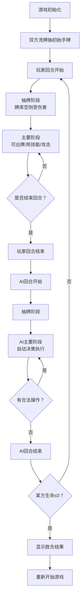

# 卡牌对战游戏产品需求文档 (PRD)

## 1. 产品概述

本项目是一个基于浏览器的单文件卡牌对战游戏，玩家与AI对手进行回合制策略对战。游戏模拟集换式卡牌游戏核心机制，包含英雄系统、随从战斗、法术效果和AI决策引擎。

- 核心目的：提供一个完整可玩的单文件浏览器卡牌对战游戏
- 目标用户：卡牌游戏爱好者、策略游戏玩家
- 市场价值：展示复杂游戏逻辑在纯前端技术栈下的实现能力

## 2. 核心功能

### 2.1 用户角色

| 角色 | 注册方式 | 核心权限 |
|------|----------|----------|
| 玩家 | 无需注册，直接游戏 | 进行游戏操作、查看日志、重新开始 |

### 2.2 功能模块

1. **游戏主界面**：双方英雄信息、手牌区、战场区、行动日志
2. **卡牌系统**：随从卡、法术卡、英雄技能，包含克制关系
3. **战斗系统**：回合流程、伤害计算、死亡结算、胜负判定
4. **AI系统**：自动决策引擎，优先消灭威胁或最大化伤害
5. **UI交互**：点击出牌、选择攻击目标、英雄技能使用

### 2.3 页面详情

| 页面名称 | 模块名称 | 功能描述 |
|----------|----------|----------|
| 游戏主界面 | 英雄信息区 | 显示双方生命值、费用水晶、英雄技能状态 |
| 游戏主界面 | 手牌区 | 显示己方手牌（可见）和对方手牌（牌背），手牌上限7张 |
| 游戏主界面 | 战场区 | 显示双方场上随从，支持攻击交互 |
| 游戏主界面 | 行动日志 | 显示最近5条游戏行动记录 |
| 游戏主界面 | 控制区 | 结束回合按钮、重新开始按钮、当前阶段提示 |

## 3. 核心流程

## 4. 用户界面设计

### 4.1 设计风格

- **主色调**：深紫色(#4A148C) + 金色(#FFD700) + 深色背景(#1A1A2E)，营造魔幻卡牌游戏氛围
- **按钮风格**：圆角矩形，金色边框，悬停时有发光效果
- **字体**：使用系统衬线字体模拟复古卡牌风格，标题加粗加大
- **布局风格**：对称式布局，战场居中，上下分别为AI和玩家区域
- **视觉效果**：卡牌阴影、悬停放大、攻击动画、伤害闪烁

### 4.2 页面设计概述

| 页面名称 | 模块名称 | UI元素 |
|----------|----------|--------|
| 游戏主界面 | 英雄区域 | 圆形头像框、生命值数字、费用水晶图标、技能按钮 |
| 游戏主界面 | 手牌区域 | 横向排列卡牌，悬停放大，可点击打出 |
| 游戏主界面 | 战场区域 | 网格布局随从，选中态高亮，攻击目标指示 |
| 游戏主界面 | 日志区域 | 半透明背景，滚动显示最近5条记录 |
| 游戏主界面 | 状态区域 | 醒目显示当前阶段和可用费用 |

### 4.3 响应式

- 桌面优先设计，支持1920×1080和1366×768两种主流分辨率
- 使用相对单位和弹性布局，在不同分辨率下正常显示
- 触控优化：按钮最小尺寸48px，卡牌间距适中

### 4.4 动画效果

- 卡牌入场：从下往上滑入 + 淡入
- 攻击动画：随从移动到目标位置后回弹
- 伤害效果：数字跳动 + 红色闪烁
- 费用更新：水晶发光动画
- 回合切换：全屏淡入淡出过渡
