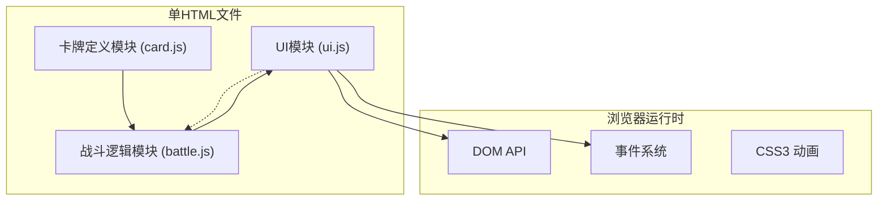

# 卡牌对战游戏技术架构文档

## 1. 架构设计



## 2. 技术描述

- **前端技术栈**：纯 HTML5 + CSS3 + 原生 JavaScript (ES6+)
- **模块化方式**：使用独立 `<script>` 标签模拟三个模块，通过 IIFE 隔离作用域
- **无第三方依赖**：不使用任何框架或库，纯手写代码
- **数据存储**：内存存储，无需数据库

### 模块划分原则

1. **card.js 模块**
   - 职责：卡牌数据结构定义、卡牌类型系统、克制关系判定
   - 暴露接口：卡牌构造函数、克制关系检查函数、卡牌模板库

2. **battle.js 模块**
   - 职责：回合流程管理、伤害计算、AI决策引擎、胜负判定
   - 依赖：card.js 模块
   - 暴露接口：游戏状态、游戏操作方法（出牌、攻击、用技能）、回合控制

3. **ui.js 模块**
   - 职责：DOM渲染、用户交互处理、动画效果
   - 依赖：battle.js 模块
   - 暴露接口：渲染函数、事件绑定

## 3. 核心数据结构

### 3.1 卡牌对象结构

```javascript
{
  id: "唯一标识",
  name: "卡牌名称",
  cost: 费用数值,
  type: "minion" | "spell",
  attack: 攻击力（随从特有）,
  health: 生命值（随从特有）,
  maxHealth: 最大生命值,
  typeTag: "随从类型标签（用于克制）",
  effect: "效果描述",
  canAttack: boolean,
  hasAttacked: boolean,
  exhausted: boolean // 刚召唤的随从
}
```

### 3.2 玩家对象结构

```javascript
{
  health: 30,
  maxHealth: 30,
  mana: 0,
  maxMana: 0,
  deck: [],
  hand: [],
  battlefield: [],
  heroSkillUsed: false,
  fatigueDamage: 0
}
```

### 3.3 游戏状态结构

```javascript
{
  turn: 1,
  currentPlayer: "player" | "ai",
  phase: "draw" | "main" | "end",
  player: {...},
  ai: {...},
  logs: [],
  gameOver: false,
  winner: null
}
```

## 4. 克制系统设计

### 类型标签系统

| 类型标签 | 克制关系 | 效果 |
|----------|----------|------|
| Beast | → Undead | 对亡灵造成额外+2伤害 |
| Undead | → Human | 对人类造成额外+1伤害，受到伤害时恢复1点生命 |
| Human | → Beast | 对野兽有+1护甲（减免1点伤害） |
| Elemental | → All | 攻击时造成1点溅射伤害给相邻随从 |
| Mech | → Elemental | 对元素伤害减免2点 |

### 克制判定逻辑

```javascript
function calculateDamage(attacker, defender) {
  let damage = attacker.attack;
  // 克制加成逻辑
  // 减伤逻辑
  return damage;
}
```

## 5. AI 决策算法

### 决策优先级（从高到低）

1. **生存检查**：如果生命值 ≤ 5，优先使用治疗技能
2. **威胁消除**：优先消灭攻击力 ≥ 3 的敌方随从
3. **随从交换**：用小随从换掉大随从（己方损失 < 对方损失）
4. **打脸输出**：如果没有威胁随从，直接攻击英雄
5. **出牌策略**：优先出高费随从，最大化场面压力

### 合法操作检测

AI 每步操作前检查：
- 是否有足够费用出牌
- 是否有未攻击的随从
- 是否可以使用英雄技能

## 6. 抽牌惩罚机制

- 牌库为空时，每次抽牌受到「疲劳伤害」
- 疲劳伤害递增：第1次1点，第2次2点，第3次3点，以此类推
- 日志中明确显示疲劳伤害

## 7. 关键验证指标

| 指标 | 数值 | 验证点 |
|------|------|--------|
| 初始卡组数量 | 20张 | 不含幸运币 |
| 初始生命值 | 30点 | 双方英雄 |
| 手牌上限 | 7张 | 超过部分直接销毁 |
| 费用上限 | 10点 | 回合数超过10时不再增加 |
| 英雄技能消耗 | 2费 | 每回合限用1次 |
| 日志保留 | 最近5条 | 滚动更新 |

## 8. 幸运币机制

- 后手AI获得1张0费法术卡「幸运币」
- 效果：本回合获得1点临时费用
- 使用后立即弃置
- 不能超出10费上限
