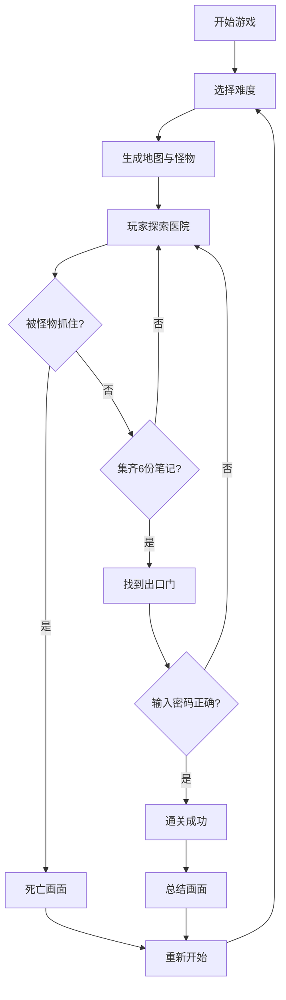

## 1. 产品概述
一款2D俯视角生存恐怖网页游戏，设定在废弃医院场景，玩家需躲避怪物、收集资源、解谜逃脱。游戏为单HTML文件，无需任何构建工具或后端，直接在浏览器中双击运行。

## 2. 核心功能

### 2.1 用户角色
| 角色 | 注册方式 | 核心权限 |
|------|----------|----------|
| 玩家 | 无需注册 | 游戏游玩、难度选择、重新开始 |

### 2.2 功能模块
1. **游戏引擎模块**: Canvas渲染、游戏循环、输入处理、摄像机系统
2. **玩家模块**: 移动控制、手电筒、体力/电量/理智值管理
3. **怪物模块**: 追击型怪物、潜伏型怪物、统一接口实现
4. **地图模块**: 网格地图、碰撞检测、房间/走廊/死路设计
5. **物品模块**: 电池、钥匙、笔记、交互系统
6. **UI模块**: 难度选择、状态显示、笔记阅读、密码输入、结局画面
7. **音效模块**: Web Audio API实时生成环境音、脚步声、怪物音效

### 2.3 页面详情
| 页面名称 | 模块名称 | 功能描述 |
|-----------|-------------|---------------------|
| 难度选择界面 | UI模块 | 简单/普通/困难三档难度选择，游戏初始界面 |
| 游戏主界面 | 核心游戏 | Canvas游戏画面、状态UI叠加层、交互提示 |
| 笔记阅读面板 | UI模块 | 展示收集到的笔记内容，显示收集进度 |
| 密码输入界面 | UI模块 | 找到出口后输入4位密码解锁 |
| 结局画面 | UI模块 | 死亡/通关总结画面，重新开始按钮 |

## 3. 核心流程
玩家选择难度 → 进入废弃医院 → WASD移动/鼠标控制手电筒方向 → 探索地图收集电池/钥匙/笔记 → 躲避怪物追击 → 使用钥匙开启上锁区域 → 集齐6份笔记解锁密码输入 → 在出口输入正确密码 → 通关成功。

## 4. 用户界面设计

### 4.1 设计风格
- **主色调**: 深黑色(#0a0a0a)背景、猩红色(#8b0000)警告色、暗黄色(#b8860b)手电光
- **按钮风格**: 暗黑风格、轻微发光边框、悬停放大效果
- **字体**: 使用等宽字体(Consolas/Monaco)营造恐怖氛围
- **布局**: Canvas居中、UI元素固定在四角
- **视觉风格**: 极简主义恐怖，大量留白（黑暗），强调光影对比

### 4.2 页面设计概述
| 页面名称 | 模块名称 | UI元素 |
|-----------|-------------|-------------|
| 难度选择界面 | UI模块 | 暗色背景、三个难度按钮居中、恐怖氛围标题 |
| 游戏主界面 | 核心游戏 | Canvas(800x600)居中、四角状态显示、底部交互提示 |
| 笔记阅读面板 | UI模块 | 半透明黑色背景、白色文字、滚动区域、关闭按钮 |
| 密码输入界面 | UI模块 | 四个数字输入框、确认/取消按钮、密码提示 |
| 结局画面 | UI模块 | 全屏半透明覆盖、大标题文字、统计数据、重新开始按钮 |

### 4.3 响应性
- 桌面端优先设计，Canvas固定800x600尺寸
- 游戏区域居中显示，周围保持黑色背景
- 不支持移动端触摸操作，专为鼠标键盘设计

### 4.4 光影与特效
- **手电筒效果**: 径向渐变光照，半径150像素，边缘柔和衰减
- **黑暗区域**: 几乎全黑，保留极微弱环境光
- **理智值幻觉**: 屏闪、红色晕影、假怪物虚影
- **电量耗尽**: 2秒逐步变暗过渡效果
- **安全室**: 微弱蓝色应急灯光
