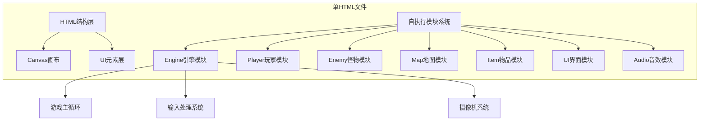

## 1. 架构设计



## 2. 技术描述
- **前端技术**: 原生HTML5 + CSS + JavaScript (ES6+)
- **渲染引擎**: HTML5 Canvas 2D API
- **音效系统**: Web Audio API 实时音频生成
- **构建工具**: 无 - 单文件自包含，直接运行
- **后端**: 无 - 纯客户端游戏
- **数据库**: LocalStorage存储游戏状态（可选）

## 3. 模块接口定义

### 3.1 IEnemy 接口
```javascript
interface IEnemy {
  update(dt: number): void;
  render(ctx: CanvasRenderingContext2D, camera: Camera): void;
  reactToSound(volume: number, pos: Position): void;
  reactToLight(intensity: number, pos: Position): void;
}
```

### 3.2 模块导出接口
| 模块 | 导出方法/属性 |
|------|--------------|
| Engine | init(), start(), stop(), getState() |
| Player | getPosition(), getStats(), move(), shineLight(), interact() |
| Map | checkCollision(x, y), getInteractable(x, y), getRoomType(x, y) |
| Enemy | updateAll(dt), renderAll(ctx, camera), broadcastSound(volume, pos), broadcastLight(intensity, pos) |
| Item | collectItem(item), getInventory(), hasKey() |
| UI | updateStats(stats), showMessage(text), showNotes(), showPasswordInput() |
| Audio | playSound(type), updateAmbience(stats) |

## 4. 游戏参数配置

### 4.1 核心常量
```javascript
const CONFIG = {
  CANVAS_WIDTH: 800,
  CANVAS_HEIGHT: 600,
  TILE_SIZE: 32,
  MAP_WIDTH: 25,
  MAP_HEIGHT: 20,
  PLAYER_SPEED: 120,
  PLAYER_RUN_SPEED: 200,
  FLASHLIGHT_RADIUS: 150,
  BATTERY_DURATION: 120,
  STAMINA_DURATION: 4,
  STAMINA_RECOVERY: 2,
};
```

### 4.2 难度参数
| 参数 | 简单 | 普通 | 困难 |
|------|------|------|------|
| 电池恢复 | 40% | 30% | 25% |
| 电池数量 | 12 | 8 | 5 |
| 怪物速度 | 0.8x | 1.0x | 1.3x |
| 怪物视野 | 0.8x | 1.0x | 1.3x |
| 理智下降 | 0.7x | 1.0x | 1.5x |

## 5. 数据模型

### 5.1 玩家状态
```javascript
interface PlayerState {
  x: number;
  y: number;
  angle: number;
  battery: number;      // 0-100
  stamina: number;     // 0-100
  sanity: number;      // 0-100
  isRunning: boolean;
  inventory: {
    batteries: number;
    keys: number;
    notes: string[];
  };
}
```

### 5.2 地图瓦片类型
| 类型ID | 名称 | 可通行 | 说明 |
|--------|------|--------|------|
| 0 | 地板 | 是 | 普通走廊/房间地面 |
| 1 | 墙壁 | 否 | 实心墙壁 |
| 2 | 门(开) | 是 | 已开启的门 |
| 3 | 门(关) | 否 | 可交互开启 |
| 4 | 门(锁) | 否 | 需要钥匙 |
| 5 | 柜子 | 否 | 可搜索 |
| 6 | 安全室 | 是 | 怪物无法进入 |
| 7 | 出口 | 特殊 | 通关目标 |

### 5.3 怪物状态机
```
IDLE → SUSPICIOUS → SEARCHING → CHASING
 ↑         ↓           ↓           ↓
 └─────────┴───────────┴───────────┘
```

## 6. 游戏循环架构

### 6.1 主循环流程
```javascript
function gameLoop(timestamp) {
  const dt = (timestamp - lastTime) / 1000;
  lastTime = timestamp;
  
  input.update();
  player.update(dt);
  enemy.updateAll(dt);
  item.update(dt);
  audio.update(dt);
  
  renderer.clear();
  map.render(ctx, camera);
  item.renderAll(ctx, camera);
  enemy.renderAll(ctx, camera);
  player.render(ctx, camera);
  lighting.applyDarkness(ctx);
  ui.render(ctx);
  
  if (!gameOver) {
    requestAnimationFrame(gameLoop);
  }
}
```
