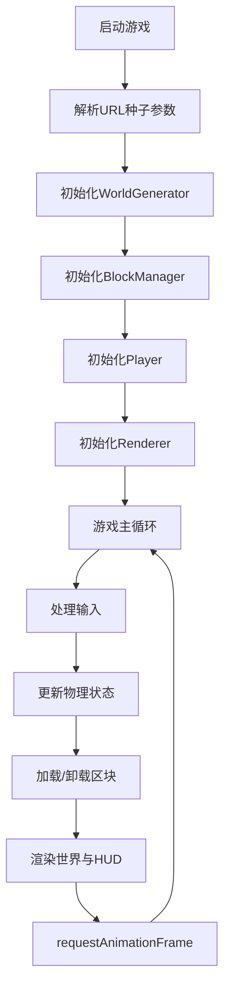

# 2D俯视角像素沙盒世界 - 产品需求文档

## 1. 产品概述
基于原生HTML5 Canvas的2D像素沙盒游戏原型，提供无限程序化生成的世界、方块破坏与放置、玩家移动与物理系统。目标是为游戏开发者提供可扩展的沙盒引擎基础。

## 2. 核心功能

### 2.1 功能模块
1. **世界生成系统**：基于种子的程序化地形生成，包含多种方块类型
2. **区块管理系统**：16×16区块的动态加载与卸载
3. **玩家控制系统**：WASD移动、摄像机平滑跟随
4. **方块交互系统**：左键破坏、右键放置
5. **背包快捷栏系统**：4个快捷槽位，数字键1-4切换
6. **HUD显示系统**：实时FPS、坐标、种子、手持物品
7. **资源散布系统**：地表装饰物（灌木丛、小树）

### 2.2 功能详情
| 功能模块 | 子功能 | 描述 |
|---------|--------|------|
| 世界生成 | 程序化地形 | Perlin噪声高度图，草、泥土、石头混合 |
| 世界生成 | 种子系统 | URL参数?seed=指定，默认42 |
| 区块系统 | 动态加载 | 摄像机周围区块按需加载 |
| 区块系统 | 修改记录 | BlockManager保存玩家修改 |
| 玩家控制 | WASD移动 | 键盘控制角色移动 |
| 玩家控制 | 摄像机跟随 | 平滑居中跟随玩家 |
| 方块交互 | 破坏方块 | 左键破坏，收集到背包 |
| 方块交互 | 放置方块 | 右键放置，碰撞检测 |
| 快捷栏 | 槽位切换 | 数字键1-4切换手持方块 |
| HUD | 信息显示 | 种子、坐标、FPS、手持物品 |
| 资源散布 | 装饰物 | 灌木丛、小树可破坏掉落 |

## 3. 核心流程

## 4. 用户界面设计

### 4.1 设计风格
- **主色调**：像素风格，复古游戏配色
- **方块颜色**：草(#4CAF50)、泥土(#795548)、石头(#607D8B)、木板(#8D6E63)、未知(#9C27B0)
- **HUD样式**：半透明黑色背景(#00000080)，白色文字
- **字体**：等宽像素字体，canvas内置

### 4.2 界面布局
| 区域 | 位置 | 内容 |
|------|------|------|
| 主画布 | 全屏 | 游戏世界渲染 |
| 左上角HUD | (10,10) | 种子、坐标、FPS |
| 右下角快捷栏 | 右下 | 4个快捷槽位预览 |
| 手持物品 | 右下角落 | 当前手持方块图标 |
| 高亮框 | 鼠标位置 | 半透明矩形指向方块 |
| 提示文字 | 屏幕中央 | "无法放置"等提示 |

### 4.3 响应式设计
- Canvas自适应窗口大小
- 像素对齐渲染
- 窗口resize时自动调整视口
