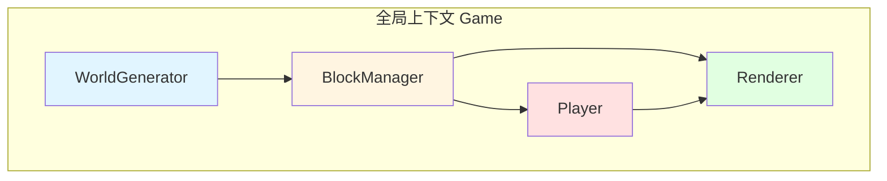

# 2D像素沙盒世界 - 技术架构文档

## 1. 架构设计



## 2. 技术栈说明
- **前端**：纯原生HTML5 + CSS + JavaScript (ES6+)
- **渲染**：Canvas 2D API
- **无第三方依赖**：零框架、零库

## 3. 模块划分与接口

### 3.1 WorldGenerator 模块
**职责**：仅负责原始地形数据生成

```javascript
class WorldGenerator {
  constructor(seed)
  getHeight(x)           // 获取某列地表高度
  getRawBlock(wx, wy)    // 获取原始生成方块（无玩家修改）
  getDecorations(chunkX) // 获取区块内装饰物列表
}
```

### 3.2 BlockManager 模块
**职责**：管理所有方块状态，包括玩家修改

```javascript
class BlockManager {
  constructor(worldGenerator)
  getBlock(wx, wy)       // 获取方块（含玩家修改）
  setBlock(wx, wy, type) // 设置方块（记录修改）
  getModifiedBlocks()    // 获取所有修改记录
}
```

### 3.3 Player 模块
**职责**：输入处理、物理、背包、交互逻辑

```javascript
class Player {
  constructor(game)
  update(dt)              // 更新物理与状态
  handleInput(keys)       // 处理键盘输入
  breakBlock(wx, wy)      // 破坏方块
  placeBlock(wx, wy)      // 放置方块
  switchHotbar(slot)      // 切换快捷栏
}
```

### 3.4 Renderer 模块
**职责**：所有Canvas绘制工作

```javascript
class Renderer {
  constructor(canvas, game)
  render()                // 完整渲染一帧
  drawWorld()             // 绘制地形
  drawPlayer()            // 绘制玩家
  drawHUD()               // 绘制HUD
  drawHighlight()         // 绘制鼠标高亮
}
```

## 4. 核心数据结构

### 方块类型定义
```javascript
const BLOCKS = {
  AIR: 0,
  GRASS: 1,
  DIRT: 2,
  STONE: 3,
  WOOD: 4,
  UNKNOWN: 5
}

const BLOCK_COLORS = {
  [BLOCKS.GRASS]: '#4CAF50',
  [BLOCKS.DIRT]: '#795548',
  [BLOCKS.STONE]: '#607D8B',
  [BLOCKS.WOOD]: '#8D6E63',
  [BLOCKS.UNKNOWN]: '#9C27B0'
}
```

### 装饰物数据
```javascript
Decoration {
  x: number,      // 世界坐标X
  y: number,      // 世界坐标Y
  type: 'bush'|'tree',
  drops: BLOCKS   // 破坏后掉落物
}
```

## 5. 性能指标
| 指标 | 目标值 |
|------|--------|
| FPS | 稳定60 |
| 单帧耗时 | <16ms |
| 输入延迟 | <100ms |
| 默认视口 | 25×18瓦片 |
