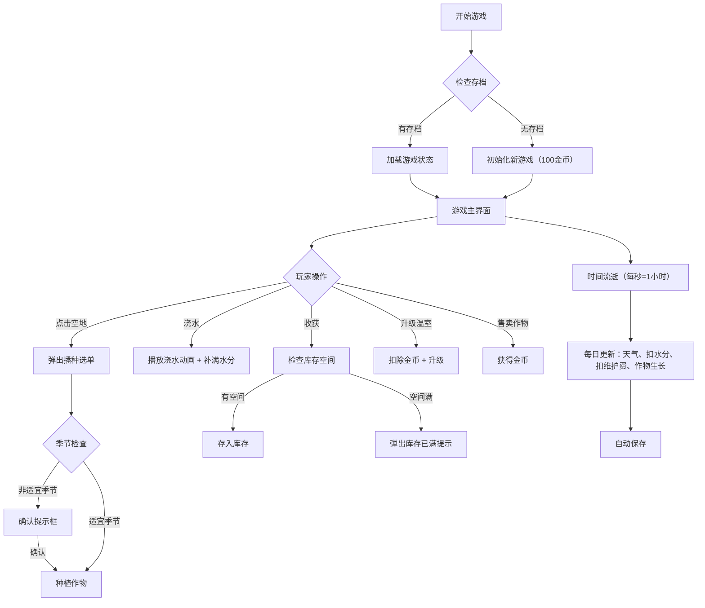

# 农场模拟游戏 - 产品需求文档

## 1. 产品概述

农场模拟游戏是一款基于浏览器的单文件休闲游戏，玩家可以种植作物、管理温室、应对天气变化，体验农场经营乐趣。

- 核心玩法：作物种植、环境管理、资源规划
- 目标用户：休闲游戏玩家，喜欢模拟经营类游戏的用户
- 技术特点：纯原生 HTML/CSS/JS，单文件运行，无需任何依赖

## 2. 核心功能

### 2.1 功能模块

1. **游戏主界面**：时间显示、金币、天气、季节信息，露天田地区域，温室区域
2. **作物系统**：5种作物（胡萝卜、番茄、小麦、草莓、南瓜），不同生长阶段和特性
3. **时间系统**：游戏内时间流逝，四季循环
4. **温室系统**：可升级温室，内部作物加速生长，不受天气影响
5. **天气系统**：随机天气（晴、阴、雨），影响作物水分
6. **库存与售卖**：收获作物存入库存，可售卖获取金币
7. **存档系统**：LocalStorage 自动保存游戏状态

### 2.2 页面详情

| 页面名称 | 模块名称 | 功能描述 |
|---------|---------|---------|
| 游戏主界面 | 状态栏 | 显示金币、季节、时间、天气图标，暂停/继续按钮 |
| 游戏主界面 | 露天田地 | 6×6网格，点击可播种/浇水/收获 |
| 游戏主界面 | 温室区域 | 显示温室状态、升级按钮、内部作物网格 |
| 游戏主界面 | 库存面板 | 显示作物库存，可售卖作物 |
| 游戏主界面 | 播种选单 | 点击空地弹出，选择要种植的作物 |

## 3. 核心流程

## 4. 用户界面设计

### 4.1 设计风格

- **主色调**：
  - 春季：#4CAF50（绿色系）
  - 夏季：#FFC107（黄色系）
  - 秋季：#FF9800（橙色系）
  - 冬季：#607D8B（蓝灰色系）
- **按钮风格**：圆角按钮，hover时有阴影和缩放效果
- **字体**：使用系统无衬线字体，清晰易读
- **布局**：卡片式布局，田地使用网格系统
- **图标**：使用 Emoji 作为图标（🌱🍅🌾🍓🎃☀️🌧️❄️）

### 4.2 页面设计概述

| 页面名称 | 模块名称 | UI 元素 |
|---------|---------|---------|
| 主界面 | 状态栏 | 背景色随季节变化，图标+数字显示，按钮有过渡动画 |
| 主界面 | 田地网格 | 6×6 CSS Grid，每个格子有hover效果，不同生长阶段用不同Emoji |
| 主界面 | 温室卡片 | 带边框的卡片，内部小网格，升级按钮突出显示 |
| 主界面 | 库存面板 | 滑入式面板，作物堆叠显示，售卖按钮 |
| 主界面 | 播种选单 | 模态框，作物列表带图标和说明 |

### 4.3 视觉反馈

- **浇水动画**：水滴图标闪烁，水花粒子效果
- **生长变化**：作物Emoji随阶段变化（🌱→小苗→成熟形态）
- **季节切换**：背景色平滑过渡动画
- **操作反馈**：按钮点击有缩放效果，成功操作有闪烁提示