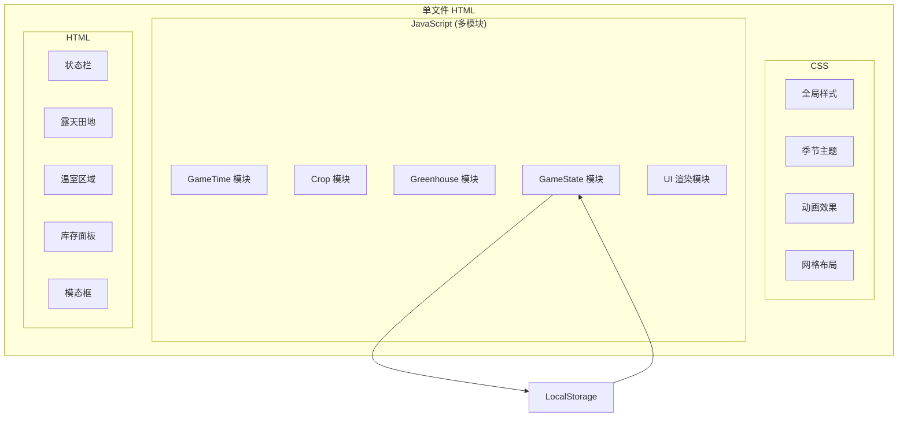

# 农场模拟游戏 - 技术架构文档

## 1. 架构设计



## 2. 技术说明

- **前端技术栈**：纯原生 HTML5 + CSS3 + ES6+ JavaScript
- **构建工具**：无，单文件直接运行
- **第三方库**：无，全部原生实现
- **数据存储**：LocalStorage 本地持久化
- **运行方式**：直接双击 farm.html 在浏览器中打开

## 3. 模块划分（多 script 块）

| 模块 | script 块位置 | 职责 |
|-----|--------------|------|
| GameTime | 第1个 script | 时间系统、四季循环、天气系统、时间驱动更新 |
| Crop | 第2个 script | 作物基类、5种具体作物实现、生长逻辑 |
| Greenhouse | 第3个 script | 温室管理、升级逻辑、维护费扣除 |
| GameState & UI | 第4个 script | 游戏状态、存档系统、UI渲染、事件处理 |

## 4. 核心数据结构

### 4.1 作物数据模型

```javascript
// 生长阶段枚举
const GrowthStage = {
    SEED: 'seed',
    SPROUT: 'sprout',
    MATURE: 'mature',
    WITHERED: 'withered'
};

// 作物基类
class Crop {
    name;
    stage = GrowthStage.SEED;
    currentDay = 0;
    stageDays; // 各阶段天数数组
    suitableSeasons; // 适宜季节数组
    canOverwinter = false;
    waterConsumption = 100;
    currentWater = 100;
    health = 100;
    zeroWaterDays = 0;
    isInGreenhouse = false;
    
    grow(timeMultiplier);
    water();
    harvest();
}
```

### 4.2 时间系统数据模型

```javascript
const Season = {
    SPRING: 'spring',
    SUMMER: 'summer',
    AUTUMN: 'autumn',
    WINTER: 'winter'
};

const Weather = {
    SUNNY: 'sunny',
    CLOUDY: 'cloudy',
    RAINY: 'rainy'
};

class GameTime {
    hour = 0;
    day = 1;
    season = Season.SPRING;
    year = 1;
    weather = Weather.SUNNY;
    isPaused = false;
    realInterval; // 1秒 = 1游戏小时
    
    tick();
    nextDay();
    nextSeason();
    generateWeather();
}
```

### 4.3 温室数据模型

```javascript
class Greenhouse {
    level = 0; // 0 = 未建造
    capacity = [0, 4, 6, 9];
    upgradeCost = [100, 300, 500];
    maintenanceCost = [0, 5, 10, 15];
    slots = []; // 内部作物格子
    isActive = true;
    
    build();
    upgrade();
    deductMaintenance();
    getGrowthMultiplier();
}
```

## 5. 游戏常量定义

| 常量 | 值 | 说明 |
|-----|---|------|
| 现实秒/游戏小时 | 1 秒 | 游戏速度：现实1秒 = 游戏内1小时 |
| 季节天数 | 30 天 | 每个季节持续的游戏天数 |
| 初始金币 | 100 | 新游戏初始金币 |
| 库存槽位 | 20 | 最大库存种类 |
| 堆叠上限 | 99 | 每种作物最大堆叠数 |
| 露天田地 | 6×6 | 36个格子 |
| 每日水分消耗 | 100 | 所有作物统一 |
| 0水分健康惩罚 | -20/天 | 水分=0时每日扣健康 |
| 温室生长倍率 | 1.2x | 温室中作物生长加速 |
| 反季生长减速 | 0.5x | 反季露天种植速度减半 |
| 当季售价 | 10 金币 | 当季作物售卖价格 |
| 反季售价 | 15 金币 | 反季作物售卖价格 |

## 6. 关键算法

### 6.1 天气生成算法

```
基础概率:
  - 晴天: 60%
  - 阴天: 10%  
  - 雨天: 30%

春季调整:
  - 雨天概率上调至 45%
  - 其余按比例分配
```

### 6.2 作物生长计算

```
生长速率 = 基础速率 × 季节系数 × 温室系数

季节系数:
  - 适宜季节: 1.0
  - 非适宜季节: 0.5
  - 冬季且不可越冬: 0 (直接枯萎)
  
温室系数:
  - 温室内且温室活跃: 1.2
  - 温室内但停摆: 按露天计算
  - 露天: 1.0
```

### 6.3 水分与健康计算

```
每日更新:
  if 雨天且露天:
    currentWater = 100
  else if 未浇水:
    currentWater = max(0, currentWater - 100)
  
  if currentWater === 0:
    zeroWaterDays++
    health = max(0, health - 20)
    if zeroWaterDays >= 2:
      枯萎消失
  else:
    zeroWaterDays = 0
```