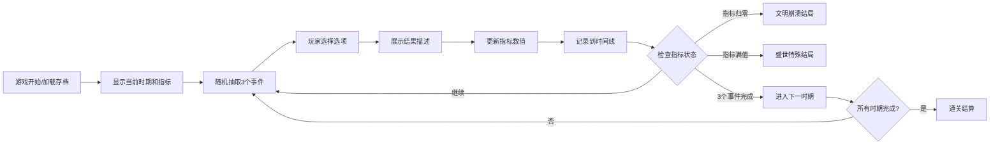

## 1. 产品概述

历史题材文字策略游戏，玩家扮演文明的"无形之手"，从公元前3000年开始经历6个历史时期，通过决策影响文明发展。

- 核心玩法：事件选择策略游戏，通过决策影响军事、经济、文化、民心四项指标
- 目标用户：历史爱好者、策略游戏玩家

## 2. 核心功能

### 2.1 用户角色

| 角色 | 注册方式 | 核心权限 |
|------|----------|----------|
| 玩家 | 无需注册 | 进行游戏决策，查看历史时间线 |

### 2.2 功能模块

1. **游戏主界面**：指标显示、时期信息、事件描述、选项按钮
2. **历史时间线**：记录所有时期切换和关键决策
3. **进度保存**：自动保存游戏状态，刷新页面可恢复
4. **结局系统**：崩溃结局、盛世结局、通关结算

### 2.3 页面详情

| 页面名称 | 模块名称 | 功能描述 |
|----------|----------|----------|
| 游戏主界面 | 指标面板 | 实时显示四项核心指标的数值和进度条 |
| 游戏主界面 | 时期显示 | 显示当前历史时期名称，配合不同的UI色调 |
| 游戏主界面 | 事件区域 | 显示事件描述和3-4个选项按钮 |
| 游戏主界面 | 结果展示 | 点击选项后展示文学性结果描述 |
| 侧边栏 | 历史时间线 | 时间轴形式记录所有时期和决策，可滚动查看 |

## 3. 核心流程

## 4. 用户界面设计

### 4.1 设计风格

- **主色调**：古朴厚重的棕褐色系，配合6个时期的差异化色调
  - 古埃及：金色+土黄
  - 古希腊：白色+蓝色
  - 古罗马：紫色+红色
  - 中世纪：深灰+暗红
  - 大航海：深蓝+金色
  - 工业革命：深灰+铜色
- **按钮风格**：复古浮雕风格，带细微纹理
- **字体**：使用Google Fonts的历史风格字体（如Cinzel、Merriweather）
- **布局风格**：卷轴式布局，仿羊皮纸质感
- **装饰元素**：时期相关的象征性图标（金字塔、柱式、盾牌、城堡、船锚、齿轮）

### 4.2 页面设计概览

| 页面名称 | 模块名称 | UI元素 |
|----------|----------|--------|
| 游戏主界面 | 指标面板 | 进度条动画、数值变化动效、色彩编码 |
| 游戏主界面 | 事件区域 | 羊皮纸背景、渐入动画、悬停效果 |
| 侧边栏 | 时间线 | 垂直时间轴、节点标记、滚动动画 |

### 4.3 响应式

- Desktop-first设计，适配1366×768及以上分辨率
- 使用Flexbox和Grid布局确保在不同分辨率下的显示效果
- 侧边栏在小屏幕下可折叠

### 4.4 音效设计

- 使用Web Audio API生成提示音
- 选项选择：短促上升音
- 指标大幅变化：强调音
- 失败结局：低沉下降音
- 盛世结局：辉煌上升音
