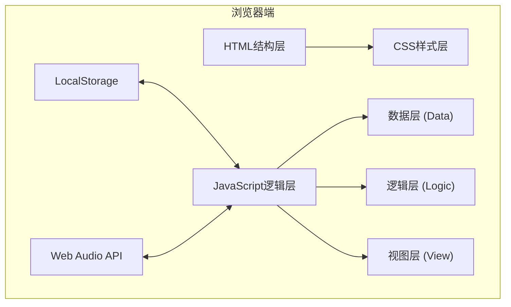

## 1. 架构设计



## 2. 技术描述

- **前端**：原生HTML5 + CSS3 + JavaScript (ES6+)
- **构建方式**：单HTML文件，无需构建工具
- **数据存储**：浏览器LocalStorage
- **音效系统**：Web Audio API生成合成音效

## 3. 代码结构

### 3.1 模块化组织

| 模块 | 职责 | 核心功能 |
|------|------|----------|
| 数据层 (Data) | 静态数据定义 | 时期配置、事件池定义 |
| 逻辑层 (Logic) | 游戏核心逻辑 | 指标计算、回合推进、状态管理 |
| 视图层 (View) | UI渲染与交互 | DOM操作、事件绑定、动画效果 |
| 音频模块 (Audio) | 音效系统 | Web Audio API音效生成 |
| 存储模块 (Storage) | 持久化存储 | 保存/加载游戏状态 |

### 3.2 核心数据结构

```javascript
// 游戏状态
GameState = {
  currentEra: number,        // 当前时期索引
  stats: {                   // 四项核心指标
    military: number,
    economy: number,
    culture: number,
    people: number
  },
  eventPoolState: [],        // 已使用的事件记录
  timeline: [],              // 时间线记录
  eventsInEra: number        // 当前时期已完成事件数
}

// 时期配置
Era = {
  id: string,
  name: string,
  year: string,
  color: string,
  bgColor: string,
  icon: string
}

// 事件定义
Event = {
  id: string,
  era: string[],             // 可出现的时期
  title: string,
  description: string,
  options: [
    {
      text: string,
      result: string,
      effects: { military, economy, culture, people }
    }
  ]
}
```

## 4. 时期定义

| 时期ID | 名称 | 起始年份 | 主色调 | 装饰元素 |
|--------|------|----------|--------|----------|
| egypt | 古埃及时期 | 公元前3000年 | #D4AF37 | 金字塔 |
| greece | 古希腊时期 | 公元前800年 | #4169E1 | 多立克柱 |
| rome | 古罗马时期 | 公元前509年 | #800080 | 雄鹰盾牌 |
| medieval | 中世纪时期 | 公元476年 | #8B0000 | 城堡 |
| exploration | 大航海时期 | 公元1453年 | #00008B | 船锚 |
| industrial | 工业革命时期 | 公元1760年 | #708090 | 齿轮 |

## 5. 事件池规范

- 事件总数：不少于20个
- 每个事件：包含3-4个选项
- 每个时期：随机抽取3个事件
- 效果值范围：-20 到 +20
- 事件需分布在不同时期

## 6. 存储规范

### 6.1 LocalStorage键名

```
civilization_game_state - 游戏主状态
civilization_timeline - 时间线记录
```

### 6.2 自动保存触发时机
- 每次做出选择后
- 时期切换时
- 页面卸载前

### 6.3 数据清理
- 游戏重新开始时清除旧数据
- 结局后保留时间线记录
