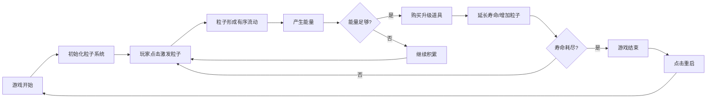

## 1. 产品概述
熵逆转 - 一款以宇宙热寂为背景的科幻题材网页游戏，玩家通过激发死寂粒子形成有序结构产生能量，购买升级延长宇宙寿命，在绝望中寻找希望。
- 核心玩法：点击激发粒子、积累能量、购买升级道具、对抗宇宙熵增
- 目标用户：喜欢科幻题材、策略类休闲游戏的玩家

## 2. 核心功能

### 2.1 功能模块
1. **核心游戏引擎**：粒子物理系统、能量计算、寿命倒计时
2. **渲染系统**：Canvas粒子渲染、量子模糊效果、黑洞引力特效
3. **UI管理系统**：实时状态显示、升级购买面板、游戏结束界面
4. **道具系统**：熵逆转器升级、黑洞发生器道具
5. **量子涨落系统**：随机出现可点击的量子涨落事件

### 2.2 页面详情
| 页面名称 | 模块名称 | 功能描述 |
|---------|---------|----------|
| 游戏主界面 | Canvas渲染层 | 200+粒子实时渲染、黑洞特效、能量波动画 |
| 游戏主界面 | UI面板 | 能量值、剩余寿命、升级等级、冷却时间显示 |
| 游戏主界面 | 升级按钮 | 熵逆转器购买、黑洞发生器激活 |
| 游戏结束界面 | 重启遮罩 | 半透明遮罩、重启宇宙按钮 |

## 3. 核心流程

## 4. 用户界面设计

### 4.1 设计风格
- **主色调**：深空蓝(#0a0a1a)、量子青(#00d4ff)、能量紫(#7c3aed)、死寂灰(#374151)
- **配色原则**：完全冷色调，无任何暖色（红、橙、黄）
- **字体**：Orbitron - 科幻风格字体，通过@font-face引入并localStorage缓存
- **视觉风格**：深空绝望与希望共存，深色宇宙背景，粒子发光轨迹

### 4.2 页面设计概览
| 页面名称 | 模块名称 | UI元素 |
|---------|---------|--------|
| 游戏主界面 | Canvas层 | 深色星空背景、发光粒子轨迹、黑洞吸收特效、量子涨落闪烁 |
| 游戏主界面 | UI面板 | 半透明深蓝面板、发光文字、科幻风格按钮 |
| 游戏结束界面 | 重启层 | 半透明黑色遮罩、居中重启按钮 |

### 4.3 响应式设计
- **桌面优先**：Canvas自适应窗口大小
- **移动端**：完全支持触摸操作，阻止默认滚动/缩放手势
- **触摸等价**：触摸点与鼠标点击行为完全一致

## 5. 性能要求
- 200个活跃粒子 + 1个黑洞时帧率 ≥ 30 FPS
- requestAnimationFrame实时测量FPS并控制台输出
- Canvas渲染优化，避免不必要的重绘
