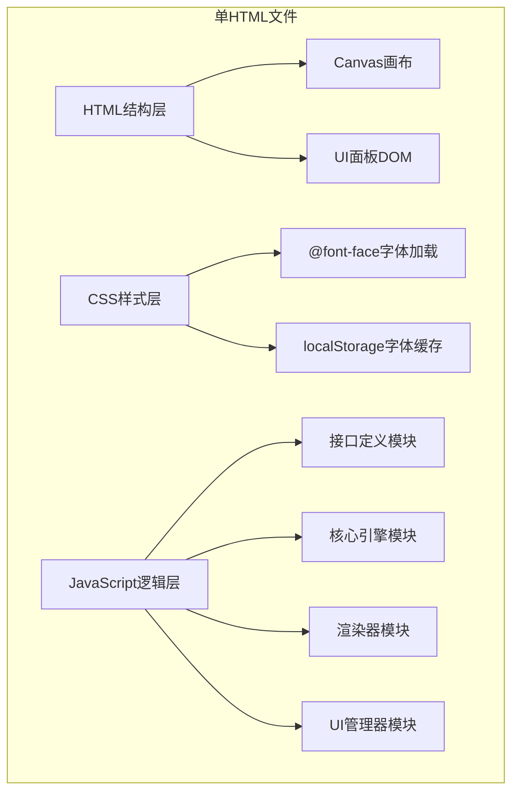

## 1. 架构设计


## 2. 技术描述
- **前端技术栈**：纯原生HTML5 + CSS3 + JavaScript (ES6+)
- **渲染引擎**：Canvas 2D API
- **模块组织**：IIFE立即执行函数表达式 + 对象字面量模式
- **外部依赖**：无任何外部依赖，所有代码内联
- **输出产物**：单个可直接运行的index.html文件

## 3. 模块架构定义

### 3.1 接口定义模块 (Interfaces)
- 详细注释所有方法的参数、返回值、副作用
- 定义粒子、黑洞、能量、涨落等核心数据结构
- 为多文件协同修改提供清晰接口规范

### 3.2 核心引擎模块 (Engine)
- 粒子物理系统：位置、速度、加速度计算
- 能量系统：有序度计算、能量产出
- 寿命系统：倒计时、熵增速率计算
- 道具系统：熵逆转器、黑洞发生器逻辑
- 量子涨落系统：随机生成、点击检测

### 3.3 渲染器模块 (Renderer)
- Canvas粒子渲染：量子模糊效果
- 轨迹渲染：有序粒子发光路径
- 黑洞渲染：引力场视觉效果
- 能量波渲染：点击反馈特效
- 量子涨落渲染：闪烁动画

### 3.4 UI管理器模块 (UIManager)
- 实时状态更新：能量、寿命、等级、冷却
- 按钮交互：升级购买、道具激活
- 游戏结束界面：遮罩、重启按钮
- 字体缓存：Orbitron字体localStorage存储

## 4. 核心数据结构

### 4.1 粒子对象
```javascript
interface Particle {
    x: number;           // X坐标
    y: number;           // Y坐标
    vx: number;          // X速度
    vy: number;          // Y速度
    order: number;       // 有序度 0-1
    energy: number;      // 能量值
    trail: Array<{x, y}>;// 轨迹点数组
}
```

### 4.2 黑洞对象
```javascript
interface BlackHole {
    x: number;           // X坐标
    y: number;           // Y坐标
    radius: number;      // 影响半径
    strength: number;    // 引力强度
    duration: number;    // 剩余持续时间(ms)
}
```

### 4.3 量子涨落对象
```javascript
interface Fluctuation {
    x: number;
    y: number;
    lifetime: number;    // 剩余寿命(ms)
    maxLifetime: number; // 最大寿命
    size: number;
}
```

## 5. 关键技术实现

### 5.1 量子模糊效果
- 多图层叠加渲染
- 随机位置偏移 + 透明度渐变
- Gaussian blur模拟量子不确定性

### 5.2 黑洞引力物理
```
引力公式: F = G * m1 * m2 / r²
实际简化: acceleration = strength / (distance² + epsilon)
方向: 粒子指向黑洞中心
```

### 5.3 FPS性能监控
- requestAnimationFrame时间戳计算
- 滑动窗口平均帧率
- 控制台实时输出

### 5.4 移动端触摸支持
- touchstart/touchmove/touchend事件
- preventDefault阻止默认行为
- 触摸点坐标映射到Canvas

### 5.5 字体缓存机制
- fetch下载字体文件
- base64编码存储到localStorage
- 二次加载直接从缓存读取
