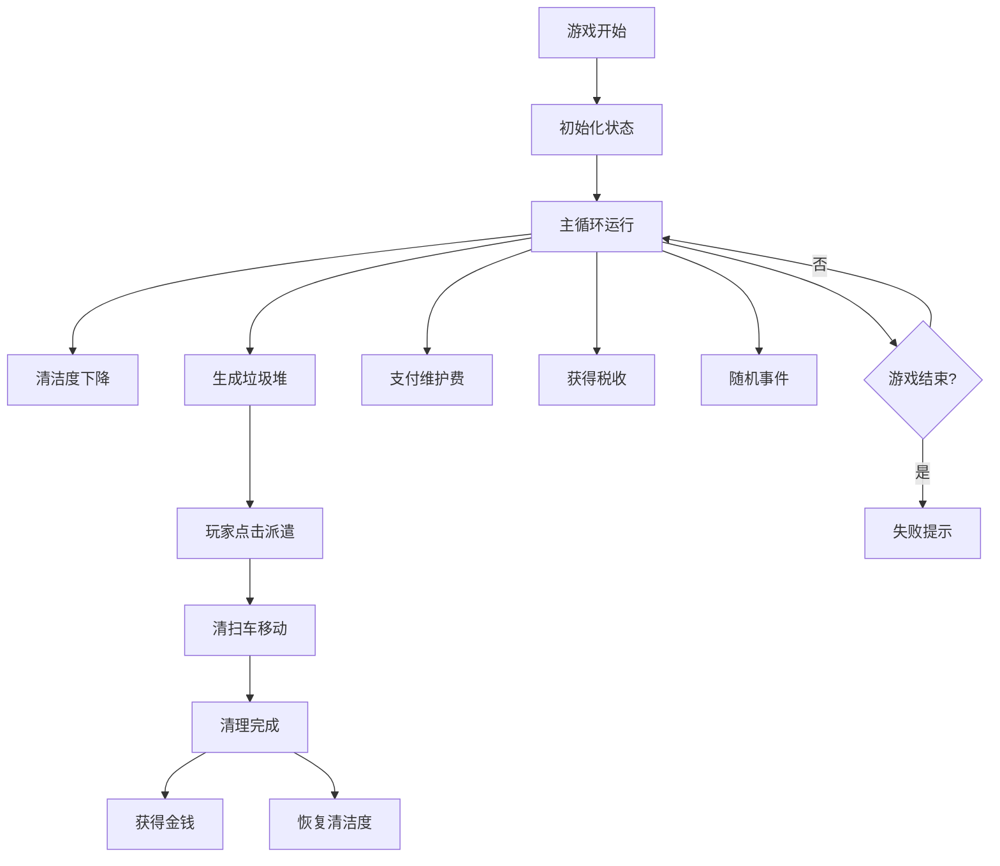

## 1. 产品概述

现代都市背景的街道清洁度管理小游戏，玩家通过管理清扫车队、维护城市清洁度、平衡收支来经营城市。

- 主要目的：提供策略性休闲游戏体验，考验玩家资源分配和应急处理能力
- 目标用户：喜欢模拟经营类游戏的玩家

## 2. 核心功能

### 2.1 用户角色
| 角色 | 注册方式 | 核心权限 |
|------|----------|----------|
| 玩家 | 无需注册 | 完整游戏体验，进度本地存储 |

### 2.2 功能模块
1. **游戏主界面**：12x8网格地图、状态面板、消息日志
2. **城市管理系统**：清洁度计算、垃圾堆生成、清扫车派遣
3. **经济系统**：金钱收支、维护费用、税收计算
4. **升级系统**：车辆属性升级、购买新车
5. **随机事件系统**：事件触发、效果应用
6. **数据持久化**：自动存档、进度恢复

### 2.3 页面详情
| 页面名称 | 模块名称 | 功能描述 |
|----------|----------|----------|
| 游戏主界面 | 地图网格 | 12x8格子展示道路、建筑、垃圾堆、清扫车 |
| 游戏主界面 | 状态面板 | 清洁度进度条、满意度、金钱、车辆状态列表 |
| 游戏主界面 | 消息日志 | 滚动显示最近10条事件记录 |
| 游戏主界面 | 升级面板 | 清扫速度、移动速度、容量升级选项 |
| 游戏主界面 | 控制按钮 | 新游戏、暂停/继续 |

## 3. 核心流程

玩家进入游戏 → 初始化城市状态 → 游戏主循环运行
  ↓
清洁度自然下降 + 随机生成垃圾堆 → 玩家点击垃圾堆派遣清扫车
  ↓
清扫车移动 → 清理垃圾堆 → 获得金钱 + 恢复清洁度
  ↓
支付维护费 + 获得税收 → 升级车辆/购买新车
  ↓
随机事件触发 → 应对挑战
  ↓
清洁度归零/满意度归零/破产 → 游戏失败

## 4. 用户界面设计

### 4.1 设计风格
- 主色调：蓝灰色系（#2c3e50, #34495e, #3498db）
- 辅助色：绿色表示清洁度、红色表示警告、金色表示金钱
- 按钮样式：圆角矩形，悬停有阴影和缩放效果
- 字体：现代无衬线字体，清晰易读
- 布局：左右分栏（地图+控制面板），移动端垂直堆叠
- 图标：简洁线条风格，使用emoji或SVG

### 4.2 页面设计概述
| 页面名称 | 模块名称 | UI元素 |
|----------|----------|--------|
| 主界面 | 地图网格 | 12x8网格，道路浅灰、建筑深灰、垃圾堆红色、清扫车蓝色 |
| 主界面 | 状态面板 | 进度条带数字显示，车辆状态带进度环 |
| 主界面 | 消息日志 | 半透明背景，滚动显示，时间戳 |
| 主界面 | 升级面板 | 卡片式布局，升级按钮带费用显示 |

### 4.3 响应式
- 桌面端：左右布局，地图占2/3，控制面板占1/3
- 平板端：上下布局，地图在上，控制面板在下
- 移动端：垂直堆叠，触控优化，按钮最小48px，增加间距

### 4.4 交互细节
- 所有可交互元素悬停显示tooltip
- 垃圾堆点击高亮，显示清理进度环
- 车辆移动平滑动画
- 状态变化数字跳动效果
