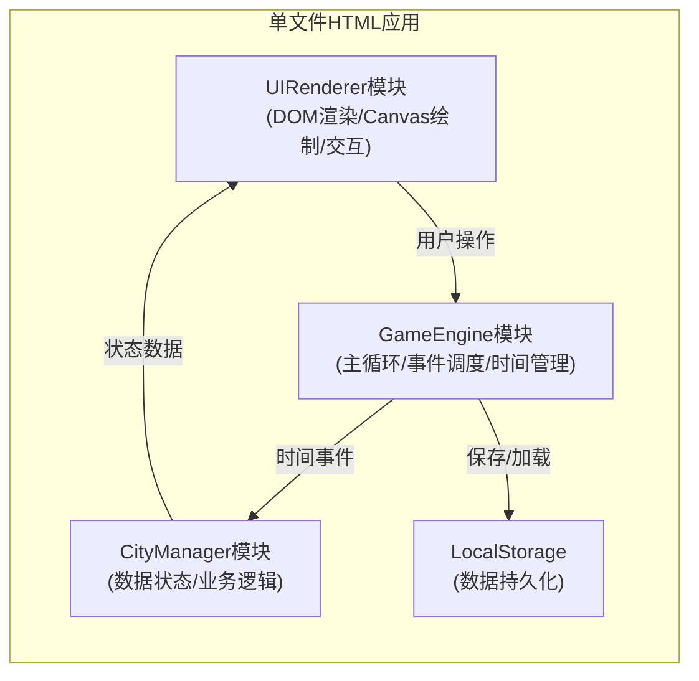

## 1. 架构设计



## 2. 技术描述

- 前端：纯HTML + CSS + JavaScript (ES6+)
- 渲染：Canvas 2D用于地图网格渲染，DOM用于UI面板
- 模块化：使用IIFE（立即执行函数表达式）实现命名空间隔离
- 数据持久化：localStorage
- 构建工具：无（单文件，直接运行）

## 3. 模块定义

### 3.1 CityManager 模块
**职责**：管理所有游戏数据状态，提供纯数据操作接口

**数据结构**：
```javascript
{
  grid: { width: 12, height: 8, cells: Array },
  cleanliness: Number,
  satisfaction: Number,
  money: Number,
  vehicles: Array,
  garbagePiles: Array,
  upgrades: { cleaningSpeed: Number, moveSpeed: Number, capacity: Number },
  gameTime: Number,
  lastEventTime: Number,
  highCleanlinessStartTime: Number,
  lowCleanlinessStartTime: Number,
  lastTaxTime: Number,
  messages: Array,
  isGameOver: Boolean
}
```

**公开接口**：
- `getState()` - 获取完整状态
- `loadState(state)` - 加载状态
- `update(deltaTime)` - 更新状态（每帧调用）
- `assignVehicleToGarbage(vehicleId, garbageId)` - 派遣车辆
- `cancelVehicleTask(vehicleId)` - 取消任务
- `purchaseVehicle()` - 购买新车
- `upgrade(type)` - 升级属性
- `clickGarbage(garbageId)` - 点击垃圾堆（自动派遣）
- `selectVehicle(vehicleId)` - 选中车辆

### 3.2 GameEngine 模块
**职责**：管理游戏主循环、时间流逝、事件触发调度

**公开接口**：
- `start()` - 启动游戏
- `pause()` - 暂停游戏
- `resume()` - 恢复游戏
- `newGame()` - 新游戏
- `onUpdate(callback)` - 注册更新回调
- `onRender(callback)` - 注册渲染回调

### 3.3 UIRenderer 模块
**职责**：负责所有DOM更新、Canvas绘制、动画、tooltip

**公开接口**：
- `render(state)` - 渲染完整状态
- `showTooltip(x, y, content)` - 显示提示
- `hideTooltip()` - 隐藏提示
- `addMessage(text)` - 添加消息
- `showGameOver(reason)` - 显示游戏结束

## 4. 关键算法

### 4.1 路径检查
- 检查两点连线上的所有格子是否都是道路
- 使用Bresenham算法计算路径上的格子

### 4.2 最近车辆查找
- 计算所有空闲车辆到目标的距离
- 选择距离最近的车辆

### 4.3 清洁度计算
- 基础下降：每秒0.2%
- 垃圾堆影响：每个堆每秒0.5%（影响自身及相邻格）

### 4.4 随机事件概率
- 基础概率：每30秒触发
- 坏事概率：与清洁度负相关（(100 - cleanliness) / 100）

## 5. 性能优化

- Canvas分层渲染（静态网格层 + 动态物体层）
- 脏矩形渲染（仅更新变化区域）
- 事件节流（UI更新不超过每帧一次）
- 对象池复用（避免频繁创建销毁）
