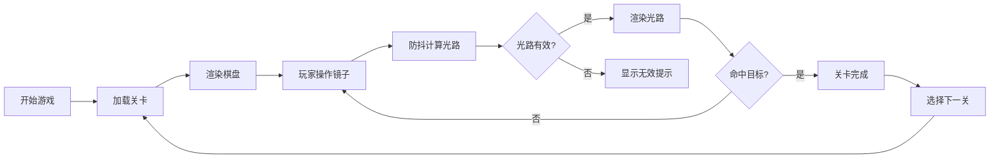

## 1. 产品概述

光线迷宫（Light Maze）是一款纯前端休闲益智游戏，玩家通过放置和旋转镜子引导光线到达目标点。
- 核心玩法：在8×8网格棋盘上操作镜子反射光线，锻炼空间思维和逻辑推理能力
- 目标用户：所有年龄段益智游戏爱好者，特别适合喜欢解谜类游戏的玩家

## 2. 核心功能

### 2.1 功能模块

1. **游戏主界面**：8×8网格棋盘、光线实时渲染、镜子/棱镜操作区
2. **关卡系统**：5个手工设计递增难度关卡 + 随机挑战模式
3. **操作控制**：镜子放置、旋转、删除、撤销、重置功能
4. **光线追踪**：实时计算光路、反射检测、循环检测、棱镜分光机制

### 2.2 页面详情

| 页面名称 | 模块名称 | 功能描述 |
|-----------|-------------|---------------------|
| 游戏主页面 | 棋盘区域 | 8×8自适应网格，显示光源、目标、镜子、棱镜、障碍物 |
| 游戏主页面 | 光线渲染 | 实时绘制光路，分光路径用不同透明度区分 |
| 游戏主页面 | 道具栏 | 显示可用镜子/棱镜数量，支持拖拽放置 |
| 游戏主页面 | 控制面板 | 撤销、重置、关卡选择、随机挑战按钮 |
| 游戏主页面 | 状态提示 | 显示步数、路径警告、循环检测提示 |

## 3. 核心流程

## 4. 用户界面设计

### 4.1 设计风格
- **主色调**：深蓝色背景（#0a1628），霓虹蓝光线（#00f5ff），金色目标（#ffd700）
- **镜子样式**：银色金属质感，3D倾斜效果
- **字体**：使用 'Segoe UI', system-ui, sans-serif，现代简洁风格
- **布局**：居中网格布局，顶部控制栏，底部状态信息
- **动画**：光线流动动画，镜子旋转过渡，成功时光效闪烁

### 4.2 页面设计概述

| 页面名称 | 模块名称 | UI元素 |
|-----------|-------------|-------------|
| 游戏主页面 | 棋盘区域 | 深蓝色网格，霓虹蓝光源，金色目标点，银色镜子，棱镜彩虹效果 |
| 游戏主页面 | 光线渲染 | 实线表示有效光路，红色虚线表示未命中路径，分光用透明度区分 |
| 游戏主页面 | 道具栏 | 圆角矩形按钮，显示剩余数量，悬停放大效果 |
| 游戏主页面 | 控制面板 | 玻璃拟态风格按钮，图标+文字组合 |

### 4.3 响应式设计
- **桌面端（1280px+）**：网格最大64px，控制栏水平排列
- **移动端（375px）**：网格最小32px，控制栏垂直堆叠
- **触屏优化**：增大点击区域，支持长按删除，拖拽放置
- **居中布局**：棋盘始终在视口内居中，不溢出

### 4.4 性能要求
- 首帧渲染 < 500ms
- 光线追踪计算 < 16ms/次
- 支持防抖（100ms）避免频繁计算
