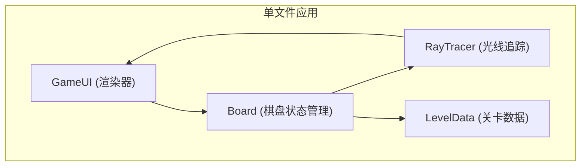

## 1. 架构设计



## 2. 技术描述
- **前端技术栈**：纯原生HTML5 + CSS3 + JavaScript (ES6+)
- **渲染方式**：Canvas 2D API 进行光线渲染 + DOM元素渲染棋盘
- **构建方式**：单文件自执行函数封装，无全局变量污染
- **无外部依赖**：不使用任何第三方库或框架

## 3. 模块划分

### 3.1 核心类结构

| 类名 | 职责 | 核心方法 |
|------|------|----------|
| LevelData | 关卡数据管理 | getLevel(), generateRandomLevel() |
| Board | 棋盘状态管理 | placeMirror(), rotateMirror(), removeMirror(), undo(), reset() |
| RayTracer | 光线追踪计算 | trace(), detectLoop(), calculatePath() |
| GameUI | 渲染与交互 | renderBoard(), renderLightPath(), bindEvents() |

### 3.2 数据结构

#### 关卡配置结构：
```javascript
{
  id: 1,
  name: "入门",
  source: { edge: 'left', offset: 3 },
  target: { edge: 'right', offset: 3 },
  maxMirrors: 2,
  obstacles: [[2, 3],
  prisms: [[4, 4]]
}
```

#### 光路点结构：
```javascript
{
  x: number,
  y: number,
  direction: 'up'|'down'|'left'|'right',
  isSplit: boolean
}
```

## 4. 关键算法

### 4.1 光线追踪算法
- 方向向量表示：上(0,-1)、下(0,1)、左(-1,0)、右(1,0)
- 镜子反射矩阵：
  - '/'：(dx, dy) → (-dy, -dx)
  - '\'：(dx, dy) → (dy, dx)
- 棱镜分光：直行 + 90度转向
- 循环检测：记录访问过的(位置+方向)组合，超过8次反射判定为无效

### 4.2 防抖机制
- 操作后延迟100ms计算光路
- 连续操作时清除之前的timeout

## 5. 性能优化
- 光线追踪限制：步数上限50步
- 反射次数上限：8次
- 循环检测：防止无限反射

## 6. 响应式布局
- 格子大小：Math.min(64, Math.max(32, viewportWidth / 10))
- 使用CSS Grid + vmin单位实现自适应
- 媒体查询适配移动端触摸操作
