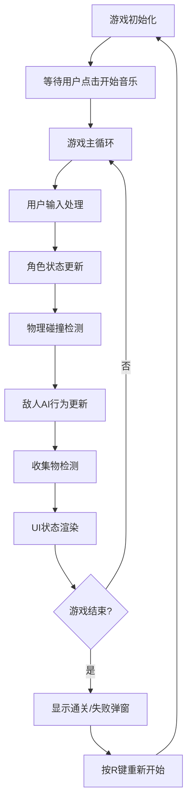

## 1. 产品概述

横版像素风格动作冒险游戏核心玩法原型，使用Canvas渲染实现一个功能完整的2D平台跳跃游戏。
- 主要目的：展示像素风格游戏开发技术，包含玩家控制、敌人AI、关卡设计、音效系统等核心游戏机制
- 目标用户：游戏开发者、像素风格游戏爱好者、HTML5 Canvas技术学习者
- 产品价值：提供一个可直接运行的完整游戏原型，涵盖现代2D游戏开发的核心技术点

## 2. 核心功能

### 2.1 功能模块
1. **游戏主界面**：Canvas渲染区域、UI状态显示（生命值、分数、收集进度）
2. **玩家控制系统**：角色状态管理（待机/行走/跳跃/攻击）、物理引擎（重力/碰撞）
3. **敌人AI系统**：三种敌人类型（巡逻型/飞行型/追击型）、碰撞检测与伤害机制
4. **关卡系统**：多屏幕地图、平台跳跃、视差滚动背景
5. **收集系统**：能量球收集、传送门触发、分数统计
6. **音效系统**：Web Audio API生成8-bit风格音效、背景音乐循环
7. **移动端适配**：虚拟摇杆、触屏操作支持

### 2.2 功能详情
| 模块名称 | 功能描述 | 技术要点 |
|---------|---------|---------|
| Canvas渲染 | 960x540画布，16:9比例，等比缩放居中 | viewport计算、坐标映射 |
| 玩家角色 | 四种状态像素绘制、物理移动、攻击判定 | 状态机、碰撞检测、粒子效果 |
| 敌人系统 | 三种AI行为模式、不少于8个敌人分布 | 路径巡逻、目标追踪、碰撞伤害 |
| 关卡设计 | 3个屏幕宽度、高台与狭窄通道、视差背景 | 相机跟随、多层滚动、地图数据 |
| 收集要素 | 15个能量球、传送门通关、分数显示 | 碰撞检测、进度追踪、UI更新 |
| 生命值系统 | 3点生命、心形显示、无敌闪烁、游戏结束 | 状态管理、动画效果、重启机制 |
| 音效系统 | 5种音效、背景音乐循环、静音按钮 | Web Audio API、音频合成 |
| 移动端适配 | 虚拟方向键、触屏操作、双指缩放禁用 | Touch事件、手势识别 |

## 3. 核心流程

## 4. 用户界面设计

### 4.1 设计风格
- **整体风格**：复古像素风格，8-bit游戏美学
- **主色调**：深蓝色背景 #1a1a2e，像素角色鲜艳对比色
- **辅助色**：玩家蓝色 #4ecdc4，敌人红色 #ff6b6b，收集物黄色 #ffe66d
- **字体**：像素风格等宽字体，中文使用系统默认黑体
- **视觉元素**：像素化边框、纯色块、简单几何形状

### 4.2 界面布局
| 区域 | 元素 | 位置 |
|------|------|------|
| 左上角 | 生命值心形图标 | (20, 20) |
| 右上角 | 分数显示 | (画布宽-120, 20) |
| 右上角 | 收集进度 | (画布宽-120, 50) |
| 右下角 | 攻击冷却图标 | (画布宽-60, 画布高-60) |
| 底部 | 移动端虚拟按键 | 底部居中分布 |
| 中央 | 通关/失败弹窗 | 居中半透明遮罩 |

### 4.3 响应式设计
- 桌面端：键盘操作，Canvas居中显示
- 移动端：触屏虚拟按键，禁止双指缩放页面
- 全平台：保持16:9画布比例，等比缩放不拉伸
- 坐标映射：触摸/鼠标位置正确转换为Canvas内部坐标

### 4.4 动画与特效
- 角色状态切换：像素帧动画效果
- 跳跃落地：灰尘粒子特效
- 受伤无敌：角色闪烁效果
- 攻击冷却：环形进度条动画
- 收集物品：发光缩放效果
