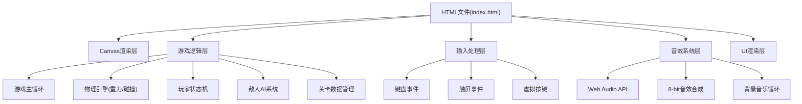

## 1. 架构设计



## 2. 技术选型

- **前端技术**: 纯HTML5 + Canvas + 原生JavaScript (ES6+)
- **渲染引擎**: Canvas 2D Context
- **音频系统**: Web Audio API (AudioContext)
- **构建工具**: 无，单HTML文件直接运行
- **外部依赖**: 无，零依赖纯原生实现

## 3. 核心数据结构

### 3.1 玩家对象
```typescript
interface Player {
  x: number;
  y: number;
  vx: number;
  vy: number;
  width: number;
  height: number;
  state: 'idle' | 'walk' | 'jump' | 'attack';
  health: number;
  maxHealth: number;
  facing: 1 | -1;
  isGrounded: boolean;
  isAttacking: boolean;
  attackCooldown: number;
  attackTimer: number;
  isInvincible: boolean;
  invincibleTimer: number;
}
```

### 3.2 敌人对象
```typescript
interface Enemy {
  x: number;
  y: number;
  vx: number;
  vy: number;
  width: number;
  height: number;
  type: 'patrol' | 'flying' | 'chase';
  health: number;
  facing: 1 | -1;
  patrolStart?: number;
  patrolEnd?: number;
  floatOrigin?: number;
  floatRange?: number;
  chaseRange?: number;
  speed?: number;
}
```

### 3.3 平台对象
```typescript
interface Platform {
  x: number;
  y: number;
  width: number;
  height: number;
  type: 'ground' | 'platform' | 'wall' | 'narrow';
}
```

### 3.4 收集物对象
```typescript
interface Collectible {
  x: number;
  y: number;
  radius: number;
  collected: boolean;
  type: 'energy';
}
```

## 4. 游戏常量定义

| 常量名 | 值 | 说明 |
|-------|-----|------|
| CANVAS_WIDTH | 960 | 画布宽度 |
| CANVAS_HEIGHT | 540 | 画布高度 |
| GRAVITY | 980 | 重力加速度 (像素/秒²) |
| MOVE_SPEED | 200 | 移动速度 (像素/秒) |
| JUMP_VELOCITY | -420 | 跳跃初始速度 (像素/秒) |
| ATTACK_DURATION | 0.3 | 攻击持续时间 (秒) |
| ATTACK_COOLDOWN | 0.5 | 攻击冷却时间 (秒) |
| INVINCIBLE_DURATION | 1.5 | 无敌时间 (秒) |
| MAP_WIDTH | 3000 | 地图总宽度 |
| TOTAL_COLLECTIBLES | 15 | 能量球总数 |
| ENEMY_COUNT | 9 | 敌人总数 |

## 5. 核心模块说明

### 5.1 游戏主循环
- 使用 `requestAnimationFrame` 实现60fps渲染
- 固定时间步长的物理更新，防止帧率影响游戏速度
- 状态更新 → 碰撞检测 → 渲染的执行顺序

### 5.2 碰撞检测
- AABB轴对齐包围盒碰撞检测
- 分离轴定理处理平台碰撞响应
- 分层碰撞检测：玩家-平台、玩家-敌人、攻击-敌人

### 5.3 相机系统
- 平滑跟随玩家的相机移动
- 相机边界限制（不超出地图范围）
- 多层视差滚动背景（0.3倍速度）

### 5.4 音效合成
- 使用 Oscillator 生成方波/锯齿波
- GainNode 控制音量包络
- 简单的琶音旋律作为背景音乐

### 5.5 移动端适配
- viewport meta 标签禁用缩放
- Touch 事件多点触控支持
- 虚拟摇杆的区域检测与状态管理

## 6. 性能优化要点

1. **渲染优化**：离屏Canvas缓存静态背景元素
2. **对象池**：粒子效果使用对象池复用
3. **碰撞优化**：空间分区减少碰撞检测次数
4. **动画优化**：状态切换时才重绘角色
5. **垃圾回收**：避免主循环中创建临时对象
