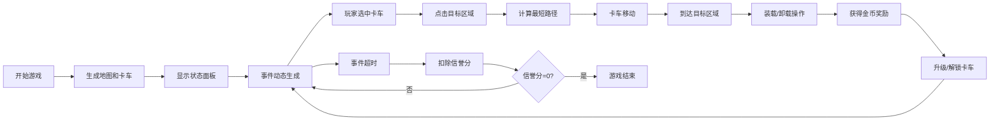

## 1. 产品概述
现代都市共享单车运维调度模拟游戏，玩家扮演共享单车运营公司的调度员，通过控制调度卡车在城市路网中移动，解决各区域的单车淤积和短缺问题。
- 核心玩法：策略调度、路径规划、资源管理
- 目标用户：策略游戏爱好者、模拟经营玩家

## 2. 核心功能

### 2.1 用户角色
无需用户注册，单玩家游戏模式

### 2.2 功能模块
1. **游戏主界面**：城市地图渲染、状态显示、操作面板
2. **地图系统**：8个功能区域、12条以上道路、最短路径计算
3. **卡车系统**：卡车移动、装载/卸载、容量升级、多卡车解锁
4. **事件系统**：淤积/短缺事件生成、倒计时、信誉分管理
5. **经济系统**：金币奖励、升级消耗
6. **音效系统**：Web Audio API生成音效

### 2.3 页面详情
| 页面名称 | 模块名称 | 功能描述 |
|---------|---------|---------|
| 游戏主界面 | 顶部状态栏 | 显示游戏时间、金币、信誉分 |
| 游戏主界面 | 地图画布 | 渲染城市地图、区域、道路、卡车、事件 |
| 游戏主界面 | 操作面板 | 卡车选中、装载/卸载、升级按钮 |
| 游戏主界面 | 游戏结束弹窗 | 信誉分归零时显示结算信息 |

## 3. 核心流程
玩家选中卡车 → 点击目标区域 → 卡车沿最短路径移动 → 到达后处理事件（装载/卸载）→ 获得金币 → 升级卡车或解锁新卡车 → 持续处理事件维持信誉分

## 4. 用户界面设计

### 4.1 设计风格
- **主色调**：深色背景（#0a0a1a）、霓虹青色（#00ffff）、科技蓝色（#0088ff）
- **辅助色**：红色（#ff4444）表示淤积、蓝色（#4488ff）表示短缺
- **视觉风格**：现代都市科技感、发光线段、霓虹效果、网格背景
- **字体**：等宽字体（Consolas, monospace）营造科技感

### 4.2 页面设计概述
| 页面名称 | 模块名称 | UI元素 |
|---------|---------|---------|
| 游戏主界面 | 顶部状态栏 | 深色半透明背景、发光文字、实时更新 |
| 游戏主界面 | 地图画布 | 深色背景、发光道路、彩色区域、动态事件图标 |
| 游戏主界面 | 操作面板 | 圆角按钮、 hover 发光效果、状态指示 |

### 4.3 响应式
单文件Canvas游戏，固定画布尺寸，居中显示

