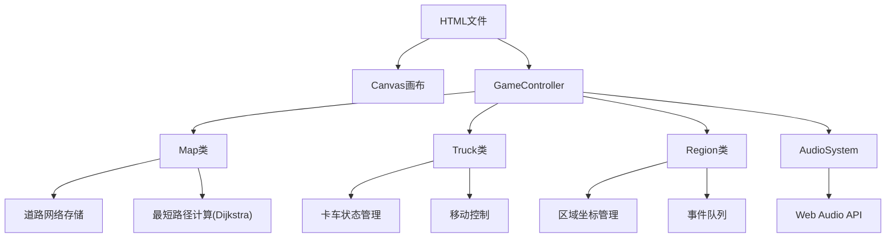

## 1. 架构设计

## 2. 技术描述
- **前端技术**：原生HTML5 + JavaScript + Canvas API + Web Audio API
- **打包方式**：单文件自包含，无外部依赖
- **渲染引擎**：Canvas 2D上下文
- **路径算法**：Dijkstra最短路径算法

## 3. 类结构定义

### 3.1 Map类
| 方法 | 描述 |
|------|------|
| constructor() | 初始化地图、区域和道路 |
| render(ctx) | 渲染地图、道路和区域 |
| findShortestPath(start, end) | 计算两点间最短路径 |
| getRegionAt(x, y) | 获取指定坐标的区域 |

### 3.2 Truck类
| 方法 | 描述 |
|------|------|
| constructor(id, startRegion) | 初始化卡车 |
| update(deltaTime) | 更新卡车位置 |
| moveToPath(path) | 沿路径移动 |
| loadBikes(amount) | 装载单车 |
| unloadBikes(amount) | 卸载单车 |
| isAtRegion() | 检查是否在区域内 |

### 3.3 Region类
| 方法 | 描述 |
|------|------|
| constructor(id, name, type, x, y) | 初始化区域 |
| addEvent(type, duration) | 添加事件 |
| removeEvent() | 移除事件 |
| update(deltaTime) | 更新事件倒计时 |

### 3.4 GameController类
| 方法 | 描述 |
|------|------|
| constructor() | 初始化游戏 |
| start() | 启动游戏循环 |
| update() | 更新游戏状态 |
| render() | 渲染所有元素 |
| handleClick(x, y) | 处理点击事件 |
| generateEvent() | 生成新事件 |

## 4. 核心参数配置

| 参数 | 值 | 说明 |
|------|-----|------|
| 区域数量 | ≥8 | 地铁站、商圈、住宅区等 |
| 道路数量 | ≥12 | 连接各区域 |
| 时间加速比 | 1分钟=2秒 | 游戏时间流逝速度 |
| 卡车基础速度 | 1像素/帧 | 60fps下 |
| 拥堵系数范围 | 0.6~1.4 | 每30游戏分钟刷新 |
| 卡车初始容量 | 10 | 最大30 |
| 容量升级梯度 | +5/次 | 每次消耗100金币 |
| 第二辆卡车解锁 | 300金币 |
| 信誉分初始值 | 100 |
| 超时扣分 | 5,8,10,12,15 | 随机选取 |
| 任务奖励 | 20~50金币 | 随机整数 |
| 事件生成频率 | 每5游戏分钟至少1个 |
| 同时存在事件数 | ≤8 |

## 5. 音效系统
- 接单音效：800Hz正弦波，100ms
- 完成音效：400Hz→800Hz双音阶，各150ms
- 音量：0.3，不刺耳

