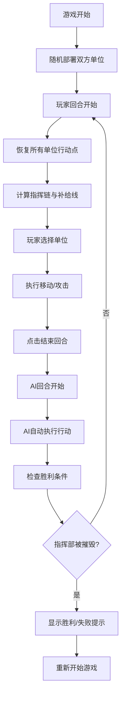

## 1. 产品概述
战争军事推演游戏是一款基于六边形网格地图的回合制策略游戏，玩家通过指挥步兵、装甲、炮兵等单位与AI对手进行战术对抗。
- 核心玩法：回合制策略、战棋类游戏，目标是摧毁敌方指挥部获胜
- 目标用户：策略游戏爱好者、军事推演爱好者

## 2. 核心功能

### 2.1 功能模块
1. **游戏主界面**：六边形网格地图、单位显示、战争迷雾效果
2. **单位系统**：步兵连、装甲排、炮兵连、指挥部四种单位类型
3. **战斗系统**：攻击计算、地形防御加成、视觉反馈、音效
4. **AI系统**：AI战术决策、自动行动
5. **指挥链系统**：补给线判定、指挥范围限制
6. **视野系统**：战争迷雾、视野计算、地形遮挡

### 2.2 页面详情
| 页面名称 | 模块名称 | 功能描述 |
|-----------|-------------|---------------------|
| 游戏主界面 | 六边形地图 | 10×8网格，平原/森林/山地/河流四种地形 |
| 游戏主界面 | 单位管理 | 四种单位属性、移动、攻击、晋升机制 |
| 游戏主界面 | 战斗系统 | 伤害计算、动画效果、音效反馈 |
| 游戏主界面 | 回合控制 | 回合切换、行动点恢复、结束回合按钮 |
| 游戏主界面 | UI面板 | 单位属性面板、回合信息、胜利提示 |

## 3. 核心流程
玩家回合开始→恢复行动点→计算指挥链与补给线→选择单位执行移动/攻击→结束回合→AI回合自动执行→循环直到一方指挥部被摧毁

## 4. 用户界面设计
### 4.1 设计风格
- 主色调：军绿色(#2d5a27)作为主色，土褐色(#8b7355)作为辅助色，红色(#c0392b)表示攻击，蓝色(#3498db)表示移动
- 按钮风格：圆角矩形，有hover效果和点击反馈
- 字体：使用系统无衬线字体，清晰易读
- 布局：Canvas居中，顶部信息栏，右侧属性面板
- 视觉风格：军事战术地图风格，采用扁平化设计配合微妙的阴影

### 4.2 页面设计概述
| 页面名称 | 模块名称 | UI元素 |
|-----------|-------------|-------------|
| 游戏主界面 | 六边形地图 | Canvas渲染、地形着色、迷雾半透明效果 |
| 游戏主界面 | 单位显示 | 不同形状/颜色区分单位类型、闪烁动画 |
| 游戏主界面 | 交互反馈 | 悬停高亮、移动范围蓝色半透明、攻击范围红色半透明 |
| 游戏主界面 | 顶部信息栏 | 回合数、行动指示、结束回合按钮 |
| 游戏主界面 | 属性面板 | 选中单位的详细属性信息 |

### 4.3 响应式
- Canvas自适应窗口大小，保持800×600的最小分辨率
- 支持窗口缩放时重新计算布局
