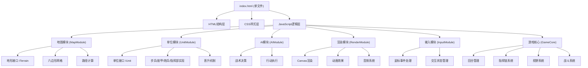

## 1. 架构设计
本游戏采用单文件HTML实现，所有代码封装在一个文件中，通过ES6模块化设计模拟多文件协作。



## 2. 技术描述
- 前端：原生HTML5 + CSS3 + ES6 JavaScript (单文件封装)
- 渲染：Canvas 2D API
- 音频：Web Audio API 振荡器
- 无需构建工具，直接浏览器运行

## 3. 核心数据结构

### 3.1 地形定义
```javascript
const TERRAIN_TYPES = {
  PLAIN: { name: '平原', moveCost: 1, defenseBonus: 0, blocksVision: false, passable: true },
  FOREST: { name: '森林', moveCost: 2, defenseBonus: 2, blocksVision: true, passable: true },
  MOUNTAIN: { name: '山地', moveCost: 3, defenseBonus: 3, blocksVision: true, passable: true },
  RIVER: { name: '河流', moveCost: Infinity, defenseBonus: 0, blocksVision: false, passable: false }
};
```

### 3.2 单位接口 IUnit
```javascript
interface IUnit {
  id: string;
  type: string;
  owner: 'player' | 'ai';
  position: { q: number, r: number };
  hp: number;
  maxHp: number;
  attack: number;
  defense: number;
  moveRange: number;
  visionRange: number;
  attackRange: { min: number, max: number };
  canCapture: boolean;
  canMove: boolean;
  kills: number;
  hasMoved: boolean;
  hasAttacked: boolean;
}
```

### 3.3 六边形坐标系统
使用轴向坐标系统(q, r)，六边形邻居计算：
```javascript
const HEX_DIRECTIONS = [
  { q: 1, r: 0 }, { q: 1, r: -1 }, { q: 0, r: -1 },
  { q: -1, r: 0 }, { q: -1, r: 1 }, { q: 0, r: 1 }
];
```

## 4. 模块接口定义

### 4.1 地图模块接口
```javascript
const MapModule = {
  generateMap: (cols, rows) => HexGrid,
  getTerrain: (q, r) => ITerrain,
  getNeighbors: (q, r) => Array<{q, r}>,
  hexDistance: (q1, r1, q2, r2) => number,
  findPath: (start, end, unit) => Array<{q, r}>,
  isPassable: (q, r, unit) => boolean
};
```

### 4.2 单位模块接口
```javascript
const UnitModule = {
  createUnit: (type, owner, position) => IUnit,
  dealDamage: (attacker, defender, terrainBonus) => number,
  promoteUnit: (unit) => void,
  canAttack: (attacker, target) => boolean,
  isInRange: (attacker, target) => boolean
};
```

### 4.3 游戏核心接口
```javascript
const GameCore = {
  initGame: () => void,
  startTurn: (player) => void,
  endTurn: () => void,
  calculateCommandChain: (player) => void,
  calculateVision: (player) => void,
  checkVictory: () => 'player' | 'ai' | null,
  resetGame: () => void
};
```

## 5. 核心算法

### 5.1 视野计算
- 从单位位置向6个方向发射射线
- 遇到森林/山地时停止射线传播
- 记录所有可见格子

### 5.2 路径查找
- 使用A*算法，六边形距离作为启发函数
- 考虑地形移动成本和单位通行限制

### 5.3 AI决策
1. 评估所有可攻击目标，优先选择可消灭的目标
2. 若无攻击目标，选择最近敌方单位移动
3. 评估移动位置安全性，避免必死位置
4. 每个行动间隔300ms便于观察
