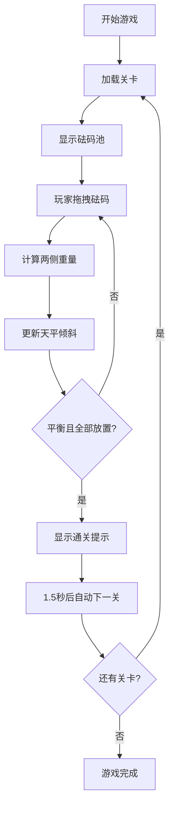

## 1. 产品概述
天平平衡益智游戏 - 通过拖拽砝码使天平平衡的休闲益智游戏
- 核心目的：提供一个有趣的物理益智体验，锻炼玩家的逻辑思维和数学能力
- 目标用户：各年龄段的休闲游戏玩家，尤其适合喜欢智力挑战的用户

## 2. 核心功能

### 2.1 功能模块
1. **游戏主界面**：虚拟天平、左右托盘、砝码池、控制按钮
2. **关卡系统**：至少6个难度递增的关卡，每个关卡有不同的砝码组合
3. **拖拽交互**：支持鼠标和触摸拖拽，砝码跟随手指/鼠标
4. **物理反馈**：天平根据重量差实时倾斜，平滑动画过渡
5. **提示系统**：模糊提示机制，不直接给出答案
6. **重置功能**：一键重置当前关卡

### 2.2 页面详情
| 页面名称 | 模块名称 | 功能描述 |
|-----------|-------------|---------------------|
| 游戏主页面 | 天平组件 | 显示横梁、支点、左右托盘，实时倾斜动画 |
| 游戏主页面 | 砝码池 | 存放待放置的砝码，支持拖拽取出和放回 |
| 游戏主页面 | 控制区 | 关卡显示、重置按钮、提示按钮 |
| 游戏主页面 | 通关弹窗 | 通关提示和自动下一关 |

## 3. 核心流程
玩家从砝码池拖拽砝码到左右托盘，观察天平倾斜角度，调整砝码分配，直到天平平衡且所有砝码都已放置。

## 4. 用户界面设计

### 4.1 设计风格
- 主色调：深木色(#8B4513)和金色(#DAA520)，营造古典天平氛围
- 辅助色：砝码使用彩虹色系区分不同重量等级
- 按钮风格：圆角立体按钮，悬停有阴影效果
- 字体：使用Playfair Display展示标题，Roboto作为交互字体
- 布局：居中对称布局，天平位于视觉中心

### 4.2 页面设计概述
| 页面名称 | 模块名称 | UI元素 |
|-----------|-------------|-------------|
| 游戏主页面 | 天平组件 | 木质横梁、金色支点、金属托盘、重量显示 |
| 游戏主页面 | 砝码池 | 圆形彩色砝码，带数字重量，半透明拖拽效果 |
| 游戏主页面 | 控制区 | 关卡标签、两个功能按钮、清晰的间距 |

### 4.3 响应性
- 桌面端优先，适配移动端触摸操作
- 使用vw/vh单位确保在不同屏幕尺寸下正常显示
- 拖拽区域适配触摸事件，支持多指操作

### 4.4 动画效果
- 天平倾斜：CSS transition平滑过渡0.3秒
- 关卡切换：淡入淡出动画，持续0.5秒
- 砝码拖拽：半透明跟随，放置有缩放反馈
- 通关效果：天平振动+光晕特效
