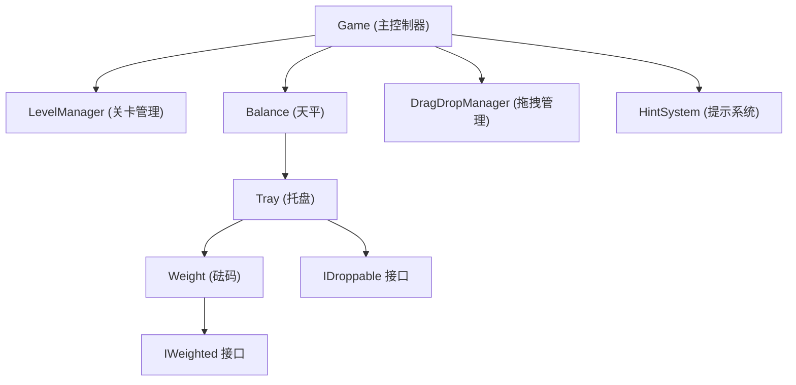

## 1. 架构设计

单文件HTML应用，采用模块化面向对象设计。



## 2. 技术描述

- **前端技术栈**：原生HTML5 + CSS3 + JavaScript ES6+
- **无外部依赖**：所有代码内联在单个HTML文件中，可离线运行
- **模块化模式**：使用IIFE和ES6 class实现模块化
- **接口定义**：使用JSDoc定义TypeScript风格的接口

## 3. 核心接口定义

### 3.1 IWeighted 接口（砝码对象接口）
```javascript
/**
 * @interface IWeighted
 * @property {number} weight - 砝码重量
 * @property {HTMLElement} element - 砝码DOM元素
 * @property {string} color - 砝码颜色
 * @property {number} diameter - 砝码直径
 */
```

### 3.2 IDroppable 接口（可放置容器接口）
```javascript
/**
 * @interface IDroppable
 * @property {HTMLElement} element - 容器DOM元素
 * @property {IWeighted[]} weights - 已放置的砝码列表
 * @property {function} addWeight - 添加砝码方法
 * @property {function} removeWeight - 移除砝码方法
 * @property {function} getTotalWeight - 获取总重量
 * @property {function} canDrop - 检查是否可放置
 */
```

## 4. 类设计

### 4.1 Weight 类（实现 IWeighted）
- 负责砝码的视觉呈现
- 管理重量、颜色、直径属性
- 提供渲染方法

### 4.2 Tray 类（实现 IDroppable）
- 管理单个托盘的砝码列表
- 计算总重量
- 渲染砝码堆叠效果
- 显示重量数值

### 4.3 WeightPool 类（实现 IDroppable）
- 管理砝码池
- 作为砝码的源容器和回收容器

### 4.4 Balance 类
- 管理天平横梁和两个托盘
- 根据重量差计算倾斜角度
- 渲染天平视觉效果

### 4.5 LevelManager 类
- 存储关卡配置
- 验证关卡可解性
- 加载和切换关卡

### 4.6 HintSystem 类
- 实现模糊提示算法
- 提供提示交互

### 4.7 DragDropManager 类
- 统一管理拖拽事件
- 支持鼠标和触摸事件
- 处理拖拽视觉反馈

### 4.8 Game 类（主控制器）
- 初始化所有组件
- 协调各模块交互
- 处理游戏状态

## 5. 关卡配置

至少6个可解关卡，难度递增：

| 关卡 | 砝码组合 | 目标总重量(每侧) |
|------|----------|------------------|
| 1 | [1, 1, 2] | 2 |
| 2 | [1, 2, 3, 2] | 4 |
| 3 | [1, 1, 2, 3, 5] | 6 |
| 4 | [2, 2, 3, 3, 4, 4] | 9 |
| 5 | [1, 2, 3, 4, 5, 6, 7] | 14 |
| 6 | [1, 1, 2, 2, 3, 5, 8, 8] | 15 |

## 6. 性能优化

- 使用CSS transform和opacity进行动画，触发GPU加速
- 避免频繁的DOM重排
- 使用事件委托处理拖拽事件
- 天平角度计算误差控制在0.5度以内
