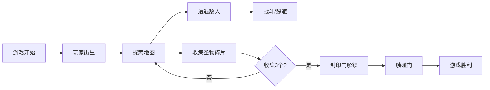

## 1. 产品概述

2D横版动作冒险网页游戏，玩家操控冒险家使用鞭子进行战斗和钩爪摆荡，收集圣物碎片解开封印门。游戏包含丰富的平台机关和敌人AI。

- **核心玩法**：鞭子攻击、钩爪摆荡、平台跳跃、敌人战斗
- **目标用户**：网页游戏爱好者，动作游戏玩家
- **产品价值**：单文件即可运行，无需安装，提供完整的游戏体验

## 2. 核心功能

### 2.1 玩家系统
- 键盘操作：左右移动、跳跃、冲刺、攀爬藤蔓
- 鞭子系统：普通挥击（攻击敌人/摧毁弹幕）、钩爪抓取（锁定钩环点摆荡）
- 受伤机制：1.5秒无敌时间，身体闪烁，击退位移，攀爬时被攻击直接跌落

### 2.2 敌人系统 - 石像守卫
- 初始石化静止状态
- 玩家进入激活半径后苏醒
- 追踪玩家并每2秒发射能量弹
- 可被玩家攻击消灭

### 2.3 地图与瓦片系统
- Tile瓦片组成：实心平台、装饰层、藤蔓区域
- 房间级分区加载，3个连通房间
- 机关平台：周期性显隐、左右移动

### 2.4 收集与胜利条件
- 3个圣物碎片散落分布
- HUD显示收集进度
- 收集全部碎片后封印门解锁
- 触碰解锁后的门判定胜利

## 3. 核心流程

## 4. 用户界面设计

### 4.1 设计风格
- **主色调**：深紫色背景 (#1a1a2e)、金色装饰 (#d4af37)、青色高光 (#00f5d4)
- **视觉风格**：复古像素风格，几何图形绘制，纯色填充
- **字体**：等宽字体，像素风格

### 4.2 HUD元素
- 左上角：生命值显示
- 右上角：圣物碎片收集进度
- 底部：冲刺冷却指示器

### 4.3 响应性
- 固定画布尺寸，居中显示
- 键盘操作，桌面端优先

## 5. 性能要求
- 稳定60fps帧率
- 操作反馈延迟 < 100ms
- 跳跃高度 ≥ 4个瓦片单位
- 冲刺冷却 ≤ 2.5秒
- 鞭子普攻后摇 ≤ 0.4秒
