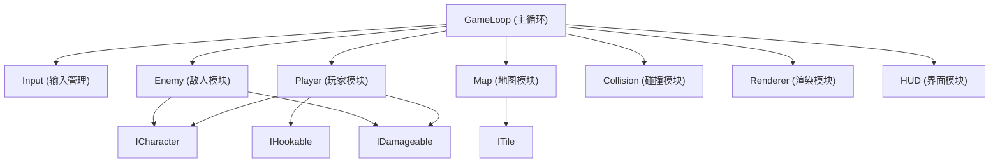

## 1. 架构设计



## 2. 技术描述

- **前端技术**：原生 HTML5 + Canvas 2D API + 原生 JavaScript (ES6+)
- **架构模式**：模块化 IIFE，单文件内嵌所有代码
- **渲染方式**：Canvas 2D 几何图形绘制，纯色填充
- **游戏循环**：requestAnimationFrame 驱动，固定时间步长

## 3. 模块接口定义

### 3.1 核心接口

```typescript
interface ICharacter {
  x: number;
  y: number;
  width: number;
  height: number;
  velocityX: number;
  velocityY: number;
  update(deltaTime: number): void;
  render(ctx: CanvasRenderingContext2D): void;
}

interface IDamageable {
  health: number;
  maxHealth: number;
  takeDamage(amount: number, knockback?: {x: number, y: number}): void;
  isDead(): boolean;
}

interface IHookable {
  x: number;
  y: number;
  radius: number;
  isActive(): boolean;
}

interface ITile {
  type: TileType;
  x: number;
  y: number;
  width: number;
  height: number;
  isSolid(): boolean;
  isClimbable(): boolean;
}
```

### 3.2 模块划分

| 模块 | 职责 | 关键功能 |
|------|------|----------|
| GameLoop | 主循环控制 | 帧率控制、更新调度、渲染调度 |
| Input | 输入管理 | 键盘状态跟踪、按键事件处理 |
| Player | 玩家逻辑 | 移动、跳跃、冲刺、攀爬、鞭子攻击、钩爪 |
| Enemy | 敌人逻辑 | 石像守卫AI、弹幕发射、受伤处理 |
| Map | 地图管理 | Tile瓦片、房间加载、机关平台 |
| Collision | 碰撞检测 | AABB碰撞、Tile碰撞、射线检测 |
| Renderer | 渲染系统 | Canvas绘制、图层管理 |
| HUD | 用户界面 | 生命值、收集进度、状态显示 |

## 4. 游戏常数配置

```javascript
const CONFIG = {
  TILE_SIZE: 32,
  GRAVITY: 0.6,
  PLAYER_SPEED: 5,
  JUMP_FORCE: -14,
  DASH_SPEED: 15,
  DASH_DURATION: 150,
  DASH_COOLDOWN: 2500,
  INVINCIBLE_DURATION: 1500,
  WHIP_ATTACK_DURATION: 400,
  WHIP_RANGE: 80,
  ENEMY_ACTIVATION_RADIUS: 200,
  ENEMY_FIRE_INTERVAL: 2000,
  ROOM_WIDTH: 25,
  ROOM_HEIGHT: 18,
  TOTAL_FRAGMENTS: 3
};
```

## 5. 地图房间设计

| 房间 | 特点 | 机关 | 敌人 | 圣物碎片 |
|------|------|------|------|----------|
| 房间1 (起点) | 教学区域，基础平台 | 无 | 无 | 1个 |
| 房间2 (中部) | 藤蔓攀爬区，移动平台 | 左右移动平台 | 1个石像守卫 | 1个 |
| 房间3 (终点) | 沟壑摆荡区，显隐平台 | 周期性显隐平台 | 1个石像守卫 | 1个 + 封印门 |
