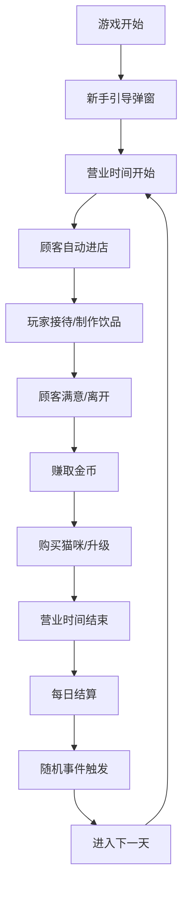

# 猫咪咖啡馆模拟经营游戏 - 产品需求文档

## 1. 产品概述
猫咪咖啡馆模拟经营游戏是一款纯前端休闲模拟经营游戏，玩家通过经营咖啡馆、接待顾客、制作饮品、照顾猫咪来赚取金币，扩大经营规模。
- 目标用户：休闲游戏爱好者，猫咪爱好者
- 产品价值：提供轻松有趣的模拟经营体验，融合猫咪养成元素

## 2. 核心功能

### 2.1 用户角色
| 角色 | 注册方式 | 核心权限 |
|------|---------|---------|
| 玩家 | 无需注册 | 完整游戏体验，经营管理，购买猫咪，制作饮品 |

### 2.2 功能模块
1. **游戏主界面**：数据面板、时间控制、顾客列表、猫咪状态、饮品制作区
2. **猫咪管理**：购买猫咪、喂食、升级、状态管理
3. **顾客系统**：顾客进店、耐心值、满意度、类型差异
4. **饮品制作**：菜单选择、制作进度、定价系统
5. **随机事件**：事件触发、效果应用
6. **新手引导**：首次加载弹窗、多步引导

### 2.3 页面详情
| 页面名称 | 模块名称 | 功能描述 |
|---------|---------|---------|
| 游戏主界面 | 数据面板 | 实时显示金币、声望、当前时间、营业状态 |
| 游戏主界面 | 时间控制 | 速度调节（1x/2x）、暂停按钮 |
| 游戏主界面 | 顾客区 | 显示当前顾客列表、耐心条、状态 |
| 游戏主界面 | 猫咪区 | 显示猫咪列表、状态、喂食按钮 |
| 游戏主界面 | 制作区 | 饮品选择、制作进度、排队管理 |
| 游戏主界面 | 结算弹窗 | 每日营业结束结算弹窗 |
| 引导弹窗 | 新手引导 | 3步新手引导，可关闭重新打开 |

## 3. 核心流程

## 4. 用户界面设计

### 4.1 设计风格
- **主色调**：温暖的橙色系（#FF9F43）搭配柔和的米色背景
- **辅助色**：猫咪粉色（#FFB6C1）、咖啡棕色（#8B4513）
- **按钮风格**：圆角设计，悬停有缩放动画
- **字体**：使用圆润可爱的无衬线字体
- **布局风格**：卡片式布局，分区清晰
- **图标风格**：使用emoji图标，活泼可爱

### 4.2 页面设计概述
| 页面名称 | 模块名称 | UI元素 |
|---------|---------|--------|
| 游戏主界面 | 顶部状态栏 | 金币💰、声望⭐、时间⏰、速度控制 |
| 游戏主界面 | 左侧顾客区 | 顾客卡片、耐心条、表情反馈 |
| 游戏主界面 | 中间猫咪区 | 猫咪卡片、状态指示、喂食按钮 |
| 游戏主界面 | 右侧制作区 | 饮品菜单、进度条、排队列表 |
| 游戏主界面 | 底部操作栏 | 帮助按钮、设置按钮 |

### 4.3 响应式
- 桌面端优先设计
- 适配主流浏览器窗口大小调整
- 确保在1920x1080分辨率下完美显示

### 4.4 动画效果
- 顾客进店动画
- 猫咪状态变化动画
- 金币增加动画
- 进度条平滑动画
- 弹窗淡入淡出效果
