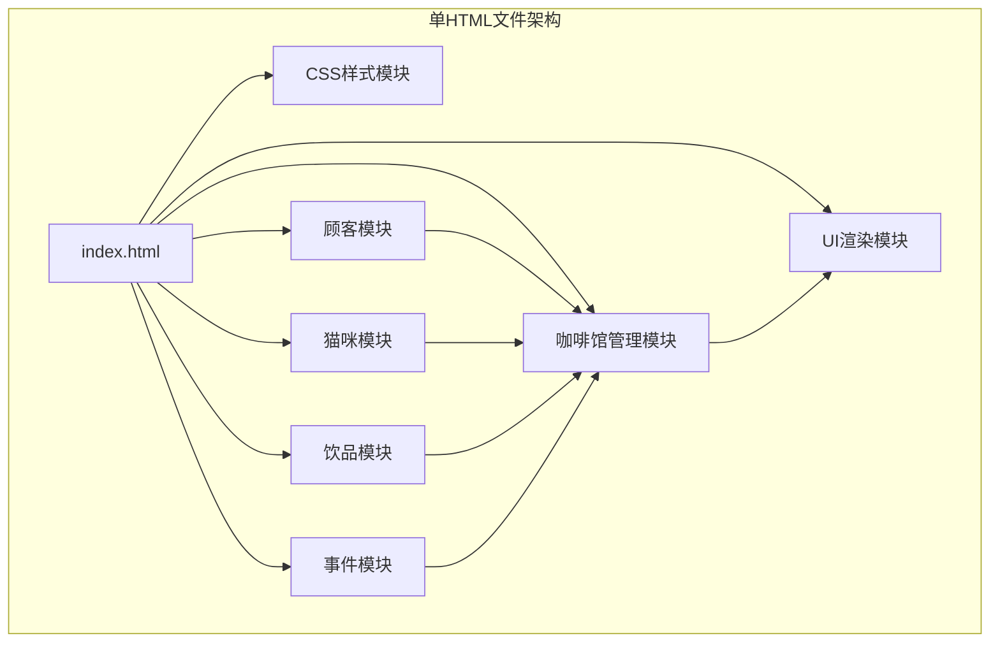
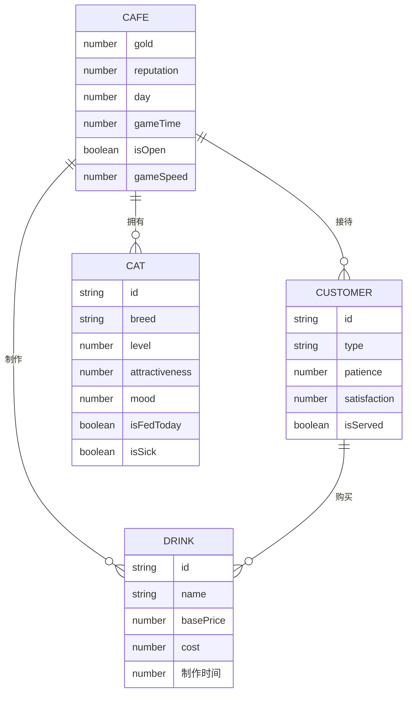

# 猫咪咖啡馆模拟经营游戏 - 技术架构文档

## 1. 架构设计



## 2. 技术描述
- **前端技术**：纯HTML5 + CSS3 + 原生JavaScript (ES6+)
- **模块化方式**：使用多个script标签模拟多文件，通过JSDoc定义TypeScript风格接口
- **无依赖**：不使用任何框架或库，不依赖localStorage
- **时间系统**：游戏内时间与现实时间比例可配置，默认1分钟=游戏内1小时

## 3. 模块接口定义

### 3.1 顾客模块接口
```javascript
/**
 * @interface ICustomer
 * @description 顾客接口定义
 */
interface ICustomer {
  id: string;
  type: 'student' | 'worker' | 'catLover';
  name: string;
  patience: number;
  maxPatience: number;
  preferredDrink: string;
  satisfaction: number;
  isServed: boolean;
  
  updatePatience(delta: number): void;
  getPatiencePercentage(): number;
  getPurchaseWill(drinkPrice: number, basePrice: number): number;
  getMoodEmoji(): string;
}

/**
 * @interface ICustomerFactory
 * @description 顾客工厂接口
 */
interface ICustomerFactory {
  createCustomer(type?: string): ICustomer;
  getRandomCustomerType(): string;
}
```

### 3.2 猫咪模块接口
```javascript
/**
 * @interface ICat
 * @description 猫咪接口定义
 */
interface ICat {
  id: string;
  breed: 'ragdoll' | 'british' | 'orange';
  name: string;
  level: number;
  attractiveness: number;
  feedingCost: number;
  mood: number;
  maxMood: number;
  moodDecayRate: number;
  isFedToday: boolean;
  isSick: boolean;
  
  feed(): void;
  upgrade(): void;
  updateMood(delta: number): void;
  getAttractivenessBonus(): number;
  getStatusEmoji(): string;
}

/**
 * @interface ICatManager
 * @description 猫咪管理器接口
 */
interface ICatManager {
  cats: ICat[];
  maxCats: number;
  
  buyCat(breed: string): boolean;
  feedCat(catId: string): void;
  upgradeCat(catId: string): void;
  getTotalAttractiveness(): number;
  getDailyFeedingCost(): number;
  updateAllCats(delta: number): void;
}
```

### 3.3 饮品模块接口
```javascript
/**
 * @interface IDrink
 * @description 饮品接口定义
 */
interface IDrink {
  id: string;
  name: string;
  basePrice: number;
  cost: number;
 制作时间: number;
  unlocked: boolean;
  customPrice: number;
  
  getProfit(): number;
  get制作时间Ms(): number;
}

/**
 * @interface I制作Manager
 * @description 制作管理器接口
 */
interface I制作Manager {
  maxConcurrent: number;
  queue: Array<{drink: IDrink, customer: ICustomer}>;
  inProgress: Array<{drink: IDrink, customer: ICustomer, progress: number, startTime: number}>;
  
  addToQueue(drink: IDrink, customer: ICustomer): boolean;
  start制作(): void;
  updateProgress(delta: number): void;
  isQueueFull(): boolean;
}
```

### 3.4 咖啡馆管理模块接口
```javascript
/**
 * @interface ICafeManager
 * @description 咖啡馆管理器接口（主控制器）
 */
interface ICafeManager {
  gold: number;
  reputation: number;
  day: number;
  gameTime: number; // 游戏内时间（分钟）
  isOpen: boolean;
  gameSpeed: number;
  isPaused: boolean;
  
  customerManager: ICustomerFactory;
  catManager: ICatManager;
  制作Manager: I制作Manager;
  
  startDay(): void;
  endDay(): void;
  update(deltaTime: number): void;
  calculateReputation(): number;
  triggerRandomEvent(): void;
  getDailyStats(): object;
}
```

## 4. 核心常量配置

```javascript
const CONFIG = {
  INITIAL_GOLD: 1000,
  INITIAL_REPUTATION: 0,
  MAX_CATS: 8,
  MIN_CUSTOMERS_PER_DAY: 15,
  BUSINESS_HOURS: 10, // 游戏内营业时间（小时）
  REAL_TO_GAME_RATIO: 60, // 1分钟现实 = 1小时游戏
  SPEED_OPTIONS: [1, 2],
  MAX_CONCURRENT_制作: 2,
  CAT_BREEDS: {
    ragdoll: { name: '布偶', price: 500, attractiveness: 15, feedingCost: 30, moodDecay: 2 },
    british: { name: '英短', price: 300, attractiveness: 10, feedingCost: 20, moodDecay: 3 },
    orange: { name: '橘猫', price: 200, attractiveness: 8, feedingCost: 15, moodDecay: 4 }
  },
  DRINKS: {
    americano: { name: '美式咖啡', basePrice: 25, cost: 10, 制作时间: 3 },
    latte: { name: '拿铁', basePrice: 35, cost: 15, 制作时间: 5 },
    catPaw: { name: '猫爪奶盖', basePrice: 45, cost: 20, 制作时间: 7 },
    catMint: { name: '猫薄荷特调', basePrice: 55, cost: 25, 制作时间: 10 }
  },
  CUSTOMER_TYPES: {
    student: { name: '学生', patience: 80, priceSensitivity: 1.5 },
    worker: { name: '上班族', patience: 60, priceSensitivity: 1.0 },
    catLover: { name: '猫奴', patience: 100, priceSensitivity: 0.5 }
  }
};
```

## 5. 数据模型



## 6. 文件结构（单HTML模拟多模块）

```html
<!DOCTYPE html>
<html>
<head>
    <style>
        /* CSS 样式模块 */
    </style>
</head>
<body>
    <div id="app"></div>
    
    <script>
        // 模块1: 接口定义与常量配置
    </script>
    
    <script>
        // 模块2: 顾客模块实现
    </script>
    
    <script>
        // 模块3: 猫咪模块实现
    </script>
    
    <script>
        // 模块4: 饮品制作模块实现
    </script>
    
    <script>
        // 模块5: 事件系统实现
    </script>
    
    <script>
        // 模块6: 咖啡馆主控制器
    </script>
    
    <script>
        // 模块7: UI渲染模块
    </script>
    
    <script>
        // 模块8: 游戏初始化与主循环
    </script>
</body>
</html>
```
