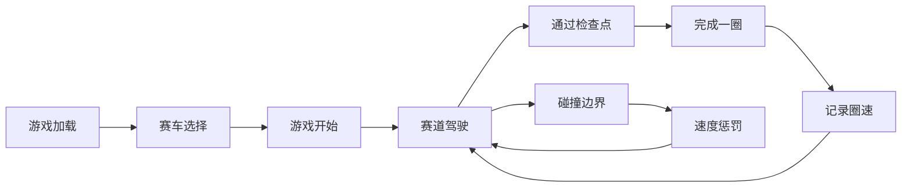

## 1. 产品概述
赛车竞速游戏是一款基于HTML5 Canvas 2D的单页面游戏，玩家驾驶赛车在环形赛道上进行计时竞速。游戏采用俯视视角，包含真实物理模拟和多种操控方式，支持桌面和移动端游玩。

- 核心目标：提供沉浸式的赛车驾驶体验，包含真实物理模拟、多车辆选择和完整的计时系统
- 目标用户：休闲游戏玩家、赛车游戏爱好者
- 技术价值：展示纯前端Canvas高性能渲染、物理模拟和跨平台交互能力

## 2. 核心功能

### 2.1 功能模块
1. **游戏主界面**：Canvas渲染区域、HUD信息显示、赛车选择菜单
2. **赛道系统**：Catmull-Rom样条赛道、检查点系统、边界碰撞检测
3. **车辆物理系统**：引擎力、刹车力、空气阻力、轮胎抓地力模拟
4. **操控系统**：键盘控制、触摸屏虚拟摇杆/按钮
5. **音效系统**：引擎声、碰撞音效
6. **计时系统**：圈速记录、分段计时、对比显示

### 2.2 页面详情
| 页面名称 | 模块名称 | 功能描述 |
|---------|---------|---------|
| 游戏主界面 | 赛道渲染 | Catmull-Rom样条插值生成平滑赛道，路面纹理绘制 |
| 游戏主界面 | 车辆渲染 | 多辆可选赛车，不同颜色和参数 |
| 游戏主界面 | HUD显示 | 圈速、最佳圈速、速度、档位、转速实时显示 |
| 游戏主界面 | 赛车选择 | 开始前选择不同性能参数的赛车 |
| 游戏主界面 | 触屏控制 | 虚拟摇杆和油门/刹车按钮 |

## 3. 核心流程

## 4. 用户界面设计

### 4.1 设计风格
- **主色调**：深色背景(#1a1a2e) + 霓虹蓝(#00f5ff) + 赛道灰(#333)
- **强调色**：速度绿(#00ff88)、警告红(#ff4444)、中性黄(#ffaa00)
- **字体**：使用等宽字体(Monospace)营造速度感，数字显示清晰易读
- **视觉风格**：赛博朋克风格，霓虹发光效果，运动模糊
- **HUD设计**：半透明黑色背景，发光边框，信息分层显示

### 4.2 页面设计
| 页面名称 | 模块名称 | UI元素 |
|---------|---------|--------|
| 游戏主界面 | 赛道 | 黑色沥青纹理，白色边线，发光中心线路 |
| 游戏主界面 | 赛车 | 俯视视角，发光尾灯，漂移时轮胎痕迹 |
| 游戏主界面 | HUD | 左上角圈速，右上角速度，底部档位/转速 |
| 游戏主界面 | 选择菜单 | 居中卡片式布局，赛车参数对比 |

### 4.3 响应式
- 桌面优先，Canvas自动适配窗口大小
- 移动端自动显示虚拟摇杆和按钮
- 触控区域优化，确保手指操作流畅

### 4.4 动效设计
- 赛车加速时引擎震动效果
- 漂移时轮胎冒烟和痕迹
- 通过检查点时的闪光提示
- HUD数值变化时的平滑过渡
