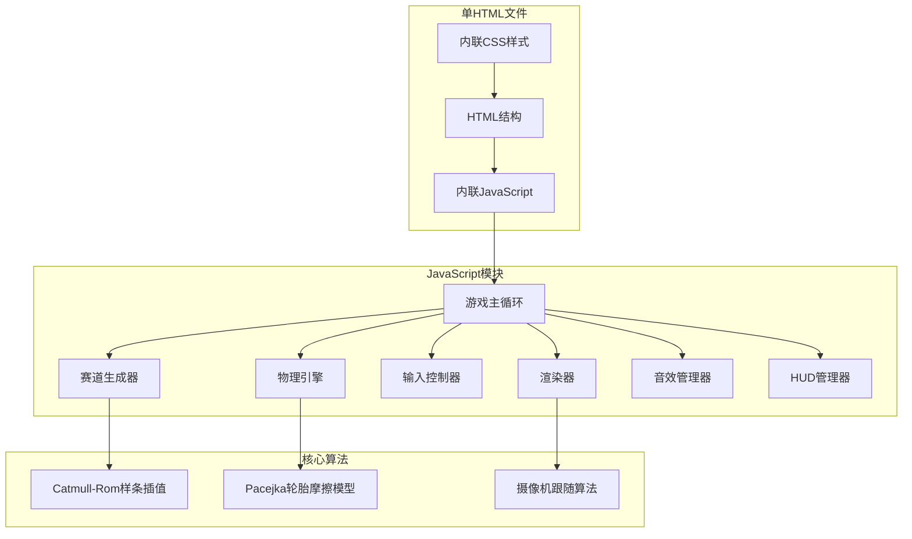

## 1. 架构设计



## 2. 技术描述

- **前端技术栈**：纯HTML5 + Canvas 2D + 原生JavaScript (ES6+)
- **无外部依赖**：所有代码内联在单个HTML文件中，无需npm安装
- **渲染引擎**：Canvas 2D API，requestAnimationFrame驱动
- **音频引擎**：Web Audio API，振荡器生成音效
- **响应式**：CSS媒体查询 + JavaScript动态调整Canvas尺寸

## 3. 核心模块设计

### 3.1 赛道系统
```javascript
// 控制点定义
interface ControlPoint { x: number; y: number; isCheckpoint?: boolean; }

// Catmull-Rom插值函数
function catmullRom(p0: Point, p1: Point, p2: Point, p3: Point, t: number): Point;

// 赛道属性
interface Track {
  centerLine: Point[];      // 中心线点集
  leftEdge: Point[];        // 左边界
  rightEdge: Point[];       // 右边界
  width: number;            // 赛道宽度
  checkpoints: number[];    // 检查点索引
}
```

### 3.2 车辆物理系统
```javascript
// 车辆参数
interface CarParams {
  name: string;
  color: string;
  maxSpeed: number;        // km/h
  acceleration: number;    // m/s²
  steeringSensitivity: number;
  mass: number;            // kg
  tireGrip: number;
}

// 物理状态
interface CarState {
  position: Point;
  velocity: Vector;
  angle: number;           // rad
  angularVelocity: number;
  wheelAngle: number;      // 转向角
  speed: number;           // m/s
  gear: number;            // -1:倒档, 0:空挡, 1-5:前进档
  rpm: number;
}
```

### 3.3 输入系统
```javascript
// 输入状态
interface InputState {
  throttle: number;        // 0-1
  brake: number;           // 0-1
  steering: number;        // -1 to 1
  handbrake: boolean;
}

// 支持的输入源
// - 键盘事件 (keydown/keyup)
// - 触摸事件 (touchstart/touchmove/touchend)
// - 虚拟摇杆
```

## 4. 物理模型公式

### 4.1 简化Pacejka轮胎模型
```
横向力 Fy = D * sin(C * atan(B * slipAngle))
其中:
- D: 峰值系数 (抓地力最大值)
- C: 形状系数
- B: 刚度系数
- slipAngle: 侧偏角
```

### 4.2 车辆动力学
```
驱动力 F_engine = throttle * maxTorque * gearRatio
空气阻力 F_drag = 0.5 * ρ * Cd * A * v²
滚动阻力 F_roll = Crr * mass * g
总加速度 a = (F_engine - F_drag - F_roll - F_friction) / mass
```

## 5. 性能优化策略

1. **渲染优化**：
   - 离屏Canvas预渲染赛道
   - 视锥剔除，只渲染可见区域
   - requestAnimationFrame稳定60fps

2. **计算优化**：
   - 物理计算与渲染分离
   - 空间哈希加速碰撞检测
   - 样条插值预计算

3. **内存优化**：
   - 对象池复用粒子效果
   - 避免GC，尽量复用对象
