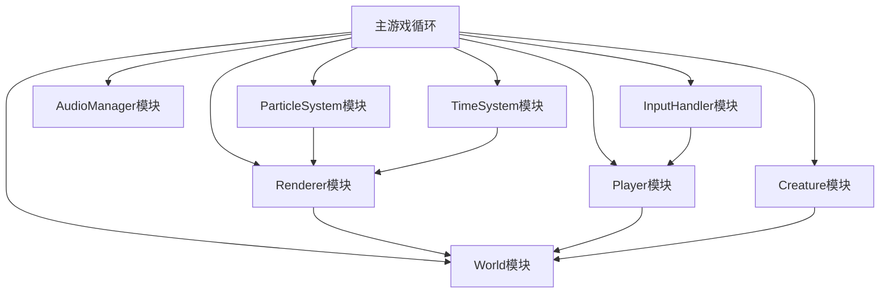

# 2D沙盒开放世界游戏原型 - 技术架构文档

## 1. 整体架构

### 1.1 架构设计原则
- 单HTML文件交付，所有代码内联
- 模块化设计，职责分离
- 明确的模块间接口
- 高性能渲染
- 无外部依赖

### 1.2 模块划分



## 2. 模块详细设计

### 2.1 World模块 - 世界数据管理

**职责**：管理方块数据、世界生成、方块操作接口

**核心接口**：
```javascript
getBlock(x, y)           // 获取指定位置方块类型
setBlock(x, y, type)     // 设置指定位置方块类型
getWidth()               // 获取世界宽度
getHeight()              // 获取世界高度
getSpawnPoint()          // 获取玩家出生点
isValidPosition(x, y)    // 检查位置是否有效
```

**数据结构**：
- 二维数组存储方块类型：`blocks[y][x]`
- 方块类型常量：AIR, GRASS, DIRT, STONE, WATER, WOOD, LEAVES

**世界生成算法**：
- 简化版柏林噪声（Perlin Noise）
- 分层生成：地表层、泥土层、石头层
- 水域生成基于高度阈值

### 2.2 Player模块 - 玩家实体

**职责**：玩家状态管理、移动、物理、碰撞检测

**核心接口**：
```javascript
update(deltaTime)        // 更新玩家状态
getX()                   // 获取玩家X坐标
getY()                   // 获取玩家Y坐标
getWidth()               // 获取玩家宽度
getHeight()              // 获取玩家高度
getVelocityY()           // 获取垂直速度
setOnGround(state)       // 设置是否在地面
isOnGround()             // 检查是否在地面
```

**物理参数**：
- 移动速度：5像素/帧
- 跳跃力量：-12像素/帧
- 重力加速度：0.5像素/帧²
- 最大下落速度：15像素/帧

**碰撞检测**：
- AABB碰撞检测算法
- 分轴检测（水平、垂直）
- 与世界方块碰撞

### 2.3 Renderer模块 - 渲染系统

**职责**：Canvas渲染、视口管理、摄像机跟随

**核心接口**：
```javascript
render()                 // 渲染一帧
resize(width, height)    // 调整画布大小
setTimeOfDay(dayRatio)   // 设置昼夜比例
getViewport()            // 获取视口信息
screenToWorld(sx, sy)    // 屏幕坐标转世界坐标
worldToScreen(wx, wy)    // 世界坐标转屏幕坐标
```

**渲染流程**：
1. 清空画布
2. 计算视口范围（只渲染可见方块）
3. 绘制方块层
4. 绘制玩家和生物
5. 绘制粒子效果
6. 绘制准星
7. 绘制昼夜遮罩层
8. 绘制UI层（快捷栏等）

**性能优化**：
- 只渲染视口内方块
- 方块颜色预计算
- 避免每帧创建对象

### 2.4 InputHandler模块 - 输入处理

**职责**：键盘鼠标输入监听、状态管理

**核心接口**：
```javascript
isKeyPressed(key)        // 检查按键状态
getMouseX()              // 获取鼠标X坐标
getMouseY()              // 获取鼠标Y坐标
isMouseLeftDown()        // 左键是否按下
isMouseRightDown()       // 右键是否按下
getSelectedSlot()        // 获取选中快捷栏
```

**输入映射**：
- W/↑: 上移
- S/↓: 下移
- A/←: 左移
- D/→: 右移
- 空格: 跳跃
- 1-4: 快捷栏切换
- M: 音效开关

### 2.5 AudioManager模块 - 音效管理

**职责**：Web Audio API音效生成、播放控制

**核心接口**：
```javascript
playDigSound()           // 播放挖掘音效
playPlaceSound()         // 播放放置音效
toggleSound()            // 切换音效开关
isSoundEnabled()         // 检查音效是否开启
```

**音效实现**：
- 使用OscillatorNode生成音调
- 挖掘音效：短促的高频衰减音
- 放置音效：低频短促音
- 背景音：低频嗡嗡声循环

### 2.6 ParticleSystem模块 - 粒子系统

**职责**：粒子创建、更新、渲染

**核心接口**：
```javascript
spawnParticles(x, y, color, count)  // 生成粒子
update(deltaTime)                   // 更新粒子
render(ctx, viewport)               // 渲染粒子
```

**粒子属性**：
- 位置(x, y)
- 速度(vx, vy)
- 颜色
- 生命周期
- 大小

### 2.7 Creature模块 - 生物系统

**职责**：跟随玩家、简单AI、碰撞回避

**核心接口**：
```javascript
update(deltaTime, world, player)    // 更新生物状态
getX()                               // 获取X坐标
getY()                               // 获取Y坐标
```

**AI行为**：
- 保持在玩家附近（2-5格距离）
- 随机漫步
- 遇到障碍时尝试绕开
- 简单的重力和碰撞

### 2.8 TimeSystem模块 - 时间系统

**职责**：昼夜循环管理、时间进度

**核心接口**：
```javascript
update(deltaTime)        // 更新时间
getDayRatio()            // 获取白天比例(0-1)
isNight()                // 是否是夜晚
getDayDuration()         // 获取白天时长
getNightDuration()       // 获取夜晚时长
```

**时间参数**：
- 白天：30秒
- 夜晚：15秒
- 平滑过渡

## 3. 性能优化策略

### 3.1 渲染优化
- 视口裁剪：只渲染屏幕可见范围内的方块
- 批量渲染：同类方块一次绘制
- 避免每帧创建新对象，对象池复用

### 3.2 计算优化
- 空间分区：碰撞检测只检查附近方块
- 缓存计算结果
- 使用整数运算代替浮点

### 3.3 内存优化
- 二维数组紧凑存储
- 粒子对象池
- 及时清理过期对象

## 4. 浏览器兼容性

- 使用标准HTML5 Canvas API
- Web Audio API特性检测
- requestAnimationFrame polyfill
- 监听visibilitychange事件处理失焦

## 5. 文件结构

单HTML文件结构：
```html
<!DOCTYPE html>
<html>
<head>
    <style>/* CSS样式 */</style>
</head>
<body>
    <canvas id="gameCanvas"></canvas>
    <script>
        // 常量定义
        
        // Noise类定义
        
        // World模块
        
        // Player模块
        
        // Renderer模块
        
        // InputHandler模块
        
        // AudioManager模块
        
        // ParticleSystem模块
        
        // Creature模块
        
        // TimeSystem模块
        
        // 主游戏类
        
        // 初始化和启动
    </script>
</body>
</html>
```
