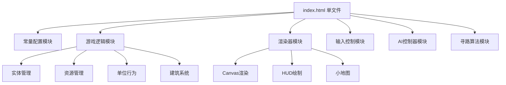

## 1. 架构设计


## 2. 技术描述
- **技术栈**：原生HTML5 + Canvas 2D + ES6 JavaScript
- **架构模式**：单文件模块化，使用IIFE实现模块隔离
- **性能优化**：
  - 对象池模式管理单位实体
  - 分层渲染（地形→建筑→单位→UI）
  - 视野裁剪，只渲染可见区域

## 3. 模块定义

### 3.1 常量配置 (CONFIG)
```javascript
const CONFIG = {
  MAP_WIDTH: 80,
  MAP_HEIGHT: 60,
  TILE_SIZE: 16,
  CANVAS_WIDTH: 1280,
  CANVAS_HEIGHT: 720,
  INITIAL_GOLD: 500,
  INITIAL_WOOD: 300,
  INITIAL_POPULATION: 0,
  MAX_POPULATION: 50,
};
```

### 3.2 数据模型

#### 单位类型定义
| 类型 | 生命值 | 攻击力 | 移动速度 | 视野 | 人口 | 成本(金/木) |
|-----|-------|-------|---------|------|------|------------|
| 工人 | 50 | 5 | 1.5 | 6 | 1 | 50/0 |
| 战士 | 80 | 15 | 1.2 | 5 | 2 | 100/0 |

#### 建筑类型定义
| 类型 | 生命值 | 建造时间 | 功能 | 成本(金/木) | 人口增加 |
|-----|-------|---------|------|------------|---------|
| 基地 | 1000 | 0 | 生产工人 | 0/0 | 10 |
| 兵营 | 500 | 10s | 生产战士 | 200/100 | 0 |
| 农场 | 200 | 5s | 增加人口 | 100/50 | 8 |

## 4. 核心算法

### 4.1 A*寻路算法
- 网格节点表示
- 曼哈顿距离启发函数
- 路径平滑处理

### 4.2 碰撞检测
- 轴对齐包围盒 (AABB)
- 单位分离避让

### 4.3 AI决策系统
- 状态机：采集→建造→生产→进攻
- 行为树结构决策

## 5. 输入事件映射

| 输入 | 功能 |
|-----|------|
| 左键单击 | 选择单位 |
| 左键拖拽 | 框选单位 |
| 右键单击 | 移动/攻击 |
| A + 点击 | 攻击移动 |
| S | 停止当前指令 |
| Shift + 数字(0-9) | 设置编队 |
| 数字(0-9) | 选择编队 |
| Ctrl + A | 全选所有己方单位 |
| 双击 | 选择同类型所有单位 |

## 6. 游戏循环
```
1. 输入处理 → 2. AI决策 → 3. 单位更新 → 4. 碰撞检测 
   → 5. 战斗计算 → 6. 资源结算 → 7. 渲染绘制
```
