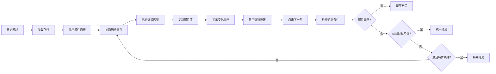

# 历史君主决策游戏 - 产品需求文档

## 1. 产品概述
历史题材的回合制决策游戏，玩家扮演古代君主，通过处理随机历史事件维持国家发展。
- 核心玩法：每回合处理历史事件，通过选择影响四项核心属性（民心、国库、兵力、威望）
- 目标用户：历史爱好者、策略游戏玩家
- 产品价值：寓教于乐，在游戏中了解中国历史

## 2. 核心功能

### 2.1 用户角色
| 角色 | 注册方式 | 核心权限 |
|------|----------|----------|
| 玩家 | 无需注册 | 完整游戏体验 |

### 2.2 功能模块
1. **游戏主界面**：属性展示区、事件展示区、选项按钮区、操作按钮区
2. **事件系统**：随机事件抽取、历史关联机制、选项属性影响
3. **状态管理**：属性值维护、年份推进、结局判定
4. **存档系统**：localStorage自动保存、进度恢复、重新开始
5. **UI反馈**：属性变化动画提示、按钮状态管理

### 2.3 页面详情
| 页面名称 | 模块名称 | 功能描述 |
|----------|----------|----------|
| 主游戏页 | 属性展示区 | 显示君主名称、年份、四项核心属性及变化提示 |
| 主游戏页 | 事件展示区 | 展示历史事件标题、描述、朝代背景 |
| 主游戏页 | 选项按钮区 | 2-4个选项按钮，选择后禁用防止重复点击 |
| 主游戏页 | 操作按钮区 | 下一年按钮、重新开始按钮 |
| 结局弹窗 | 结局展示 | 覆灭结局、统一结局、特殊结局展示 |

## 3. 核心流程
玩家打开页面 → 加载存档/开始新游戏 → 展示当前属性和年份 → 随机抽取历史事件 → 玩家选择选项 → 属性变化动画提示 → 点击下一年 → 检查结局条件 → 循环或结束

## 4. 用户界面设计

### 4.1 设计风格
- **主色调**：古朴典雅的中国风，以墨色、朱砂红、金色为主
- **按钮风格**：圆角矩形，悬停有深浅变化，禁用状态置灰
- **字体**：标题使用衬线字体（如宋体），正文使用易读字体
- **布局风格**：卡片式布局，上下分栏，属性面板居顶
- **装饰元素**：适当使用中式纹样、卷轴效果、印章点缀

### 4.2 页面设计概述
| 页面名称 | 模块名称 | UI元素 |
|----------|----------|--------|
| 主游戏页 | 属性面板 | 横向排列四个属性卡片，带数值和图标 |
| 主游戏页 | 事件卡片 | 卷轴样式，包含朝代标签、标题、描述 |
| 主游戏页 | 选项按钮 | 垂直排列，按钮内有选项描述 |
| 主游戏页 | 底部操作区 | 左右分布"重新开始"和"下一年"按钮 |
| 结局弹窗 | 模态框 | 居中显示，包含结局标题、描述、重新开始按钮 |

### 4.3 响应性
- 桌面端优先设计，移动端自适应
- 属性面板在移动端转为两行两列网格
- 事件卡片宽度随屏幕调整，保持良好阅读体验
- 触摸操作优化，按钮最小尺寸44px

### 4.4 动画效果
- 属性变化：+/-数值淡入上浮，1.5秒后淡出消失
- 按钮状态：悬停缩放效果，点击按压反馈
- 事件切换：淡入淡出过渡
- 结局弹窗：缩放淡入效果
