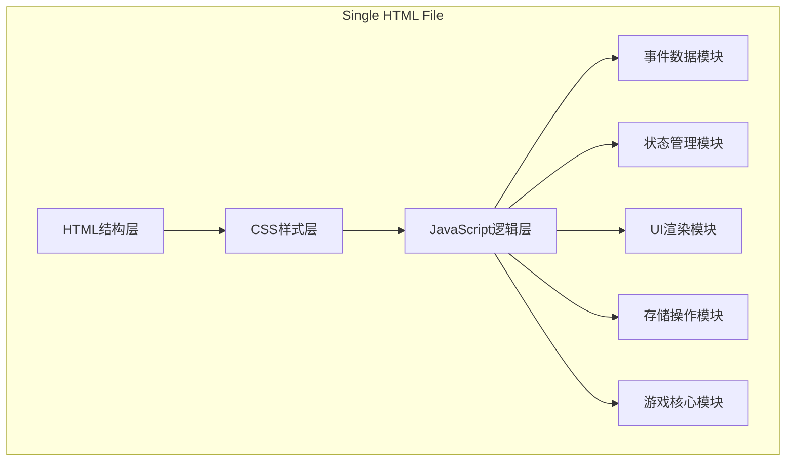

# 历史君主决策游戏 - 技术架构文档

## 1. 架构设计

单HTML文件架构，所有代码组织在同一文件的不同script模块中：



## 2. 技术栈说明
- **前端**：原生HTML5 + CSS3 + JavaScript (ES6+)
- **构建工具**：无，单文件直接运行
- **数据存储**：浏览器localStorage
- **外部依赖**：无，纯原生实现

## 3. 模块接口定义

### 3.1 事件数据模块 (EventPool)
```javascript
// 接口约定
interface EventOption {
    text: string;
    effects: {
        people?: number;
        treasury?: number;
        military?: number;
        prestige?: number;
    };
    tag?: string; // 用于历史关联的标签
}

interface HistoryEvent {
    id: string;
    title: string;
    description: string;
    dynasty: 'qin' | 'han' | 'tang' | 'song' | 'ming';
    options: EventOption[];
    prerequisite?: string; // 前置条件事件ID
    weight?: number; // 基础权重
}

// 输出：事件池数组，至少15个事件
```

### 3.2 状态管理模块 (StateManager)
```javascript
// 接口约定
interface GameState {
    monarchName: string;
    year: number;
    attributes: {
        people: number;     // 民心 0-100
        treasury: number;   // 国库 0-100
        military: number;   // 兵力 0-100
        prestige: number;   // 威望 0-100
    };
    currentEvent: HistoryEvent | null;
    eventHistory: string[]; // 已触发事件ID记录
    choiceTags: string[];   // 选择倾向标签记录
    hasChosen: boolean;     // 当前回合是否已选择
    gameOver: boolean;      // 游戏是否结束
}

// 方法约定
- getState(): GameState
- setState(partial: Partial<GameState>): void
- updateAttribute(key: string, delta: number): number
- resetState(): void
```

### 3.3 UI渲染模块 (UIRenderer)
```javascript
// 接口约定
- renderAttributes(state: GameState, changes?: object): void
- renderEvent(event: HistoryEvent): void
- renderYear(year: number): void
- disableOptions(disabled: boolean): void
- showAttributeChange(key: string, delta: number): void
- showEnding(type: 'downfall' | 'unification' | 'special'): void
- hideEnding(): void
```

### 3.4 存储操作模块 (Storage)
```javascript
// 接口约定
const STORAGE_KEY = 'monarch_game_save';

- save(state: GameState): void
- load(): GameState | null
- clear(): void
```

### 3.5 游戏核心模块 (GameCore)
```javascript
// 接口约定
- init(): void
- nextYear(): void
- chooseOption(optionIndex: number): void
- checkEnding(): string | null
- getWeightedRandomEvent(): HistoryEvent
```

## 4. 历史关联机制设计

**设计意图**：通过标签系统和权重调整实现事件间的关联性，让玩家的选择产生长期影响。

**实现方案**：
1. 每个选项可带有倾向性标签（如'warrior'、'diplomat'、'tyrant'、'benevolent'）
2. 标签累计达到阈值时，解锁特殊事件或提高特定事件的抽取权重
3. 部分事件设有前置条件，需要特定事件已触发过才会出现
4. 根据玩家的选择倾向，动态调整同类型事件的出现概率

## 5. 特殊结局触发条件

**设计意图**：设置彩蛋式结局，鼓励玩家探索不同的选择路径。

**触发条件**：
- 连续10次选择带有'benevolent'（仁政）标签的选项 → "尧舜之治"结局
- 国库≥90且民心≥90且威望≥90且兵力≥90（全属性≥90） → "盛世传奇"结局
- 威望≥95且其他属性≥50 → "千古一帝"结局

## 6. 动画实现方案

**属性变化提示**：
```css
.attr-change {
    animation: floatUp 1.5s ease-out forwards;
    opacity: 0;
}

@keyframes floatUp {
    0% { opacity: 0; transform: translateY(0); }
    10% { opacity: 1; transform: translateY(-5px); }
    70% { opacity: 1; transform: translateY(-20px); }
    100% { opacity: 0; transform: translateY(-30px); }
}
```

## 7. 文件结构

```
index.html
├── <head>
│   ├── <meta> 响应式设置
│   ├── <title> 页面标题
│   └── <style> CSS样式（含动画）
└── <body>
    ├── HTML结构元素
    └── <script> 各模块按顺序定义
        ├── 1. 常量与类型定义
        ├── 2. 事件数据模块
        ├── 3. 状态管理模块
        ├── 4. UI渲染模块
        ├── 5. 存储操作模块
        ├── 6. 游戏核心模块
        └── 7. 初始化与事件绑定
```
