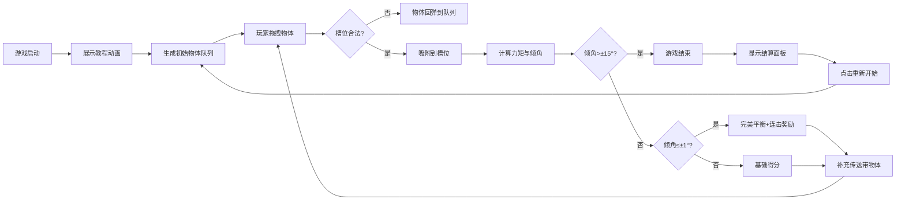

## 1. 产品概述
跷跷板平衡大师 - 一款休闲益智物理游戏，玩家通过拖拽不同重量的物体到跷跷板两侧，保持杆的平衡以获得高分。
- 核心玩法：基于力矩平衡原理的物理仿真，考验玩家的预判与策略思维
- 目标用户：所有年龄段的休闲游戏爱好者

## 2. 核心功能

### 2.1 功能模块
1. **游戏主界面**：跷跷板、传送带物体队列、计分面板
2. **物体系统**：圆形、正方形、三角形三种形状，重量1-10随机
3. **物理引擎**：力矩计算、倾角平滑插值、环境随机抖动
4. **交互系统**：鼠标/触摸拖拽、槽位吸附、碰撞检测
5. **音效系统**：Web Audio API合成放置音、警告音、结束音
6. **计分系统**：基础分、完美平衡奖励、连击倍率
7. **游戏流程**：教程动画、游戏进行、结束结算、重置功能

### 2.3 页面详情
| 页面名称 | 模块名称 | 功能描述 |
|-----------|-------------|---------------------|
| 游戏主页面 | 跷跷板区域 | 中央支点、左右各10+槽位、倾角实时显示 |
| 游戏主页面 | 传送带区域 | 随机生成3个待拖拽物体，自动补充 |
| 游戏主页面 | 计分面板 | 实时分数、游戏时长、完美连击数 |
| 游戏主页面 | 结束弹窗 | 最终得分、坚持时长、最高连击、重新开始按钮 |

## 3. 核心流程

## 4. 用户界面设计
### 4.1 设计风格
- **主色调**：深蓝色(#165DFF)作为主色，浅蓝渐变背景，橙红色作为警告色
- **按钮风格**：圆角胶囊按钮，悬停有缩放和阴影效果
- **字体**：Google Fonts - Orbitron(数字显示) + Poppins(正文)
- **布局风格**：居中对称布局，跷跷板居上，传送带居下
- **视觉风格**：简约科技风，轻微拟物化阴影，流畅动画过渡

### 4.2 页面设计概述
| 页面名称 | 模块名称 | UI元素 |
|-----------|-------------|-------------|
| 游戏主页面 | 跷跷板区域 | 深灰色金属质感杆、金色支点、刻度线、半透明槽位标记 |
| 游戏主页面 | 物体样式 | 渐变填充、重量数字居中、拖拽时上浮阴影 |
| 游戏主页面 | 警告效果 | 倾角>12°时边框变红、播放警告音、抖动效果 |
| 游戏主页面 | 教程动画 | 半透明遮罩、示意箭头、分步文字说明 |

### 4.3 响应式
- **桌面优先**：Canvas渲染游戏区域，固定尺寸800×600
- **移动端适配**：viewport缩放，禁止页面滚动，触摸事件支持
- **触摸优化**：增大拖拽热区，物体跟随手指无延迟

### 4.4 动画与交互
- 物体拖拽：跟随光标，z-index提升，轻微放大
- 槽位吸附：ease-out缓动，150ms完成
- 倾角变化：平滑插值，每帧更新，避免跳变
- 完美平衡：光圈扩散动画，分数弹出特效
- 游戏结束：跷跷板快速下落，屏幕闪红
