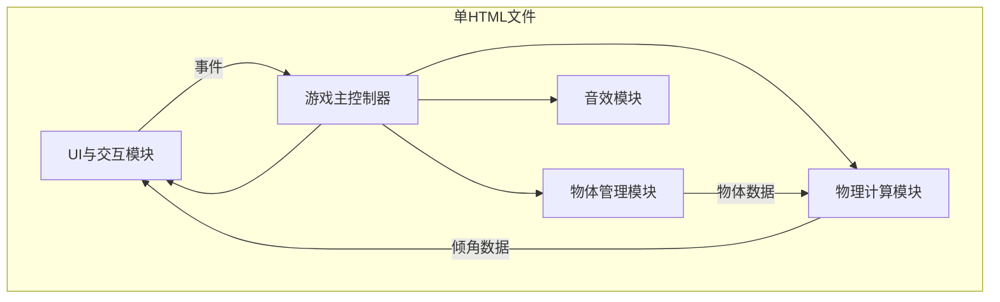

## 1. 架构设计


## 2. 技术描述
- **技术栈**：纯HTML5 + CSS3 + Vanilla JavaScript (ES6+)
- **渲染方式**：Canvas 2D API 绘制游戏场景
- **音频引擎**：Web Audio API 实时合成音效
- **动画驱动**：requestAnimationFrame，目标60FPS
- **构建方式**：单文件内嵌，无需构建工具，双击即玩

## 3. 模块接口定义

### 3.1 物体管理模块 (ObjectManager)
```typescript
interface GameObject {
  id: string;
  shape: 'circle' | 'square' | 'triangle';
  weight: number;
  x: number;
  y: number;
  slotIndex: number | null;
  side: 'left' | 'right' | null;
  isDragging: boolean;
}

interface IObjectManager {
  generateObject(): GameObject;
  getConveyorObjects(): GameObject[];
  placeObject(obj: GameObject, slotIndex: number, side: 'left' | 'right'): boolean;
  removeObject(objId: string): void;
  getPlacedObjects(): GameObject[];
  refillConveyor(): void;
  reset(): void;
}
```

### 3.2 物理计算模块 (PhysicsEngine)
```typescript
interface ITorqueData {
  leftTorque: number;
  rightTorque: number;
  netTorque: number;
  currentAngle: number;
  targetAngle: number;
}

interface IPhysicsEngine {
  calculateTorque(objects: GameObject[]): ITorqueData;
  updateAngle(deltaTime: number): number;
  applyEnvironmentJitter(objectCount: number): void;
  isGameOver(): boolean;
  isPerfectBalance(): boolean;
  isWarningZone(): boolean;
  reset(): void;
}
```

### 3.3 UI与交互模块 (UIRenderer)
```typescript
interface IUIRenderer {
  render(objects: GameObject[], angle: number, gameState: GameState): void;
  onDragStart(callback: (objId: string, x: number, y: number) => void): void;
  onDragMove(callback: (x: number, y: number) => void): void;
  onDragEnd(callback: (x: number, y: number) => void): void;
  showTutorial(): Promise<void>;
  showGameOver(score: number, time: number, maxCombo: number): void;
  hideGameOver(): void;
  showFeedback(message: string, type: 'success' | 'warning' | 'error'): void;
}
```

### 3.4 音效模块 (AudioEngine)
```typescript
interface IAudioEngine {
  init(): void;
  playPlaceSound(): void;
  playWarningSound(volume: number): void;
  playGameOverSound(): void;
  playPerfectSound(): void;
}
```

## 4. 核心常量定义
```javascript
const CONSTANTS = {
  SLOTS_PER_SIDE: 12,
  SLOT_WIDTH: 40,
  MAX_ANGLE: 15,
  WARNING_ANGLE: 12,
  PERFECT_ANGLE: 1,
  BASE_SCORE: 10,
  PERFECT_BONUS: 20,
  MAX_CONVEYOR_OBJECTS: 3,
  ANGLE_SMOOTHING: 0.08,
  JITTER_BASE: 0.05,
  JITTER_MULTIPLIER: 0.02,
};
```

## 5. 数据流程
1. **输入层**：鼠标/触摸事件 → 坐标转换 → 物体选中检测
2. **逻辑层**：拖拽状态管理 → 槽位碰撞检测 → 放置合法性判断
3. **物理层**：物体力矩求和 → 目标角度计算 → 平滑插值更新
4. **渲染层**：场景清空 → 跷跷板绘制 → 物体绘制 → UI叠加
5. **音效层**：事件触发 → 音频参数计算 → 振荡器播放

## 6. 性能优化
- **Canvas分层**：静态背景预渲染，动态元素单独绘制
- **对象池**：物体对象复用，避免频繁GC
- **事件节流**：触摸/鼠标move事件RAF对齐
- **音频预热**：游戏启动时初始化AudioContext，避免首次播放延迟
