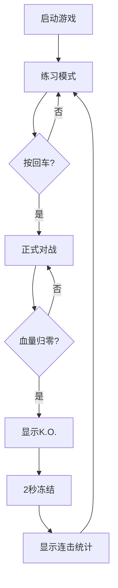

## 1. 产品概述
高性能Canvas 2D双人格斗对战游戏，支持完整的格斗机制与流畅的游戏体验。
- 解决传统格斗游戏的高门槛问题，提供完整的对战系统与练习模式
- 面向格斗游戏爱好者，支持本地双人对战与单人练习

## 2. 核心功能

### 2.1 功能模块
1. **游戏主界面**: Canvas游戏画布、血条能量槽UI、连击数显示
2. **对战系统**: 双人操作、攻击段位判定、防御机制、必杀技
3. **状态系统**: 角色状态机、气绝浮空、受身系统、伤害修正

### 2.2 页面详情
| 页面名称 | 模块名称 | 功能描述 |
|---------|---------|---------|
| 游戏主页面 | 游戏画布 | 60fps Canvas渲染，角色动画，特效显示 |
| 游戏主页面 | UI系统 | 血条平滑动画，能量槽光效，连击计数 |
| 游戏主页面 | 输入系统 | 双人键盘输入，8帧输入缓冲，指令识别 |

## 3. 核心流程
游戏启动→练习模式（对手待机）→按回车开始对战→角色攻防互动→一方血量归零→显示K.O.→2秒后显示统计→重置回练习模式

## 4. 用户界面设计
### 4.1 设计风格
- 主色调：深色背景(1a1a2e)，角色区分色(红/蓝)，能量槽金色渐变
- 视觉风格：复古街机风，像素感描边，霓虹光效
- 字体： monospace等宽字体，复古街机感
- 布局：居中游戏画布，顶部UI栏，底部操作提示

### 4.2 页面设计概述
| 页面名称 | 模块名称 | UI元素 |
|---------|---------|--------|
| 游戏主页面 | 游戏画布 | 800x600 Canvas，角色精灵，碰撞盒，特效 |
| 游戏主页面 | 血条UI | 平滑递减动画，分段血条，闪烁效果 |
| 游戏主页面 | 能量槽 | 金色发光，递增动画，满槽脉冲 |
| 游戏主页面 | 连击数 | 渐变放大，颜色随连击数变化 |

### 4.3 响应性
桌面端优先，固定画布尺寸，居中显示，支持窗口缩放适配
