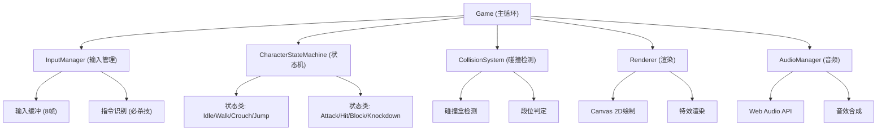

## 1. 架构设计



## 2. 技术描述
- 前端: 纯HTML5 + Canvas 2D + ES6 Modules
- 无框架依赖，单文件内联所有模块
- 音频: Web Audio API 振荡器合成音效
- 渲染: requestAnimationFrame 60fps 主循环

## 3. 模块接口定义

### 3.1 Game 主模块
```typescript
interface Game {
  state: 'practice' | 'fight' | 'ko' | 'stats';
  frameCount: number;
  players: [Character, Character];
  screenShake: { x: number; y: number; duration: number };
  
  init(): void;
  update(): void;
  render(): void;
  startMatch(): void;
  endMatch(): void;
}
```

### 3.2 InputManager 输入管理
```typescript
interface InputManager {
  buffer: InputFrame[]; // 8帧缓冲
  getInput(player: 0|1): PlayerInput;
  checkCommand(command: string, player: 0|1): boolean;
  updateBuffer(): void;
}

interface PlayerInput {
  x: number; y: number;
  light: boolean; heavy: boolean;
  jump: boolean; block: boolean; super: boolean;
}
```

### 3.3 CharacterStateMachine 状态机
```typescript
interface CharacterState {
  enter(): void;
  update(): void;
  exit(): void;
  canTransitionTo(state: string): boolean;
}

interface Character {
  state: CharacterState;
  hp: number; maxHp: number;
  energy: number; maxEnergy: number;
  combo: number; maxCombo: number;
  stun: number; stunThreshold: number;
  position: { x: number; y: number };
  velocity: { x: number; y: number };
  facing: 1|-1;
  hitboxes: Hitbox[];
  hurtboxes: Hitbox[];
  
  transitionState(state: string): void;
  takeDamage(amount: number, level: 'high'|'mid'|'low'): void;
}
```

### 3.4 攻击帧数据表
| 招式类型 | 发生帧 | 持续帧 | 收招帧 | 段位 | 伤害 |
|---------|-------|-------|-------|------|------|
| 轻攻击 | 5 | 8 | 12 | 中段 | 50 |
| 重攻击 | 10 | 12 | 20 | 中段 | 100 |
| 蹲轻攻 | 4 | 6 | 10 | 下段 | 40 |
| 蹲重攻 | 8 | 10 | 18 | 下段 | 80 |
| 跳攻击 | 8 | 10 | 0 | 上段 | 60 |
| 必杀技 | 12 | 15 | 25 | 中段 | 150 |

### 3.5 段位防御判定
| 段位 | 站立防御 | 蹲防 |
|------|---------|------|
| 上段 | ✓ | ✗ |
| 中段 | ✓ | ✓ |
| 下段 | ✗ | ✓ |

## 4. 性能优化策略
- 对象池模式复用特效对象
- 避免每帧创建新对象
- 使用整数运算代替浮点
- 离屏绘制静态元素
- 空间分区碰撞检测
