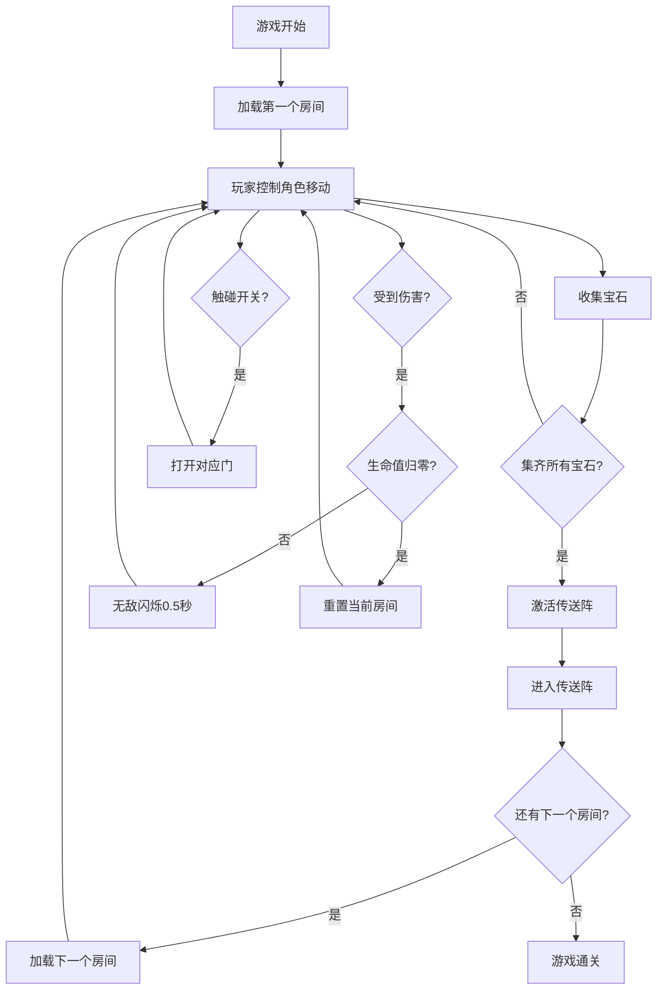

## 1. 产品概述

本项目是一个基于HTML5 Canvas的横版卷轴动作冒险游戏，使用原生JavaScript实现，无需任何外部库或资源文件。游戏包含丰富的角色动作系统、多样化的敌人AI、精巧的关卡设计和动态的难度调整机制，为玩家提供兼具挑战性和趣味性的游戏体验。

## 2. 核心功能

### 2.1 玩家角色系统
玩家可操作一个具备多种动作能力的角色：
- **基础移动**：行走（120像素/秒）、奔跑（200像素/秒）
- **跳跃**：垂直高度≥100像素，水平覆盖≥120像素
- **边缘攀爬**：可抓住平台边缘并向上攀爬
- **近战攻击**：近距离攻击敌人
- **钩爪摆荡**：发射钩爪进行摆荡移动（最大长度150像素，线速度≤400像素/秒）

### 2.2 敌人AI系统
包含三种行为模式的敌人：
| 敌人类型 | 行为模式 |
|---------|---------|
| 固定巡逻兵 | 在平台上来回走动 |
| 飞行追踪者 | 在一定范围内朝玩家移动 |
| 投石巨怪 | 站桩周期性抛出抛物线石块 |

### 2.3 关卡设计
关卡由多个房间拼接而成，通过门或缺口连接，包含：
- **开关系统**：需要拉下对应开关才能打开门（石门完全升起时间≤1.5秒）
- **深渊区域**：需要利用钩爪摆荡才能通过
- **高台区域**：必须连续攀爬边缘才能上去
- **传送阵**：集齐房间所有宝石后在出口处激活

### 2.4 收集系统
- 场景中分布可收集的发光宝石
- 拾取判定范围：角色中心点周围24像素半径
- HUD实时显示宝石数量
- 集齐所有宝石后激活出口传送阵

### 2.5 生命值与死亡系统
- 玩家拥有5点生命值
- 受伤后有0.5秒无敌闪烁时间
- 敌人攻击和尖刺陷阱都会扣血
- 生命值归零后从当前房间初始入口重新开始
- 死亡后当前房间机关、敌人、宝石重置，已通过房间保持解锁

### 2.6 动态威胁等级系统
敌人AI根据玩家状态调整进攻积极性：
- 玩家血量低时敌人更具攻击性
- 玩家摆荡或攀爬时敌人行为调整
- 行为调整有明显区分度

### 2.7 动画系统
所有角色动画使用离屏Canvas动态绘制的精灵条实现：
- 跑步、跳跃、攻击、攀爬、摆荡、受伤、死亡动画
- 按帧切换播放

### 2.8 陷阱系统
包含三种陷阱元素：
| 陷阱类型 | 触发机制 | 特殊效果 |
|---------|---------|---------|
| 尖刺地面 | 接触即扣血 | - |
| 毒气孔 | 定时喷发 | 喷发前0.8秒粒子预警 |
| 钟乳石 | 玩家经过下方时触发 | 短暂延迟后落下，砸中地面屏幕抖动0.2秒（幅度≤8像素） |

### 2.9 特殊机制
- 钩爪摆荡过程中被攻击或碰到尖刺时立即脱钩
- 受击硬直并向下掉落
- 物理系统预留父子坐标转换接口，便于未来扩展移动平台

## 3. 核心流程

## 4. 用户界面设计

### 4.1 设计风格
- **主色调**：深蓝色背景 (#1a1a2e) 搭配明亮的游戏元素
- **强调色**：金色宝石 (#ffd700)、红色危险 (#ff4444)、绿色生命 (#44ff44)
- **视觉风格**：像素风/复古游戏风格，简洁的几何图形
- **动画风格**：流畅的帧动画，粒子特效增强视觉反馈

### 4.2 HUD设计
| 元素 | 位置 | 样式 |
|------|------|------|
| 生命值 | 左上角 | 5个心形图标，绿色填充表示生命 |
| 宝石数量 | 右上角 | 金色宝石图标 + 数字计数 |
| 房间名称 | 顶部中央 | 简洁的文字显示 |

### 4.3 响应性
- 游戏画布固定尺寸（推荐 1280x720）
- 居中显示在浏览器窗口
- 支持键盘控制，无需触摸优化
