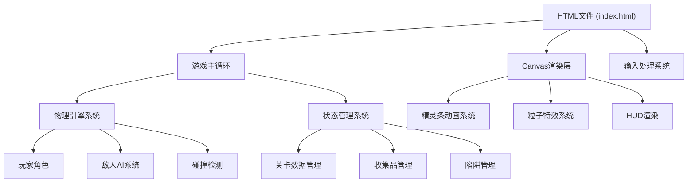
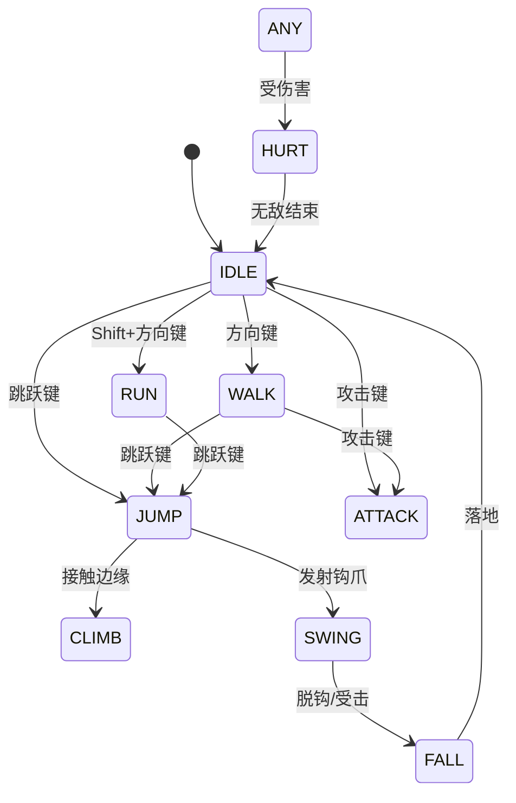

## 1. 架构设计



## 2. 技术描述

- **前端技术栈**：原生HTML5 + JavaScript + Canvas 2D API
- **构建方式**：单文件集成，无需构建工具或外部依赖
- **渲染引擎**：Canvas 2D 上下文
- **动画系统**：基于离屏Canvas动态生成精灵条
- **物理系统**：自研2D物理引擎，包含重力、碰撞、摆荡物理

## 3. 核心模块设计

### 3.1 游戏主循环
| 阶段 | 描述 | 频率 |
|------|------|------|
| 输入处理 | 键盘状态轮询 | 每帧 |
| 逻辑更新 | 物理、AI、状态更新 | 60 FPS |
| 渲染 | Canvas绘制 | 60 FPS |

### 3.2 玩家状态机


### 3.3 输入控制映射
| 按键 | 功能 |
|------|------|
| A / ← | 向左移动 |
| D / → | 向右移动 |
| W / ↑ | 向上/攀爬 |
| S / ↓ | 向下 |
| Space | 跳跃 |
| Shift | 奔跑 |
| J / Z | 近战攻击 |
| K / X | 钩爪发射/脱钩 |
| E | 互动（开关） |
| R | 重置当前房间 |

### 3.4 物理常量定义
| 参数 | 值 | 说明 |
|------|-----|-----|
| GRAVITY | 800 | 重力加速度 (像素/秒²) |
| WALK_SPEED | 120 | 行走速度 (像素/秒) |
| RUN_SPEED | 200 | 奔跑速度 (像素/秒) |
| JUMP_FORCE | -400 | 跳跃初速度 |
| MAX_FALL_SPEED | 600 | 最大下落速度 |
| GRAPPLE_MAX_LENGTH | 150 | 钩爪最大长度 |
| GRAPPLE_MAX_SPEED | 400 | 摆荡最大线速度 |

## 4. 数据结构定义

### 4.1 玩家数据结构
```javascript
Player = {
  x, y, width, height,       // 位置和尺寸
  vx, vy,                    // 速度
  health, maxHealth,         // 生命值
  invincibleTimer,           // 无敌计时器
  state,                     // 状态机状态
  facing,                    // 朝向 (1/-1)
  onGround,                  // 是否在地面
  climbData,                 // 攀爬状态数据
  grappleData,               // 钩爪状态数据
  attackData,                // 攻击状态数据
  animationFrame,            // 当前动画帧
  parentPlatform             // 父平台（预留接口）
}
```

### 4.2 敌人数据结构
```javascript
Enemy = {
  type,                      // 类型: patrol/fly/troll
  x, y, width, height,       // 位置和尺寸
  vx, vy,                    // 速度
  health,                    // 生命值
  state,                     // 状态
  threatLevel,               // 当前威胁等级
  patrolData,                // 巡逻数据
  flyData,                   // 飞行数据
  trollData,                 // 投石数据
  animationFrame             // 动画帧
}
```

### 4.3 房间数据结构
```javascript
Room = {
  id, name,                   // 房间标识
  platforms,                  // 平台列表
  walls,                      // 墙壁列表
  doors,                      // 门列表
  switches,                   // 开关列表
  gems,                       // 宝石列表
  traps,                      // 陷阱列表
  enemies,                    // 敌人列表
  spawnPoint,                 // 出生点
  exitPortal,                 // 出口传送阵
  grapplePoints,              // 钩爪点
  climbEdges                  // 可攀爬边缘
}
```

## 5. 动画系统设计

### 5.1 精灵条生成
使用离屏Canvas动态绘制每一帧，形成精灵条：
- 每个动画序列包含4-8帧
- 帧尺寸：玩家 48x64 像素，敌人 48x48 像素
- 帧率：10 FPS 动画播放速度

### 5.2 动画状态列表
| 角色 | 动画状态 | 帧数 |
|------|---------|------|
| 玩家 | idle, walk, run, jump, climb, swing, attack, hurt, death | 4-8 |
| 巡逻兵 | idle, walk, attack, hurt | 4-6 |
| 飞行者 | fly, attack, hurt | 4-6 |
| 投石怪 | idle, throw, hurt | 4-6 |

## 6. 碰撞检测系统

### 6.1 碰撞层级
1. **固体碰撞**：平台、墙壁、门
2. **伤害碰撞**：敌人、敌人攻击、尖刺、毒气
3. **互动碰撞**：宝石、开关、传送阵、钩爪点、攀爬边缘
4. **触发碰撞**：钟乳石触发区域

### 6.2 碰撞算法
- AABB (轴对齐包围盒) 碰撞检测
- 分离轴定理 (SAT) 用于精确碰撞响应
- 连续碰撞检测 (CCD) 防止高速穿透

## 7. 性能优化策略

1. **空间分区**：将场景划分为网格，只检测相邻网格内的碰撞
2. **对象池**：复用粒子对象，避免频繁创建销毁
3. **视口裁剪**：只渲染屏幕内的对象
4. **离屏缓存**：静态背景预渲染到离屏Canvas
