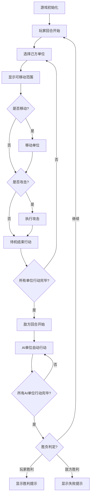

## 1. 产品概述
策略战棋游戏单页原型，基于12×12方格地图的回合制战斗系统，玩家与敌方AI交替行动，通过单位移动、攻击和升级机制进行对战。
- 主要目的：提供一个可直接运行的战棋游戏原型，验证核心玩法机制
- 目标用户：战棋游戏爱好者，游戏开发者用于玩法验证

## 2. 核心功能

### 2.1 功能模块
1. **游戏主界面**：12×12地图网格，回合信息显示，单位属性侧边栏
2. **地图系统**：4种地形（平原、森林、山地、河流）+ 障碍物，地形影响移动消耗和战斗属性
3. **单位系统**：4种单位类型（剑士、弓箭手、骑士、飞龙），拥有攻击、防御、生命、移动力、经验值等属性
4. **回合制系统**：玩家与敌方AI交替回合，单位可执行移动+攻击操作
5. **战斗系统**：近战/远程攻击判定，伤害计算，闪避判定，防御加成
6. **升级系统**：击败敌人获得经验，达到阈值升级提升属性
7. **AI系统**：敌方自动寻路、移动、攻击的智能决策
8. **胜利判定**：消灭所有敌方单位即获胜

### 2.2 页面详情
| 页面名称 | 模块名称 | 功能描述 |
|---------|---------|---------|
| 游戏主页面 | 地图网格 | 12×12方格，显示地形和单位，支持点击交互 |
| 游戏主页面 | 信息栏 | 显示回合数、当前行动方、游戏状态 |
| 游戏主页面 | 单位属性栏 | 选中单位时显示详细属性面板 |
| 游戏主页面 | 游戏控制 | 结束回合按钮，重新开始功能 |

## 3. 核心流程

## 4. 用户界面设计

### 4.1 设计风格
- 主色调：深褐色(#5D4037)作为基础，代表战棋的史诗感
- 辅助色：绿色(#4CAF50)表示玩家单位，红色(#F44336)表示敌方单位
- 地形色：平原#8BC34A，森林#2E7D32，山地#795548，河流#2196F3，障碍物#424242
- 按钮风格：圆角矩形，带hover效果和点击反馈
- 字体：使用系统无衬线字体，保证跨平台一致性
- 布局风格：CSS Grid布局地图，Flex布局信息栏，整体采用复古战棋卡牌风格

### 4.2 页面设计概述
| 页面名称 | 模块名称 | UI元素 |
|---------|---------|---------|
| 游戏主页面 | 地图网格 | 12×12方格，不同地形颜色区分，单位使用emoji图标，可移动/可攻击范围使用半透明高亮 |
| 游戏主页面 | 信息栏 | 顶部横幅，回合数大号字体，行动方用颜色标识 |
| 游戏主页面 | 单位属性栏 | 右侧固定面板，属性列表使用卡片式布局，关键属性高亮显示 |
| 游戏主页面 | 游戏控制 | 底部按钮组，主按钮突出显示 |

### 4.3 响应式
- 桌面端优先：地图格子48px×48px，侧边栏固定宽度280px
- 移动端适配：使用媒体查询，格子缩小至36px×36px，侧边栏改为底部滑出
- 触摸优化：增加点击区域，最小可点击尺寸40px×40px

### 4.4 动效设计
- 单位移动：使用CSS transition实现平滑移动动画
- 攻击效果：被攻击单位闪烁红色，伤害数字弹出动画
- 范围高亮：渐入渐出的透明度动画
- 回合切换：淡入淡出的状态提示
