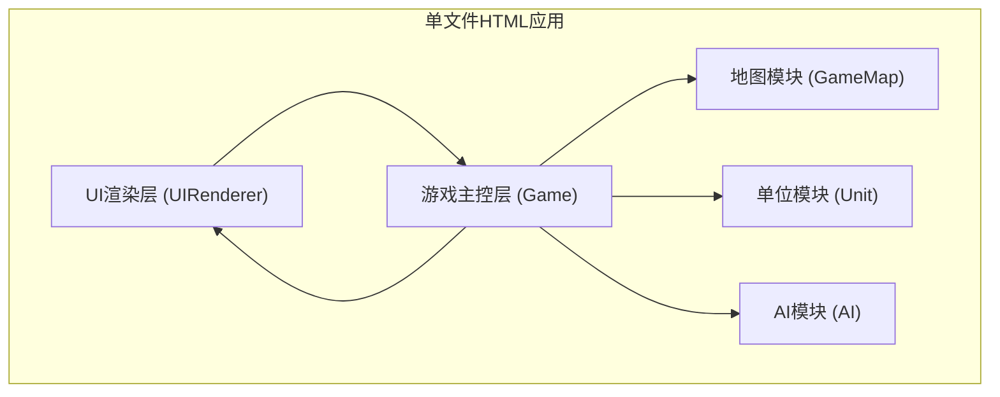

## 1. 架构设计


## 2. 技术描述
- **前端技术**：原生HTML5 + CSS3 + JavaScript (ES6+)
- **构建方式**：单文件整合，无构建工具，直接浏览器打开运行
- **布局技术**：CSS Grid (地图) + CSS Flexbox (整体布局)
- **动画实现**：CSS Transitions + CSS Animations
- **无外部依赖**：不使用任何第三方库或框架

## 3. 核心类设计

### 3.1 Game 类（游戏主控）
```javascript
class Game {
  constructor()          // 初始化游戏
  initGame()             // 初始化地图和单位
  startPlayerTurn()      // 开始玩家回合
  startEnemyTurn()       // 开始敌方回合
  selectUnit(unit)       // 选择单位
  moveUnit(toX, toY)     // 移动单位
  attackUnit(target)     // 攻击单位
  endUnitAction()        // 结束单位行动
  checkVictory()         // 检查胜负
}
```

### 3.2 GameMap 类（地图模块）
```javascript
class GameMap {
  constructor(width, height, terrainData)
  getTerrain(x, y)       // 获取地形
  isPassable(x, y, unitType)  // 检查是否可通行
  getMoveCost(x, y, unitType) // 获取移动消耗
  calculateMoveRange(unit)     // 计算可移动范围(BFS)
  calculateAttackRange(unit)   // 计算可攻击范围
}
```

### 3.3 Unit 类（单位模块）
```javascript
class Unit {
  constructor(config, x, y, team)
  takeDamage(damage)     // 受到伤害
  gainExp(amount)        // 获得经验
  levelUp()              // 升级
  canMove()              // 是否可移动
  canAttack()            // 是否可攻击
  hasMoved               // 是否已移动
  hasAttacked            // 是否已攻击
}
```

### 3.4 AI 类（敌方AI）
```javascript
class AI {
  constructor(game)
  executeTurn()          // 执行AI回合
  processUnit(unit)      // 处理单个AI单位
  findNearestEnemy(unit) // 寻找最近敌人
  calculatePath(unit, target) // 计算路径
}
```

### 3.5 UIRenderer 类（UI渲染）
```javascript
class UIRenderer {
  constructor(game)
  renderMap()            // 渲染地图
  renderUnits()          // 渲染单位
  renderMoveRange(cells) // 渲染移动范围
  renderAttackRange(cells) // 渲染攻击范围
  renderUnitInfo(unit)   // 渲染单位信息
  showMessage(text)      // 显示消息
}
```

## 4. 数据结构定义

### 4.1 地形配置
```javascript
const TERRAIN_CONFIG = {
  PLAIN: { name: '平原', color: '#8BC34A', moveCost: { infantry: 1, cavalry: 1, flying: 1 }, passable: { infantry: true, cavalry: true, flying: true }, defenseBonus: 0, dodgeChance: 0 },
  FOREST: { name: '森林', color: '#2E7D32', moveCost: { infantry: 2, cavalry: 2, flying: 1 }, passable: { infantry: true, cavalry: true, flying: true }, defenseBonus: 0, dodgeChance: 0.2 },
  MOUNTAIN: { name: '山地', color: '#795548', moveCost: { infantry: 3, cavalry: 3, flying: 1 }, passable: { infantry: true, cavalry: true, flying: true }, defenseBonus: 0.3, dodgeChance: 0 },
  RIVER: { name: '河流', color: '#2196F3', moveCost: { infantry: Infinity, cavalry: Infinity, flying: 1 }, passable: { infantry: false, cavalry: false, flying: true }, defenseBonus: 0, dodgeChance: 0 },
  ROCK: { name: '岩石', color: '#424242', moveCost: { infantry: Infinity, cavalry: Infinity, flying: Infinity }, passable: { infantry: false, cavalry: false, flying: false }, defenseBonus: 0, dodgeChance: 0 }
};
```

### 4.2 单位配置
```javascript
const UNIT_CONFIG = {
  SWORDSMAN: { name: '剑士', emoji: '⚔️', type: 'infantry', attackRange: 1, isRanged: false, baseStats: { attack: 25, defense: 20, hp: 100, maxHp: 100, move: 3 } },
  ARCHER: { name: '弓箭手', emoji: '🏹', type: 'infantry', attackRange: 2, isRanged: true, baseStats: { attack: 20, defense: 10, hp: 60, maxHp: 60, move: 2 } },
  KNIGHT: { name: '骑士', emoji: '🐴', type: 'cavalry', attackRange: 1, isRanged: false, baseStats: { attack: 30, defense: 15, hp: 80, maxHp: 80, move: 5 } },
  DRAGON: { name: '飞龙', emoji: '🐉', type: 'flying', attackRange: 1, isRanged: false, baseStats: { attack: 35, defense: 25, hp: 120, maxHp: 120, move: 4 } }
};
```

## 5. 核心算法

### 5.1 BFS寻路算法
- 使用广度优先搜索计算可移动范围
- 考虑地形移动消耗
- 飞龙单位无视地形消耗（统一为1）
- 单位占据的格子视为阻挡

### 5.2 伤害计算公式
```javascript
damage = Math.floor(attacker.attack * (100 / (100 + defender.defense * (1 + terrainBonus))));
```

### 5.3 弓箭手射击线检测
- 检查两点之间的直线
- 确保中间格子无障碍物或单位

## 6. 文件结构
- **单文件**：index.html（整合HTML结构、CSS样式、JavaScript逻辑）
- 内部模块划分：
  - HTML: 页面结构
  - CSS: 样式定义
  - JavaScript: 5个核心类 + 配置数据 + 游戏启动
