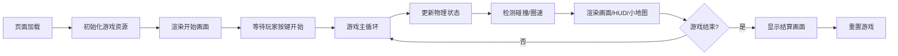

## 1. 产品概述

本项目是一个基于 HTML5 Canvas 的 2D 俯视角赛车竞速游戏，玩家通过键盘控制赛车在封闭环形赛道上与 AI 对手进行竞速比赛，提供真实的物理驾驶体验和丰富的游戏机制。

- 主要目的：为用户提供一个可直接在浏览器中运行的高质量赛车游戏体验
- 目标用户：休闲游戏玩家、赛车游戏爱好者
- 产品价值：纯前端实现，无需安装，支持持久化记录最佳圈速，具备专业赛车游戏的核心玩法

## 2. 核心功能

### 2.1 用户角色
| 角色 | 登录方式 | 核心权限 |
|------|----------|----------|
| 玩家 | 无需登录 | 进行游戏、查看圈速记录 |

### 2.2 功能模块
1. **游戏主界面**：Canvas 渲染场景、HUD 信息显示、缩略小地图
2. **车辆控制系统**：加速、制动、转向、氮气加速、漂移机制
3. **物理引擎**：不同路面材质物理特性、碰撞检测与响应、粒子效果
4. **AI 对手系统**：路径跟随、超车/防守行为、尾流机制
5. **计时系统**：单圈计时、最佳圈速记录、localStorage 持久化
6. **音效系统**：Web Audio API 生成圈速完成提示音

### 2.3 页面详情
| 页面名称 | 模块名称 | 功能描述 |
|----------|----------|----------|
| 游戏主界面 | HUD 显示 | 实时显示当前圈速、最佳圈速、时间差值、氮气状态 |
| 游戏主界面 | 小地图 | 缩略显示赛道和所有车辆位置，低频率更新 |
| 游戏主界面 | Canvas 渲染 | 60fps 渲染赛道、车辆、粒子效果 |

## 3. 核心流程

## 4. 用户界面设计

### 4.1 设计风格
- **主色调**：深色背景（#1a1a2e）配合霓虹色调的 HUD 显示（青色 #00f5d4、红色 #ff2a6d）
- **视觉风格**：复古未来主义，科技感十足，带有赛车运动的速度感
- **字体**：使用等宽字体（如 monospace）显示计时数据，确保数字对齐美观
- **布局**：Canvas 居中显示，HUD 元素分布在屏幕四角，小地图固定在右上角

### 4.2 页面设计概览
| 页面名称 | 模块名称 | UI 元素 |
|----------|----------|----------|
| 游戏主界面 | Canvas 场景 | 深灰色沥青路面、棕黄色沙地、赛道边界白线、车辆精灵、烟雾粒子 |
| 游戏主界面 | HUD 显示 | 左上角圈速数据、左下角氮气条、右上角小地图 |
| 游戏主界面 | 圈速完成提示 | 屏幕中央闪烁的圈速时间、新纪录动画效果 |

### 4.3 响应性
- 桌面端优先，Canvas 固定尺寸（1200x800）
- 小屏幕自动缩放 Canvas 以适应窗口
- 键盘操作，无需触摸优化

## 5. 性能要求
- 主循环稳定 60fps，使用 requestAnimationFrame
- 标签页不可见时自动暂停物理更新和计时
- 粒子数量超过 50 时仍保持 60fps
- 路面切换时帧率波动不超过 2 帧
