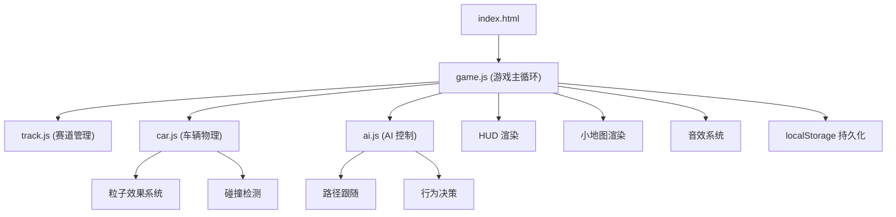

## 1. 架构设计



## 2. 技术描述

- **前端技术栈**：纯 HTML5 Canvas + 原生 ES6+ JavaScript
- **模块化组织**：按功能拆分为独立 JS 文件，无第三方依赖
- **渲染引擎**：Canvas 2D Context
- **游戏循环**：requestAnimationFrame 实现 60fps 稳定循环
- **数据持久化**：localStorage 存储最佳圈速记录
- **音效系统**：Web Audio API 生成合成音效

## 3. 文件结构

| 文件路径 | 用途 |
|----------|------|
| /index.html | 入口页面，Canvas 容器，JS 引入 |
| /track.js | 赛道定义、路面材质、碰撞边界、路径点 |
| /car.js | 车辆物理引擎、输入处理、漂移、氮气、粒子 |
| /ai.js | AI 车辆控制逻辑、路径跟随、超车决策 |
| /game.js | 游戏主循环、HUD、小地图、计时、音效 |

## 4. 核心模块设计

### 4.1 Track 模块 (track.js)
```javascript
// 核心数据结构
{
  width: number,           // 赛道宽度
  points: Array<{x, y}>,  // 赛道中心线坐标点
  boundaries: Array<{x1, y1, x2, y2}>, // 碰撞边界
  surfaceType: Function,   // 获取指定位置的路面类型
  checkPointIndex: number, // 检测点索引
  getNearestPoint: Function, // 获取最近路径点
}

// 路面材质定义
const SURFACE = {
  ASPHALT: { grip: 1.0, drag: 0.98, color: '#333' },
  SAND: { grip: 0.6, drag: 0.92, color: '#c2a366' }
};
```

### 4.2 Car 模块 (car.js)
```javascript
// 车辆物理状态
{
  x: number, y: number,       // 位置
  angle: number,              // 朝向角度 (弧度)
  velocity: {x, y},           // 速度向量
  angularVelocity: number,    // 角速度
  speed: number,              // 当前速度标量
  nitro: number,              // 氮气量 (0-100)
  nitroCooldown: boolean,     // 氮气冷却中
  drifting: boolean,          // 漂移状态
  driftAngle: number,         // 漂移角度
  skidMarks: Array,           // 轮胎痕迹
  particles: Array,           // 烟雾粒子
  offTrackTime: number,       // 冲出赛道时间
  invincibleTime: number,     // 无敌时间
  
  // 物理常量
  MAX_SPEED: 400,             // 沥青最大速度 px/s
  NITRO_MAX_SPEED: 550,       // 氮气最大速度 px/s
  SAND_SPEED_PENALTY: 0.7,    // 沙地速度惩罚
  ACCELERATION: 200,          // 加速度 px/s²
  BRAKE_FORCE: 400,           // 制动力
  TURN_SPEED: 3.5,            // 转向速度 rad/s
}
```

### 4.3 AI 模块 (ai.js)
```javascript
// AI 决策系统
{
  targetPointIndex: number,   // 目标路径点索引
  lookAhead: number,          // 前瞻距离
  aggression: number,         // 攻击性参数 (0.8-1.2)
  defenseMode: boolean,       // 防守模式
  
  // 行为状态机
  state: 'follow' | 'overtake' | 'defend',
  decideAction: Function,      // 根据玩家位置决策
  followPath: Function,         // 沿路径行驶
  overtake: Function,           // 超车行为
  defend: Function,             // 防守行为
}
```

### 4.4 Game 模块 (game.js)
```javascript
// 游戏主控制器
{
  canvas: HTMLCanvasElement,
  ctx: CanvasRenderingContext2D,
  lastTime: number,           // 上一帧时间
  deltaTime: number,          // 帧间隔 (秒)
  paused: boolean,            // 暂停状态
  lapTime: number,            // 当前圈速 (秒)
  bestLapTime: number | null, // 最佳圈速
  lapStarted: boolean,        // 圈速计时开始
  
  // 输入状态
  keys: { up, down, left, right, space },
  
  // 游戏对象
  playerCar: Car,
  aiCars: Array<Car>,
  track: Track,
  
  // 核心方法
  init: Function,
  gameLoop: Function,
  update: Function,
  render: Function,
  renderHUD: Function,
  renderMinimap: Function,
  playLapSound: Function,
  checkLapComplete: Function,
}
```

## 5. 性能优化策略

1. **小地图优化**：独立更新频率（每 3 帧更新一次）
2. **粒子池化**：重用粒子对象，避免频繁 GC
3. **空间分区**：碰撞检测仅检查附近边界
4. **离屏渲染**：赛道背景预渲染到离屏 Canvas
5. **可见性检测**：仅渲染屏幕内的粒子和轮胎痕迹
6. **页面可见性 API**：标签页隐藏时暂停游戏循环

## 6. 物理引擎要点

### 6.1 漂移判定
- 条件：速度 > 150px/s 且 转向角速度 > 2.0rad/s
- 效果：抓地力降低 40%，产生烟雾粒子，尾部侧滑
- 出弯惩罚：速度损失 5-15%，与漂移角度成正比

### 6.2 碰撞响应
- 检测：点到线段距离检测
- 响应：入射角计算反射向量，速度乘以弹性系数 0.6
- 防止卡墙：沿法线推出碰撞边界

### 6.3 自动重置
- 条件：车辆中心点距离赛道边界 > 3 秒
- 重置：找到最近路径点，朝向路径方向
- 惩罚：氮气清零，3 秒无敌时间
