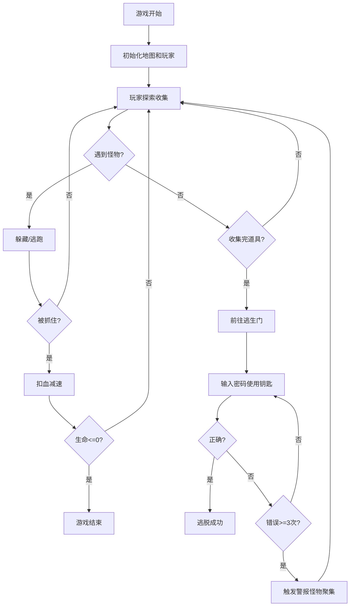

## 1. 产品概述

本产品是一个单HTML文件的生存恐怖游戏原型，玩家在废弃医院环境中探索、收集道具、躲避怪物，最终找到钥匙和密码逃出医院。游戏采用俯视角2D Canvas渲染，营造黑暗压抑的恐怖氛围。

- 核心玩法：资源管理、怪物规避、谜题解密、生存逃脱
- 目标用户：恐怖游戏爱好者、独立游戏开发者、游戏原型研究者

## 2. 核心功能

### 2.1 用户角色

| 角色 | 注册方式 | 核心权限 |
|------|----------|----------|
| 玩家 | 无需注册 | 完整游戏体验、存档/读档 |

### 2.2 功能模块

1. **游戏核心系统**：地图渲染、玩家控制、怪物AI、碰撞检测
2. **资源管理系统**：手电筒电量、生命值、道具收集
3. **音频系统**：脚步声、心跳声、怪物吼声、紧张音效
4. **存档系统**：localStorage手动存档、读档恢复
5. **解密系统**：密码锁、钥匙收集、密码纸条
6. **UI系统**：HUD显示、交互提示、密码输入面板

### 2.3 功能详情

| 页面/模块 | 子模块 | 功能描述 |
|-----------|--------|----------|
| 游戏场景 | 地图渲染 | 5个连通房间、走廊、安全屋、逃生大门，Canvas 2D渲染 |
| 玩家系统 | 移动控制 | WASD移动，Shift奔跑，Ctrl蹲下，E交互 |
| 玩家系统 | 手电筒 | 锥形光束、60秒电量、电池拾取、低电闪烁 |
| 怪物AI | 感知系统 | 60度锥形视觉、脚步声听觉、柜子躲藏机制 |
| 怪物AI | 行为模式 | 巡逻、追逐、假装失去兴趣、折返搜索 |
| 战斗系统 | 受伤机制 | 每次受伤扣20血、移速降低30%可叠加 |
| 道具系统 | 收集品 | 电池、医疗包、钥匙、密码纸条 |
| 逃脱系统 | 密码锁 | 三位数密码、三次错误触发警报吸引怪物 |
| 安全屋 | 存档机制 | 怪物无法进入、手动存档localStorage、读档重置怪物 |
| 音效系统 | Web Audio | 无外部文件、脚步声变化、心跳、怪物吼声、紧张蜂鸣 |
| 视觉效果 | 畸变效果 | 游戏后期随机出现场景扭曲残影 |
| UI界面 | HUD | 电量条、生命条、道具栏、交互提示、密码键盘 |

## 3. 核心流程

## 4. 用户界面设计

### 4.1 设计风格

- **主色调**：深黑色(#0a0a0a)背景，暗红色(#8b0000)强调，惨白色(#ffffff)文字
- **辅助色**：手电筒光束暖黄色(#ffd700)渐变，生命条血红色(#dc143c)，电量条蓝绿色(#00ced1)
- **字体**：等宽字体(Consolas/Monaco)营造复古恐怖游戏氛围
- **布局**：全屏Canvas居中，UI元素固定在屏幕四角，不遮挡游戏区域
- **视觉效果**：噪点叠加、vignette暗角、手电筒光束渐变、怪物出现时画面抖动

### 4.2 界面设计概览

| 模块 | 位置 | UI元素 |
|------|------|--------|
| 生命条 | 左上角 | 红色渐变进度条 + 数值 |
| 电量条 | 右上角 | 蓝绿色渐变进度条 + 电池图标 |
| 道具栏 | 左下角 | 钥匙、电池数量、医疗包图标 |
| 交互提示 | 屏幕底部中央 | "按E..."白色文字，带闪烁效果 |
| 密码面板 | 屏幕中央 | 3x3数字键盘、显示输入数字、确认/取消 |
| 游戏提示 | 开始/结束 | 全屏半透明覆盖层、大标题文字 |

### 4.3 响应式设计

- 采用桌面优先设计，Canvas尺寸自适应窗口大小
- 保持16:9宽高比，超出区域黑边填充
- UI元素使用相对定位，根据窗口缩放调整大小
- 支持F11全屏模式，提供沉浸式体验

### 4.4 游戏氛围设计

- **环境光**：几乎全黑，仅手电筒照亮前方锥形区域
- **光影**：硬边缘阴影，手电筒光束带有轻微噪点抖动
- **怪物出现**：视觉畸变、画面泛红、音效增强
- **安全屋**：相对明亮的荧光灯效果，给予安全感
