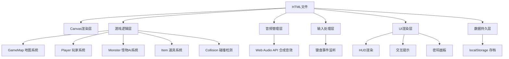

## 1. 架构设计



## 2. 技术说明

- **前端技术**：纯HTML5 + JavaScript (ES5) + CSS3
- **渲染引擎**：Canvas 2D API
- **音频引擎**：Web Audio API (OscillatorNode合成音效，无外部文件)
- **数据存储**：浏览器localStorage
- **构建工具**：无需构建工具，单文件直接运行
- **兼容浏览器**：Chrome、Edge、Firefox等现代浏览器

## 3. 代码组织结构

采用模块化构造函数模式（ES5兼容）：

| 构造函数 | 职责 | 核心方法 |
|----------|------|----------|
| Game | 游戏主循环、系统协调 | init(), update(), render(), run() |
| GameMap | 地图生成、房间管理、碰撞数据 | generate(), isWall(), isSafeHouse() |
| Player | 玩家状态、移动、手电筒 | move(), updateFlashlight(), takeDamage() |
| Monster | 怪物AI、感知系统、行为树 | update(), seePlayer(), hearSound() |
| ItemManager | 道具生成、拾取、使用 | spawnItems(), collectItem(), useItem() |
| InputHandler | 键盘输入处理 | isKeyDown(), onKeyPress() |
| AudioManager | Web Audio音效合成 | playStep(), playHeartbeat(), playMonster() |
| UIManager | HUD、交互提示、密码面板 | renderHUD(), showPrompt(), showKeypad() |
| SaveSystem | 存档读档系统 | save(), load(), hasSave() |

## 4. 核心数据结构

### 4.1 玩家数据

```javascript
{
  x: number,           // 像素坐标
  y: number,
  angle: number,       // 朝向角度(弧度)
  health: number,      // 0-100
  speed: number,       // 基础速度200px/s
  speedMultiplier: number,  // 减速乘数(受伤叠加)
  isCrouching: boolean,
  isRunning: boolean,
  flashlight: {
    battery: number,   // 0-60单位
    isOn: boolean,
    flickerTimer: number
  },
  inventory: {
    hasKey: boolean,
    batteries: number,
    medkits: number,
    collectedDigits: [number, number, number]  // 密码数字
  },
  isInCabinet: boolean,
  cabinetTransition: number  // 0-1动画进度
}
```

### 4.2 怪物数据

```javascript
{
  x: number,
  y: number,
  angle: number,
  state: 'patrol' | 'chase' | 'search' | 'fake_leave',
  targetX: number,
  targetY: number,
  patrolPoints: [{x, y}],
  currentPatrolIndex: number,
  visionAngle: 60,    // 度
  visionRange: 150,   // 像素
  hearingRange: 200,
  lastSeenPlayerPos: {x, y},
  fakeLeaveTimer: number,
  searchTimer: number
}
```

### 4.3 地图数据

```javascript
{
  tileSize: 32,       // 像素
  width: number,
  height: number,
  tiles: [number][],  // 0=空地, 1=墙, 2=门, 3=柜子, 4=安全屋
  rooms: [{x, y, w, h, type}],
  corridors: [{x1, y1, x2, y2}],
  exitDoor: {x, y, locked: true},
  cabinets: [{x, y, occupied: boolean}]
}
```

## 5. 游戏循环与帧率控制

```javascript
function Game() {
  this.lastTime = 0;
  this.deltaTime = 0;
  this.fixedTimeStep = 1/60;  // 60 FPS固定更新
  
  this.loop = function(timestamp) {
    this.deltaTime += (timestamp - this.lastTime) / 1000;
    this.lastTime = timestamp;
    
    while (this.deltaTime >= this.fixedTimeStep) {
      this.update(this.fixedTimeStep);
      this.deltaTime -= this.fixedTimeStep;
    }
    
    this.render();
    requestAnimationFrame(this.loop.bind(this));
  };
}
```

## 6. 关键算法

### 6.1 手电筒光束渲染
- 使用Canvas `createRadialGradient`创建锥形渐变
- 计算玩家前方扇形区域，使用`clip()`遮罩
- 低电量时随机切换透明度实现闪烁效果

### 6.2 怪物扇形视野检测
```javascript
Monster.prototype.seePlayer = function(player) {
  var dx = player.x - this.x;
  var dy = player.y - this.y;
  var dist = Math.sqrt(dx*dx + dy*dy);
  var angleToPlayer = Math.atan2(dy, dx);
  var angleDiff = this.normalizeAngle(angleToPlayer - this.angle);
  
  var detectRange = player.isCrouching ? 50 : this.visionRange;
  var halfVision = (this.visionAngle / 2) * Math.PI / 180;
  
  return dist <= detectRange && Math.abs(angleDiff) <= halfVision;
};
```

### 6.3 AABB碰撞检测
```javascript
function checkCollision(x, y, radius, map) {
  var tileX = Math.floor(x / map.tileSize);
  var tileY = Math.floor(y / map.tileSize);
  // 检查周围9格
  for (var dy = -1; dy <= 1; dy++) {
    for (var dx = -1; dx <= 1; dx++) {
      if (map.tiles[tileY + dy] && map.tiles[tileY + dy][tileX + dx] === 1) {
        // 圆形与矩形碰撞检测
        var closestX = Math.max((tileX + dx) * map.tileSize, 
                       Math.min(x, (tileX + dx + 1) * map.tileSize));
        var closestY = Math.max((tileY + dy) * map.tileSize, 
                       Math.min(y, (tileY + dy + 1) * map.tileSize));
        var distX = x - closestX;
        var distY = y - closestY;
        if (distX * distX + distY * distY < radius * radius) {
          return true;
        }
      }
    }
  }
  return false;
}
```

### 6.4 Web Audio合成音效
- 脚步声：白噪声通过带通滤波器，随机改变频率模拟不同地表
- 心跳声：低频振荡器(60-120Hz)，根据距离/状态调整速率
- 怪物吼声：锯齿波叠加低频调制
- 紧张蜂鸣：高频正弦波渐进增强

## 7. 性能优化

- 手电筒光束使用离屏Canvas缓存，仅在玩家移动/旋转时重绘
- 怪物AI更新每2帧执行一次，降低CPU占用
- 视觉畸变效果使用CSS transform而非Canvas重绘
- 对象池复用音效节点，避免频繁创建销毁
- 地图瓦片一次性预渲染为背景图
