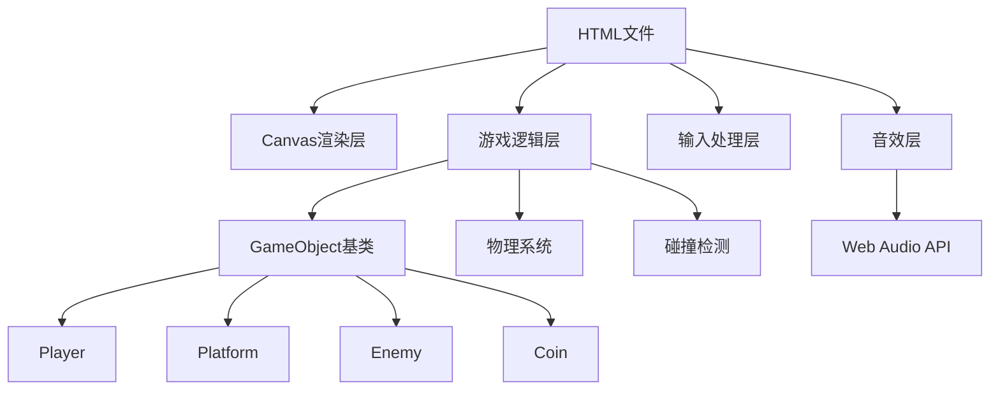

## 1. 架构设计



## 2. 技术描述

- **前端技术**：原生HTML5 + Canvas 2D + JavaScript (ES6+)
- **渲染引擎**：Canvas 2D Context
- **音效**：Web Audio API振荡器
- **游戏循环**：requestAnimationFrame + FIXED_DT固定步长
- **打包方式**：单文件HTML，无需构建工具

## 3. 核心技术要点

### 3.1 GameObject接口
```javascript
class GameObject {
  update(dt) {}
  render(ctx) {}
}
```

### 3.2 物理系统
- 固定时间步长：FIXED_DT = 1/60
- 重力加速度：980px/s²
- 碰撞检测：AABB碰撞

### 3.3 代码结构
- IIFE模块化，避免全局污染
- 按功能分区注释
- 类型标注清晰

## 4. 文件结构

```
auto53/
└── index.html          # 单文件包含所有代码
```
