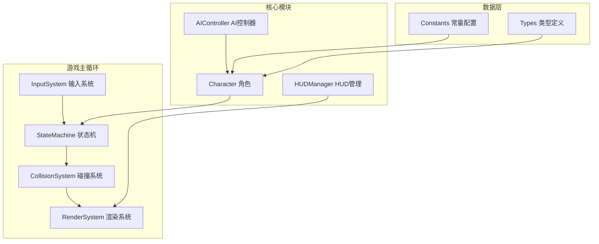
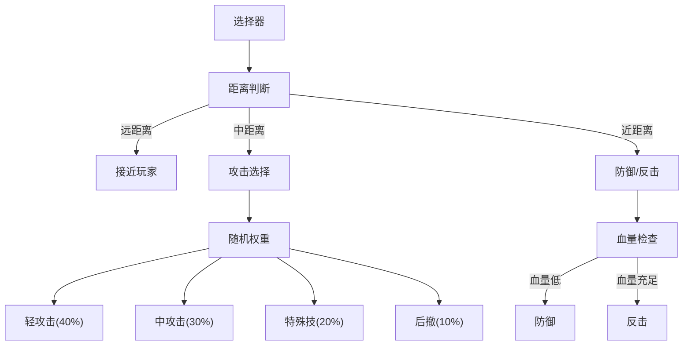

## 1. 架构设计



## 2. 技术描述

- **前端技术**：纯HTML5 + Vanilla JavaScript + CSS3，单文件自包含
- **渲染引擎**：Canvas 2D API
- **游戏循环**：requestAnimationFrame + 帧时间补偿
- **架构模式**：模块化设计，接口分离

## 3. 模块划分

### 3.1 核心模块接口

| 模块 | 核心接口 | 职责 |
|------|----------|------|
| InputSystem | getBuffer(), clearBuffer(), update() | 键盘输入捕获、6帧输入缓冲管理 |
| StateMachine | transition(state), update(delta) | 角色状态管理、状态切换逻辑 |
| CollisionSystem | checkHit(attacker, defender), drawDebug() | 攻击判定、受击判定、相杀处理 |
| RenderSystem | render(world), shakeScreen(intensity) | Canvas绘制、动画渲染、特效处理 |
| AIController | decideAction(), updateBehaviorTree() | AI决策、行为树执行 |

### 3.2 角色数据结构

```typescript
interface Character {
  id: string;
  name: string;
  x: number;
  y: number;
  facing: 1 | -1;
  health: number;
  maxHealth: number;
  energy: number;
  maxEnergy: number;
  defense: number;
  maxDefense: number;
  state: State;
  stateTimer: number;
  combo: number;
  comboTimer: number;
  isAdversity: boolean;
  
  attackChain: Attack[];
  specialMove: Skill;
  superMove: Skill;
  
  hitbox: Rect;
  hurtbox: Rect;
  currentAttack: Attack | null;
}
```

## 4. 状态机定义

### 4.1 角色状态枚举

| 状态 | 说明 | 可取消帧 |
|------|------|----------|
| IDLE | 站立 | 全程可取消 |
| WALK_F | 前进 | 全程可取消 |
| WALK_B | 后退 | 全程可取消 |
| JUMP | 跳跃 | 上升阶段可取消 |
| CROUCH | 蹲下 | 全程可取消 |
| ATTACK_L | 轻攻击 | 收招前50%可取消 |
| ATTACK_M | 中攻击 | 收招前30%可取消 |
| ATTACK_H | 重攻击 | 不可取消 |
| SPECIAL | 特殊技 | 不可取消 |
| SUPER | 超必杀 | 不可取消 |
| BLOCK | 防御 | 全程可取消 |
| HIT | 受创 | 不可取消 |
| GUARD_BREAK | 破防 | 不可取消 |

## 5. 关键技术实现

### 5.1 输入缓冲系统
- 使用循环队列存储最近6帧的输入指令
- 每个状态检查可取消窗口，有输入则立即响应
- 支持方向键+攻击键组合输入

### 5.2 碰撞判定系统
- 攻击判定框（hitbox）仅在有效帧激活
- 受击判定框（hurtbox）常驻
- 双方同时命中时触发相杀（clash），双方均造成伤害但不进入受创

### 5.3 AI行为树


### 5.4 逆境反击机制
- 触发条件：血量低于30%
- 效果：
  - 攻击力提升50%
  - 能量积攒速度翻倍
  - 受创硬直时间减少30%
- 限制：仅在本局剩余时间内有效，血量恢复后效果消失

## 6. 性能优化
- 对象池复用特效对象
- 离屏Canvas预渲染静态元素
- requestAnimationFrame时间戳计算delta
- 固定逻辑帧率60FPS，渲染跟随显示器刷新率
