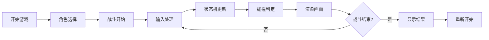

## 1. 产品概述

一款纯前端实现的1v1实时格斗对战游戏，玩家可通过键盘操作与AI对手进行格斗。游戏包含角色选择、连击系统、防御破防机制、逆境反击等核心格斗游戏要素。
- 目标：提供流畅、有趣的格斗游戏体验，无需任何外部资源即可运行
- 价值：展示现代前端技术在游戏开发中的应用，可作为学习和参考案例

## 2. 核心功能

### 2.1 用户角色
| 角色 | 操作方式 | 核心权限 |
|------|----------|----------|
| 玩家 | 键盘操作 | 控制角色移动、攻击、防御、释放技能 |
| AI对手 | 自动行为树 | 具备进攻、后撤、防御、特殊技的智能行为 |

### 2.2 功能模块
1. **游戏主界面**：角色选择、游戏开始、HUD显示
2. **战斗系统**：角色状态机、攻击判定、受创判定
3. **输入系统**：键盘输入处理、6帧输入缓冲
4. **AI系统**：行为树驱动的智能决策
5. **渲染系统**：Canvas绘制、动画效果、屏幕震动

### 2.3 页面详情
| 页面名称 | 模块名称 | 功能描述 |
|----------|----------|----------|
| 游戏主界面 | 角色选择 | 2名可选角色，展示角色特性 |
| 游戏主界面 | HUD显示 | 血量槽、能量槽、防御槽、连击数显示 |
| 战斗场景 | 角色渲染 | Canvas绘制角色动作、攻击特效 |
| 战斗场景 | 碰撞判定 | 攻击判定框与受击判定框分离计算 |

## 3. 核心流程

## 4. 用户界面设计

### 4.1 设计风格
- **主色调**：深色背景（#1a1a2e）配霓虹色强调（#00f5d4、#ff006e），营造街机格斗风格
- **辅助色**：红色（#e63946）表示危险/血量，蓝色（#4361ee）表示能量，黄色（#ffbe0b）表示连击
- **按钮风格**：圆角矩形，霓虹边框发光效果
- **字体**：使用像素风格或等宽字体，强化复古街机感
- **布局风格**：居中固定960×640游戏画布，HUD信息分布四角

### 4.2 页面设计概述
| 页面名称 | 模块名称 | UI元素 |
|----------|----------|--------|
| 角色选择 | 角色卡片 | 角色头像、名称、特性简介、选中发光效果 |
| 战斗场景 | HUD | 左上角玩家1血条、右上角AI血条、底部中央连击数、两侧能量槽 |
| 战斗场景 | 角色 | 简约几何图形、关键帧动画、命中闪光效果 |
| 结果界面 | 结算面板 | 胜利/失败文字、战斗统计、重新开始按钮 |

### 4.3 响应式
- 固定游戏画布尺寸960×640
- 浏览器窗口小于该尺寸时等比缩放居中显示
- 禁用页面滚动条，保持视觉整洁

### 4.4 动效设计
- 角色动作关键帧动画（出手帧、命中帧、收招帧）
- 命中时的白色闪光效果
- 攻击命中时的屏幕震动
- 连击数的放大跳动动画
- 超必杀释放时的全屏特效
