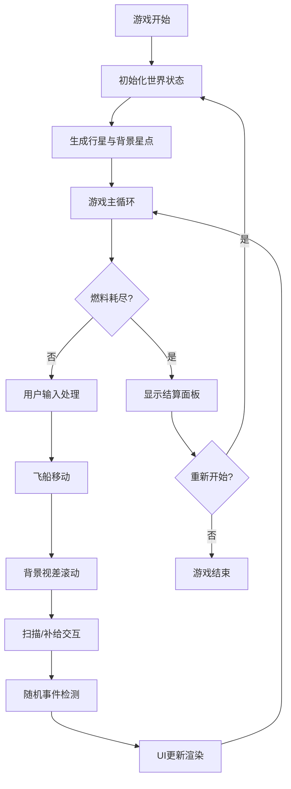

## 1. 产品概述
太空探索游戏是一款基于Canvas 2D的俯视视角太空探索游戏，玩家操控飞船在无限宇宙中探索行星、收集资源、应对随机事件。
- 核心玩法：飞船操控、行星扫描、资源收集、补给管理
- 目标价值：提供沉浸式太空探索体验，结合策略性资源管理与随机事件的趣味性

## 2. 核心功能

### 2.1 用户角色
无多角色区分，单玩家模式

### 2.2 功能模块
1. **游戏主画面**：Canvas 2D渲染、分层星点背景视差滚动、飞船居中显示
2. **飞船操控**：方向键/WASD加速、惯性物理系统、燃料消耗机制
3. **行星系统**：8+行星生成、两种行星类型、补给站行星、资源类型系统
4. **扫描机制**：距离检测、能量消耗、扫描动画、行星状态标记
5. **资源与UI**：燃料/能量状态条、坐标显示、资源清单、Canvas绘制UI
6. **事件总线**：模块间解耦通信、随机事件系统（引力异常、陨石群、远古信号）
7. **评级系统**：多维度评分计算、探索结束结算面板
8. **游戏重开**：世界状态完全重置

### 2.3 页面详情
| 页面名称 | 模块名称 | 功能描述 |
|-----------|-------------|---------------------|
| 游戏主画面 | 宇宙背景 | 3层200+星点视差滚动，无限宇宙模拟 |
| 游戏主画面 | 飞船系统 | 惯性操控、燃料消耗、朝向跟随速度 |
| 游戏主画面 | 行星系统 | 8+行星随机分布、间距≥150px、两种类型区别 |
| 游戏主画面 | 扫描系统 | 60px范围检测、空格触发、波纹动画、状态标记 |
| 游戏主画面 | 补给系统 | 2颗补给站、50px范围停靠、E键补满燃料 |
| 界面UI | 状态栏 | 左上角燃料/能量条、坐标显示，右上角资源清单 |
| 界面UI | 事件系统 | 每20秒±5秒触发随机事件，3种事件类型 |
| 结算面板 | 评级系统 | 勘探数量、资源价值、事件次数综合评分 |
| 结算面板 | 重开功能 | 完全重置世界状态重新开始 |

## 3. 核心流程

## 4. 用户界面设计

### 4.1 设计风格
- 主色调：深空黑色背景 (#0a0a1a)、星点白色 (#ffffff)、行星多彩色系
- 强调色：燃料橙色 (#ff6b35)、能量蓝色 (#4ecdc4)、资源绿色 (#95e1a3)
- UI风格：极简科技感，半透明面板，锐利边框
- 字体：等宽 monospace 字体增强科幻感
- 动画：波纹扩散效果、平滑数值变化、行星光环闪烁

### 4.2 页面设计概述
| 页面名称 | 模块名称 | UI元素 |
|-----------|-------------|-------------|
| 游戏主画面 | 宇宙背景 | 3层星点、不同亮度、视差滚动速度 |
| 游戏主画面 | 飞船 | 三角形、跟随速度方向旋转、白色轮廓 |
| 游戏主画面 | 行星 | 圆形、不同半径颜色、RockyPlanet灰色纹理标记、GasGiant光晕效果 |
| 游戏主画面 | 补给站 | 蓝紫色闪烁光环、特殊标记 |
| 界面UI | 状态栏 | 左上角双进度条（燃料橙、能量蓝）、坐标文字 |
| 界面UI | 资源栏 | 右上角资源类型图标与数量、半透明面板 |
| 结算面板 | 评级显示 | 居中半透明面板、探索统计数据、评级字母、重开按钮 |

### 4.3 响应性
- 单文件HTML，自适应浏览器窗口大小
- Canvas尺寸匹配窗口innerWidth/innerHeight
- 游戏世界坐标独立于屏幕坐标
- 支持窗口大小动态调整

### 4.4 视觉特效
- 行星扫描波纹动画（0.5秒持续时间）
- 补给站蓝紫色光环闪烁
- 飞船引擎尾焰效果（加速时显示）
- 陨石群障碍动画
- 背景星点分层视差滚动
